# $1$ Lox语言

我们先来简单介绍一下Lox语言的用法。

## $1. 1$ $Hello, Atguigu$

我们来用Lox写一个$hello \; world$程序：

```js
// 第一个Atguigu程序
print("Hello, world!");
```

Lox语言是一门动态类型的语言，和JavaScript的语法非常相似，因为借鉴了很多JS中的语法。

## $1.2$ Lox语言中的数据类型

我们有以下几种内置的数据类型：

**布尔类型**：Lox语言中有两个布尔值，每个值都有一个字面量：

```c
true;  // Not false.
false; // Not *not* false.
```

**数值类型**：Lox只有一种数值类型：双精度浮点数。由于浮点数还可以表示各种各样的整数，因此可以覆盖很多领域，同时保持简单。

```c
1234;  // 整数数值
12.34; // 十进制数值
```

**字符串类型**：在第一个示例中，我们已经看到一个字符串字面量。与大多数语言一样，它们用双引号引起来：

```c
"I am a string";
"";    // 空字符串
"123"; // 字符串类型，不是数值类型
```

我们在实现它们时会看到，在这个无害的字符序列中隐藏了相当多的复杂性。

**空值类型**：在许多其他语言中称为$null$。在Lox语言中，我们将其拼写为`nil`。

## $1.4$ Lox中的表达式

### $1.4.1$ 算术运算

Lox借鉴了JavaScript中的基本算术运算符：

```c
add + me;      // 加法
subtract - me; // 减法
multiply * me; // 乘法
divide / me;   // 除法
```

运算符两边的子表达式都是 **操作数** 。因为有两个操作数，它们被称为 **二元** 运算符。由于运算符固定在操作数的中间，因此也称为 **中缀** 运算符，相对的，还有 **前缀** 运算符（运算符在操作数前面，例如`--i`）和 **后缀** 运算符（运算符在操作数后面，例如`i++`）。

有一个数学运算符既是中缀运算符也是前缀运算符，`-`运算符可以对数字取负：

```c
-negateMe;
```

所有这些操作符都是针对数字的，将任何其他类型操作数传递给它们都是错误的。唯一的例外是`+`运算符—你也可以传给它两个字符串将它们串接起来。

### $1.4.2$ 比较与相等运算

接下来，我们有几个返回布尔值的运算符。我们可以使用旧的比较运算符来比较数字（并且只能比较数字）：

```c
less < than;
lessThan <= orEqual;
greater > than;
greaterThan >= orEqual;
```

我们可以测试两个任意类型的值是否相等：

```c
1 == 2;         // false.
"cat" != "dog"; // true.
```

即使是不同类型也可以：

```c
314 == "pi"; // false.
```

不同类型的值 **永远不会** 相等：

```c
123 == "123"; // false.
```

Lox语言去掉了JavaScript中的隐式类型转换。在JS中：

```js
123 == "123"; // true
```


### $1.4.3$ 逻辑运算

取反运算符，是前缀运算符`!`，如果操作数是`true`，则返回`false`，反之亦然：

```c
!true;  // false.
!false; // true.
```

其他两个逻辑运算符实际上是表达式伪装下的控制流结构。`and`表达式用于确认两个操作数是否 **都是** `true`。如果左侧操作数是`false`，则返回左侧操作数，否则返回右侧操作数：

```c
true and false; // false.
true and true;  // true.
```

`or`表达式用于确认两个操作数中任意一个（或者都是）为`true`。如果左侧操作数为`true`，则返回左侧操作数，否则返回右侧操作数：

```c
false or false; // false.
true or false;  // true.
```

`and`和 `or`之所以像控制流结构，是因为它们会**短路**。如果左操作数为假，`and`不仅会返回左操作数，在这种情况下，它甚至不会计算右操作数。反过来，如果`or`的左操作数为真，右操作数就会被跳过。

### $1.4.4$ 优先级与括号

所有这些运算符都具有与JS语言相同的优先级和结合性。在优先级不满足要求的情况下，你可以使用`()`来分组：

```c
var average = (min + max) / 2;
```


## $1.5$ 语句

现在我们来看语句。表达式的主要作用是产生一个 **值** ，语句的主要作用是产生一个 **效果** 。由于根据定义，语句不求值，因此必须以某种方式改变世界（通常是修改某些状态，读取输入或产生输出）才能有用。

我们已经见过一个语句了，就是：

```js
print("hello, world!");
```

`print`语句计算单个表达式并将结果显示给用户。我们还会看到一些语句，例如：

```c
表达式;
1 + 2;
```

表达式后跟分号（`;`）可以将表达式提升为语句状态。这被称为 **表达式语句** 。

如果我们想将一系列语句打包成一个语句，那么可以将它们打包在一个块（$block$）中：

```c
{
  print("第一个语句");
  print("第二个语句");
}
```

块还会影响作用域，我们将在后面进行说明。

## $1.6$ 变量

我们可以使用`var`语句声明变量。如果你省略了初始化操作，变量的值默认为`nil`：

```c
var imAVariable = "变量语法";
var iAmNil;
```

一旦声明完成，我们就可以通过变量名对其进行访问和赋值：

```c
var name = "atguigu";
print(name); // "atguigu".
name = "zuoyuan";
print(name); // "zuoyuan".
```

## $1.7$ 控制流

`if`语句根据某些条件执行两条语句中的一条：

```c
if (condition) {
  print("yes");
} else {
  print ("no");
}
```

只要条件表达式的计算结果为`true`，`while`循环就会重复执行循环体：

```c
var a = 1;
while (a < 10) {
  print(a);
  a = a + 1;
}
```

最后，还有`for`循环：

```c
for (var a = 1; a < 10; a = a + 1) {
  print(a);
}
```

这个循环与之前的 `while` 循环做同样的事情。

## $1.8$ 函数

函数调用表达式与JS中的一样：

```c
add(1, 2);
```

我们也可以在不传递任何参数的情况下调用一个函数：

```c
moveFast();
```

在本例中括号是强制性的。如果你把它们去掉，就不会调用函数，只是指向该函数。

在Lox里，我们可以通过`function`关键字来定义函数：

```js
function add(a, b) {
  print(a + b);
  return a + b;
}
```

如果执行到达函数体的末尾而没有`return`语句，则会隐式返回`nil`。

### $1.8.1$ 闭包

在Lox中，函数是 **一等公民** ，这意味着它们都是真实的值，你可以对这些值进行引用、存储在变量中、传递等等。下面的代码是有效的：

```js
function addPair(a, b) {
  return a + b;
}

function identity(a) {
  return a;
}

print(identity(addPair)(1, 2)); // 打印 "3".
```

由于函数声明是语句，所以可以在另一个函数中声明局部函数：

```js
function outerFunction() {
  function localFunction() {
    print("I'm local!");
  }

  localFunction();
}
```

如果将局部函数、头等函数和块作用域组合在一起，就会遇到这种有趣的情况：

```js
function returnFunction() {
  var outside = "outside";

  function inner() {
    print(outside);
  }

  return inner;
}

var fn = returnFunction();
fn();
```

在这里，`inner()`访问了在其函数体外的外部函数中声明的局部变量。

要做到这一点，`inner()`必须“保留”对它使用的任何外部变量的引用，这样即使在外层函数返回之后，这些变量仍然存在。我们把能做到这一点的函数称为**闭包**。

可以想象，实现这些会增加一些复杂性，因为我们不能再假定变量作用域严格地像堆栈一样工作，在函数返回时局部变量就消失了。

# $2$ 词法分析

任何编译器或解释器的第一步都是扫描。扫描器以一系列字符的形式接收源代码，并将其分组成一系列的块，我们称之为$token$（词法单元）。这些是有意义的“单词”和“标点”，它们构成了语言的语法。

对于我们来说，扫描也是一个很好的起点，因为代码不是很难—相当于有很多分支的`switch`语句。这可以帮助我们在学习更后面有趣的部分之前进行热身。在本章结束时，我们将拥有一个功能齐全、速度快的扫描器，它可以接收任何一串Lox源代码，并产生$token$序列，我们将在下一章把这些标记输入到语法分析器中。

## $2.1$ 解释器框架

由于这是我们的第一个真正的章节，在我们开始实际扫描代码之前，我们需要先勾勒出我们的解释器的基本形态。在$Java$中，一切都是从一个类开始的。

> 创建新文件`Atguigu.java`

```java
package com.atguigu;

import java.io.BufferedReader;
import java.io.IOException;
import java.io.InputStreamReader;
import java.nio.charset.Charset;
import java.nio.file.Files;
import java.nio.file.Paths;
import java.util.List;

public class Atguigu {
  public static void main(String[] args) throws IOException {
    if (args.length > 1) {
      System.out.println("用法: atguigu [脚本文件]");
      System.exit(64); 
    } else if (args.length == 1) {
      runFile(args[0]);
    } else {
      runPrompt();
    }
  }
}
```

Lox是一种脚本语言，这意味着它直接从源代码执行。我们的解释器支持两种运行代码的方式。如果从命令行启动解释器并为其提供脚本文件的路径，它将读取该文件并执行。

> 在`Atguigu.java`中，添加到`main()`方法之后

```java
private static void runFile(String path) throws IOException {
  byte[] bytes = Files.readAllBytes(Paths.get(path));
  run(new String(bytes, Charset.defaultCharset()));
}
```

> 在`Atguigu.java`，添加到`runFile()`方法之后

```java
private static void runPrompt() throws IOException {
  InputStreamReader input = new InputStreamReader(System.in);
  BufferedReader reader = new BufferedReader(input);

  System.out.println("尚硅谷：让天下没有难学的技术！");
  for (;;) { 
    System.out.print("atguigu> ");
    String line = reader.readLine();
    if (line == null) break;
    run(line);
  }
}
```

`readLine()`函数，顾名思义，读取用户在命令行上的一行输入，并返回结果。要终止交互式命令行应用程序，通常需要输入`Control-D`。这样做会向程序发出 **文件结束** 的信号。当这种情况发生时，`readLine()`就会返回`null`，所以我们检查一下是否存在`null`以退出循环。

交互式提示符和文件运行工具都是对这个核心函数的简单包装：

> 在`Atguigu.java`文件中，添加到`runPrompt()`之后

```java
  private static void run(String source) {
    Scanner scanner = new Scanner(source);
    List<Token> tokens = scanner.scanTokens();

    // 现在先打印token序列
    for (Token token : tokens) {
      System.out.println(token);
    }
  }
```

因为我们还没有写出解释器，所以这些代码还不是很有用，但这只是小步骤，你要明白？现在，它可以打印出我们即将完成的扫描器所返回的$token$序列，这样我们就可以看到我们的解析是否生效。

### $2.1.1$ 错误处理

当我们设置东西的时候，另一个关键的基础设施是错误处理。教科书有时会掩盖这一点，因为这更多的是一个实际问题，而不是一个正式的计算机科学问题。但是，如果你关心的是如何制作一个真正可用的语言，那么优雅地处理错误是至关重要的。

我们的语言提供的处理错误的工具构成了其用户界面的很大一部分。当用户的代码在工作时，他们根本不会考虑我们的语言—他们的脑子里都是他们的程序。通常只有当程序出现问题时，他们才会注意到我们的实现。

当这种情况发生时，我们就需要向用户提供他们所需要的所有信息，让他们了解哪里出了问题，并引导他们慢慢达到他们想要去的地方。要做好这一点，意味着从现在开始，在解释器的整个实现过程中都要考虑错误处理。

> 在`Atguigu.java`文件中，添加到`run()`方法之后

```java
static void error(int line, String message) {
    report(line, "", message);
  }

  private static void report(int line, String where,
                             String message) {
    System.err.println(
        "[line " + line + "] Error" + where + ": " + message);
    hadError = true;
  }
```

这个`error()`函数和其工具方法`report()`会告诉用户在某一行上发生了一些语法错误。这其实是最起码的，可以说你有错误报告功能。想象一下，如果你在某个函数调用中不小心留下了一个悬空的逗号，解释器就会打印出来：

```java
Error: Unexpected "," somewhere in your code. Good luck finding it!
```

我们在`Atguigu`主类中使用这个错误报告功能的主要原因就是因为那个`hadError`字段。它的定义在这里：

> 在`Atguigu.java`文件中，在`Atguigu`类中添加：

```java
public class Atguigu {
  static boolean hadError = false;
```

我们将以此来确保我们不会尝试执行有已知错误的代码。此外，它还能让我们像一个好的命令行工具那样，用一个非零的结束代码退出。

> 在`Atguigu.java`文件中，在`runFile()`中添加：

```java
    run(new String(bytes, Charset.defaultCharset()));
    
    // 通过退出码表示出错。
    if (hadError) System.exit(65);
  }
```

我们需要在交互式循环中重置此标志。如果用户输入有误，也不应终止整个会话。

> 在`Atguigu.java`文件中，在`runPrompt()`中添加：

```java
      run(line);
      hadError = false;
    }
```

我把错误报告拉出来，而不是把它塞进扫描器和其他可能发生错误的阶段，还有另一个原因，是为了提醒您，把产生错误的代码和报告错误的代码分开是一个很好的工程实践。

前端的各个阶段都会检测到错误，但是它们不需要知道如何向用户展示错误。再一个功能齐全的语言实现中，可能有多种方式展示错误信息：在$stderr$，在$IDE$的错误窗口中，记录到文件，等等。您肯定不希望扫描器和解释器中到处充斥着这类代码。

理想情况下，我们应该有一个实际的抽象，即传递给扫描程序和解析器的某种`ErrorReporter`接口，这样我们就可以交换不同的报告策略。对于我们这里的简单解释器，我没有那样做，但我至少将错误报告代码移到了一个不同的类中。

有了一些基本的错误处理，我们的应用程序外壳已经准备好了。一旦我们有了一个带有 `scanTokens()`方法的`Scanner`类，我们就可以开始运行它了。在我们开始之前，让我们更精确地了解什么是$tokens$。

## $2.2$ $token$（词法单元）

下面是一行Lox代码：

```js
var language = "atguigu";
```

在这里，`var`是声明变量的关键字。“v-a-r”这三个字符的序列是有意义的。但如果我们从`language`中间抽出三个字母，比如“g-u-a”，它们本身并没有任何意义。

这就是词法分析的意义所在。我们的工作是扫描字符列表，并将它们归纳为具有某些含义的最小序列。每一组字符都被称为词素。在示例代码行中，词素是：

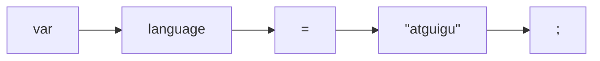

词素只是源代码的原始子字符串。 但是，在将字符序列分组为词素的过程中，我们也会发现了一些其他有用的信息。 当我们获取词素并将其与其他数据捆绑在一起时，结果是一个$token$（词法单元）。它包含一些有用的内容，比如：

### $2.2.1$ $token$类型

关键词是语言语法的一部分，所以解析器经常会有这样的代码：“如果下一个$token$是`while`，那么就……” 。这意味着解析器想知道的不仅仅是它有某个标识符的词素，而是它得到一个**保留字**，以及它是**哪个**关键字。

解析器可以通过比较字符串对原始词素中的标记进行分类，但这样做很慢，而且有点难看。相反，在我们识别一个词素的时候，我们还要记住它代表的是哪种词素。我们为每个关键字、操作符、标点位和字面量都有不同的类型。

> 创建新文件`TokenType.java`

```java
package com.atguigu;

public enum TokenType {
  // 单字符标记
  LEFT_PAREN, RIGHT_PAREN, LEFT_BRACE, RIGHT_BRACE,
  COMMA, MINUS, PLUS, SEMICOLON, SLASH, STAR,

  // 单字符或者双字符标记
  BANG, BANG_EQUAL,
  EQUAL, EQUAL_EQUAL,
  GREATER, GREATER_EQUAL,
  LESS, LESS_EQUAL,

  // 字面量
  IDENTIFIER, STRING, NUMBER,

  // 关键字
  AND, ELSE, FALSE, FUNCTION, FOR, IF, NIL, OR,
  PRINT, RETURN, TRUE, VAR, WHILE,

  EOF
}
```

### $2.2.2$ 字面量

字面量有对应词素—数字和字符串等。由于扫描器必须遍历文字中的每个字符才能正确识别，所以它还可以将值的文本表示转换为运行时对象，解释器后续将使用该对象。

### $2.2.3$ 位置信息

在错误处理时，我们需要告诉用户错误发生在哪里。（用户）从这里开始定位问题。在我们的简易解释器中，我们只说明了$token$出现在哪一行上，但更复杂的实现中还应该包括列位置和长度。

我们将所有这些数据打包到一个类中。

> 创建新文件`Token.java`

```java
package com.atguigu;

public class Token {
  final TokenType type;
  final String lexeme;
  final Object literal;
  final int line; 

  public Token(TokenType type, String lexeme, Object literal, int line) {
    this.type = type;
    this.lexeme = lexeme;
    this.literal = literal;
    this.line = line;
  }

  public String toString() {
    return type + " " + lexeme + " " + literal;
  }
}
```

现在我们有了一个信息充分的对象，足以支撑解释器的所有后期阶段。

## $2.3$ 正则语言和表达式

既然我们已知道我们要输出的什么，那么，我们就开始吧。扫描器的核心是一个循环。从源码的第一个字符开始，扫描器计算出该字符属于哪个词素，并消费它和属于该词素的任何后续字符。当到达该词素的末尾时，扫描器会输出一个$token$。

然后再循环一次，它又循环回来，从源代码中的下一个字符开始再做一次。它一直这样做，吃掉字符，然后隔一会儿输出$token$，直到它到达输入的终点。

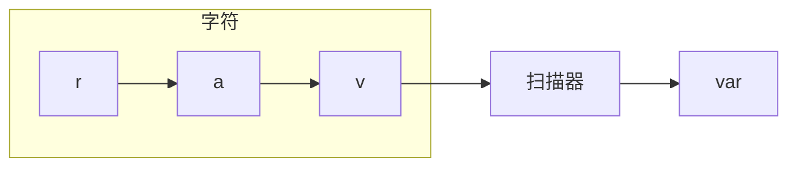

在循环中，我们会查看一些字符，以确定它 **匹配** 的是哪种词素，这部分内容可能听起来很熟悉，但如果你知道正则表达式，你可以考虑为每一种词素定义一个$regex$，并使用这些$regex$来匹配字符。如果你了解正则表达式，你可以考虑为每一种词素定义一个$regex$，然后用来匹配字符。例如，Lox对标识符（变量名等）的规则与JS语言相同。下面的$regex$可以匹配一个标识符：

```js
[a-zA-Z_][a-zA-Z_0-9]*
```

如果你确实想到了正则表达式，那么你的直觉还是很深刻的。决定一门语言如何将字符分组为词素的规则被称为它的**词法语法**。在Lox中，和大多数编程语言一样，该语法的规则非常简单，可以将其归为**正则语言**。这里的正则和正则表达式中的 **正则** 是一样的含义。

如果你愿意，你可以非常精确地使用正则表达式来识别Lox的所有不同词组。由于我们的目标是了解扫描器是如何工作的，所以我们不会把这个任务交给正则表达式。我们要亲自动手实现。

## $2.4$ `Scanner`类

事不宜迟，我们先来建一个扫描器吧。

> 创建新文件`Scanner.java`

```java
package com.atguigu;

import java.util.ArrayList;
import java.util.HashMap;
import java.util.List;
import java.util.Map;

import static com.craftinginterpreters.lox.TokenType.*; 

public class Scanner {
  private final String source;
  private final List<Token> tokens = new ArrayList<>();

  Scanner(String source) {
    this.source = source;
  }
}
```

我们将原始的源代码存储为一个简单的字符串，并且我们已经准备了一个列表来保存扫描时产生的标记。前面提到的循环看起来类似于：

> 在`Scanner.java`文件中，方法`Scanner()`后添加

```java
  public List<Token> scanTokens() {
    while (!isAtEnd()) {
      // We are at the beginning of the next lexeme.
      start = current;
      scanToken();
    }

    tokens.add(new Token(EOF, "", null, line));
    return tokens;
  }
```

扫描器通过自己的方式遍历源代码，添加$token$，直到遍历完所有字符。然后，它在最后附加一个的 **end of file** 的$token$。严格意义上来说，这并不是必须的，但它可以使我们的解析器更加干净。

这个循环依赖于几个字段来跟踪扫描器在源代码中的位置。

> 在`Scanner.java`文件中，在`Scanner`类中添加

```java
  private final List<Token> tokens = new ArrayList<>();
  // 添加下面三行代码
  private int start = 0;
  private int current = 0;
  private int line = 1;

  Scanner(String source) {
```

`start`和`current`字段是指向字符串的偏移量。`start`字段指向被扫描的词素中的第一个字符，`current`字段指向当前正在处理的字符。`line`字段跟踪的是`current`所在的源文件行数，这样我们产生的$token$就可以知道其位置。

然后，我们还有一个辅助函数，用来告诉我们是否已消费完所有字符。

> 在`Scanner.java`文件中，在`scanTokens()`方法之后添加

```java
  private boolean isAtEnd() {
    return current >= source.length();
  }
```

## $2.5$ 识别词素

在每一次循环中，我们会扫描一个$token$。这是扫描器真正的核心。让我们先从简单情况开始。想象一下，如果每个词素只有一个字符长。您所需要做的就是消费下一个字符并为其选择一个$token$类型。在Lox中有一些词素只包含一个字符，所有我们从这些词素开始。

> 在`Scanner.java`文件中，添加到`scanTokens()`方法之后

```java
private void scanToken() {
    char c = advance();
    switch (c) {
      case '(': addToken(LEFT_PAREN); break;
      case ')': addToken(RIGHT_PAREN); break;
      case '{': addToken(LEFT_BRACE); break;
      case '}': addToken(RIGHT_BRACE); break;
      case ',': addToken(COMMA); break;
      case '-': addToken(MINUS); break;
      case '+': addToken(PLUS); break;
      case ';': addToken(SEMICOLON); break;
      case '*': addToken(STAR); break; 
    }
  }
```

同样，我们也需要一些辅助方法。

> 在`Scanner.java`文件中，添加到`isAtEnd()`方法后

```java
  private char advance() {
    current++;
    return source.charAt(current - 1);
  }

  private void addToken(TokenType type) {
    addToken(type, null);
  }

  private void addToken(TokenType type, Object literal) {
    String text = source.substring(start, current);
    tokens.add(new Token(type, text, literal, line));
  }
```

`advance()`方法获取源文件中的下一个字符并返回它。`advance()`用于处理输入，`addToken()`则用于输出。该方法获取当前词素的文本并为其创建一个新$token$。我们马上会使用另一个重载方法来处理带有字面值的$token$。

### $2.5.1$ 词法错误

在我们深入探讨之前，我们先花一点时间考虑一下词法层面的错误。如果用户抛入解释器的源文件中包含一些Lox中不使用的字符—如`@#^`，会发生什么？现在，这些字符被默默抛弃了。它们没有被Lox语言使用，但是不意味着解释器可以假装它们不存在。相反，我们应该报告一个错误：

> 在`Scanner.java`文件中，在`scanToken()`方法中添加

```java
      case '*': addToken(STAR); break; 

      default:
        Atguigu.error(line, "未预期字符。");
        break;
    }
```

注意，错误的字符仍然会被前面调用的`advance()`方法消费。这一点很重要，这样我们就不会陷入无限循环了。

另请注意，我们一直在扫描。 程序稍后可能还会出现其他错误。 如果我们能够一次检测出尽可能多的错误，将为我们的用户带来更好的体验。 否则，他们会看到一个小错误并修复它，但是却出现下一个错误，不断重复这个过程。语法错误“打地鼠”一点也不好玩。

因为`hadError`进行了赋值，我们永远不会尝试执行任何代码，即使程序在继续运行并扫描代码文件的其余部分。

### $2.5.2$ 操作符

我们的单字符词素已经生效了，但是这不能涵盖Lox中的所有操作符。比如`!`，这是单字符，对吧？有时候是的，但是如果下一个字符是等号，那么我们应该改用`!=`词素。注意，这里的`!`和`=` **不是** 两个独立的操作符。在Lox中，你不能写`! =`来表示不等操作符。这就是为什么我们需要将`!=`作为单个词素进行扫描。同样地，`<`、`>`和`=`都可以与后面跟随的`=`来组合成其他相等和比较操作符。

对于所有这些情况，我们都需要查看第二个字符。

> 在`Scanner.java`文件中，在`scanToken()`方法中添加

```java
      case '*': addToken(STAR); break; 
      case '!':
        addToken(match('=') ? BANG_EQUAL : BANG);
        break;
      case '=':
        addToken(match('=') ? EQUAL_EQUAL : EQUAL);
        break;
      case '<':
        addToken(match('=') ? LESS_EQUAL : LESS);
        break;
      case '>':
        addToken(match('=') ? GREATER_EQUAL : GREATER);
        break;
      default:
```

这些分支中使用了下面的新方法：

> 在`Scanner.java`文件中，添加到`scanToken()`方法后

```java
  private boolean match(char expected) {
    if (isAtEnd()) return false;
    if (source.charAt(current) != expected) return false;

    current++;
    return true;
  }
```

这就像一个有条件的`advance()`。只有当前字符是我们正在寻找的字符时，我们才会消费。

使用`match()`，我们分两个阶段识别这些词素。例如，当我们得到`!`时，我们会跳转到它的`case`分支。这意味着我们知道这个词素是以`!`开始的。然后，我们查看下一个字符，以确认词素是一个`!=`还是仅仅是一个`!`。

## $2.6$ 更长的词素

我们还缺少一个操作符：表示除法的`/`。这个字符需要一些特殊处理，因为注释也是以斜线开头的。

> 在`Scanner.java`文件中，在`scanToken()`方法中添加

```java
      break;
      case '/':
        if (match('/')) {
          // A comment goes until the end of the line.
          while (peek() != '\n' && !isAtEnd()) advance();
        } else {
          addToken(SLASH);
        }
        break;
      default:
```

这与其它的双字符操作符是类似的，区别在于我们找到第二个`/`时，还没有结束本次$token$。相反，我们会继续消费字符直至行尾。

这是我们处理较长词素的一般策略。当我们检测到一个词素的开头后，我们会分流到一些特定于该词素的代码，这些代码会不断地消费字符，直到结尾。

我们又有了一个辅助函数：

> 在`Scanner.java`文件中，在`match()`方法后添加

```java
  private char peek() {
    if (isAtEnd()) return '\0';
    return source.charAt(current);
  }
```

这有点像`advance()`方法，只是不会消费字符。这就是所谓的$lookahead$（前瞻）。因为它只关注当前未消费的字符，所以我们有**一个前瞻字符** 。一般来说，数字越小，扫描器运行速度就越快。词法语法的规则决定了我们需要前瞻多少字符。幸运的是，大多数广泛使用的语言只需要提前一到两个字符。

注释是词素，但是它们没有含义，而且解析器也不想要处理它们。所以，我们达到注释末尾后，**不会** 调用`addToken()`方法。当我们循环处理下一个词素时，`start`已经被重置了，注释的词素就消失了。

既然如此，现在正好可以跳过其它那些无意义的字符了：换行和空格。

> 在`Scanner.java`文件中，在`scanToken()`方法中添加

```java
      	break;
      case ' ':
      case '\r':
      case '\t':
        // 忽略空白字符
        break;

      case '\n':
        line++;
        break;
      default:
        Atguigu.error(line, "未预期字符。");
```

当遇到空白字符时，我们只需回到扫描循环的开头。这样就会在空白字符之后开始一个新的词素。对于换行符，我们做同样的事情，但我们也会递增行计数器。（这就是为什么我们使用`peek()`而不是`match()`来查找注释结尾的换行符。我们到这里希望能读取到换行符，这样我们就可以更新行数了）

我们的扫描器越来越聪明了。它可以处理相当自由形式的代码，如：

```java
// this is a comment
(( )){} // grouping stuff
!*+-/=<> <= == // operators
```

### $2.6.1$ 字符串字面量

现在我们对长词素已经很熟悉了，我们可以开始处理字面量了。我们先处理字符串，因为字符串总是以一个特定的字符`"`开头。

> 在`Scanner.java`文件中，在`scanToken()`方法中添加

```java
      	break;
      case '"': string(); break;
      default:
```

这里会调用：

> 在`Scanner.java`文件中，在`scanToken()`方法之后添加

```java
  private void string() {
    while (peek() != '"' && !isAtEnd()) {
      if (peek() == '\n') line++;
      advance();
    }

    if (isAtEnd()) {
      Atguigu.error(line, "字符串未终结。");
      return;
    }

    // The closing ".
    advance();

    // Trim the surrounding quotes.
    String value = source.substring(start + 1, current - 1);
    addToken(STRING, value);
  }
```

与注释类似，我们会一直消费字符，直到`"`结束该字符串。如果输入内容耗尽，我们也会进行优雅的处理，并报告一个对应的错误。

没有特别的原因，Lox支持多行字符串。这有利有弊，但禁止换行比允许换行更复杂一些，所以我把它们保留了下来。这意味着当我们在字符串内遇到新行时，我们也需要更新`line`值。

最后，还有一个有趣的地方就是当我们创建$token$时，我们也会产生实际的字符串值，该值稍后将被解释器使用。这里，值的转换只需要调用`substring()`剥离前后的引号。如果Lox支持转义序列，比如`\n`，我们会在这里取消转义。

### $2.6.2$ 数值字面量

在Lox中，所有的数字在运行时都是浮点数，但是同时支持整数和小数字面量。一个数字字面量就是一系列数位，后面可以跟一个`.`和一或多个尾数。

```java
1234
12.34
```

我们不允许小数点处于最开始或最末尾，所以下面的格式是不正确的：

```java
.1234
1234.
```

我们可以很容易地支持前者，但为了保持简单，我把它删掉了。如果我们要允许对数字进行方法调用，比如`123.sqrt()`，后者会变得很奇怪。

为了识别数字词素的开头，我们会寻找任何一位数字。为每个十进制数字添加`case`分支有点乏味，所以我们直接在默认分支中进行处理。

> 在`Scanner.java`文件中，在`scanToken()`方法中替换一行

```java
      default:
        // 替换部分开始
      	if (isDigit(c)) {
          number();
        } else {
          Atguigu.error(line, "未预期字符。");
        }
        // 替换部分结束
        break;
```

这里依赖下面的小工具函数：

> 在`Scanner.java`文件中，在`peek()`方法之后添加

```java
  private boolean isDigit(char c) {
    return c >= '0' && c <= '9';
  } 
```

一旦我们知道当前在处理数字，我们就分支进入一个单独的方法消费剩余的字面量，跟字符串的处理类似。

> 在`Scanner.java`文件中，在`scanToken()`方法后添加

```java
  private void number() {
    while (isDigit(peek())) advance();

    // Look for a fractional part.
    if (peek() == '.' && isDigit(peekNext())) {
      // Consume the "."
      advance();

      while (isDigit(peek())) advance();
    }

    addToken(NUMBER,
        Double.parseDouble(source.substring(start, current)));
  }
```

我们在字面量的整数部分中尽可能多地获取数字。然后我们寻找小数部分，也就是一个小数点(`.`)后面至少跟一个数字。如果确实有小数部分，同样地，我们也尽可能多地获取数字。

在定位到小数点之后需要前瞻两个字符，因为我们只有确认其 **后** 有数字才会消费`.`。所以我们添加了：

> 在`Scanner.java`文件中，在`peek()`方法后添加

```java
  private char peekNext() {
    if (current + 1 >= source.length()) return '\0';
    return source.charAt(current + 1);
  }
```

最后，我们将词素转换为其对应的数值。我们的解释器使用$Java$的`Double`类型来表示数字，所以我们创建一个该类型的值。我们使用$Java$自带的解析方法将词素转换为真正的$Java$ 的`double`类型。我们可以自己实现，但是，说实话，除非你想为即将到来的编程面试做准备，否则不值得你花时间。

剩下的词素是`Boolean`和`nil`，但我们把它们作为关键字来处理，这样我们就来到了以下内容：

## $2.7$ 保留字和标识符

我们的扫描器基本完成了，词法语法中还需要实现的部分仅剩标识符及其近亲—保留字。你也许会想，我们可以采用与处理`<=`等多字符操作符时相同的方法来匹配关键字，如`or`。

```java
case 'o':
  if (peek() == 'r') {
    addToken(OR);
  }
  break;
```

考虑一下，如果用户将变量命名为`orchid`会发生什么？扫描器会先看到前面的两个字符，然后立刻生成一个`or`标记。这就涉及到了一个重要原则，叫作$maximal \; munch$（最长匹配）。当两个语法规则都能匹配扫描器正在处理的一大块代码时，**哪个规则相匹配的字符最多，就使用哪个规则** 。

该规则规定，如果我们可以将`orchid`匹配为一个标识符，也可以将`or`匹配为一个关键字，那就采用第一种结果。这也就是为什么我们在前面会默认为，`<=`应该识别为单一的`<=`标记，而不是`<`后面跟了一个`=`。

最大匹配原则意味着，我们只有扫描完一个可能是标识符的片段，才能确认是否一个保留字。毕竟，保留字也是一个标识符，只是一个已经被语言要求为自己所用的标识符。这也是**保留字**一词的由来。

所以我们首先假设任何以字母或下划线开头的词素都是一个标识符。

> 在`Scanner.java`文件中，在`scanToken()`中添加代码

```java
        default:
        if (isDigit(c)) {
          number();
				// 新增部分开始
        } else if (isAlpha(c)) {
          identifier();
        // 新增部分结束
        } else {
          Atguigu.error(line, "Unexpected character.");
        }
```

其它代码如下：

> 在`Scanner.java`文件中，在`scanToken()`方法之后添加

```java
  private void identifier() {
    while (isAlphaNumeric(peek())) advance();

    addToken(IDENTIFIER);
  }
```

通过以下辅助函数来定义：

> 在`Scanner.java`文件中，在`peekNext()`方法之后添加

```java
  private boolean isAlpha(char c) {
    return (c >= 'a' && c <= 'z') ||
           (c >= 'A' && c <= 'Z') ||
            c == '_';
  }

  private boolean isAlphaNumeric(char c) {
    return isAlpha(c) || isDigit(c);
  }
```

这样标识符就开始工作了。为了处理关键字，我们要查看标识符的词素是否是保留字之一。如果是，我们就使用该关键字特有的标记类型。我们在`Map`中定义保留字的集合。

> 在`Scanner.java`文件中，在`Scanner`类中添加

```java
  private static final Map<String, TokenType> keywords;

  static {
    keywords = new HashMap<>();
    keywords.put("and",      AND);
    keywords.put("else",     ELSE);
    keywords.put("false",    FALSE);
    keywords.put("for",      FOR);
    keywords.put("function", FUNCTION);
    keywords.put("if",       IF);
    keywords.put("nil",      NIL);
    keywords.put("or",       OR);
    keywords.put("print",    PRINT);
    keywords.put("return",   RETURN);
    keywords.put("true",     TRUE);
    keywords.put("var",      VAR);
    keywords.put("while",    WHILE);
  }
```

接下来，在我们扫描到标识符之后，要检查是否与`Map`中的某些项匹配。

> 在`Scanner.java`文件中，在`identifier()`方法中替换一行

```java
    while (isAlphaNumeric(peek())) advance();

    // 替换部分开始
    String text = source.substring(start, current);
    TokenType type = keywords.get(text);
    if (type == null) type = IDENTIFIER;
    addToken(type);
    // 替换部分结束
  }
```

如果匹配的话，就使用关键字的$token$类型。否则，就是一个普通的用户定义的标识符。

至此，我们就有了一个完整的扫描器，可以扫描整个Lox词法语法。启动$REPL$，输入一些有效和无效的代码。它是否产生了你所期望的词法单元？试着想出一些有趣的边界情况，看看它是否能正确地处理它们。

# $3$ 抽象语法树

> 抽象语法树：$Abstract \; Syntax \; Tree$，$AST$

## $3.1$ 四则运算表达式的抽象语法树

我们可以思考一下一个表达式`1 + 2 * 3 - 4`的计算过程，如果使用人脑来进行计算的话，我们会先计算乘法，然后再计算加法，然后再计算减法，因为我们知道运算符的优先级。其实我们可以把人脑中的计算过程，也就是运算符的优先级使用树形结构表达出来，怎么样表达呢？内部节点是运算符，叶子节点是操作数。下面就是表达式的树形结构：

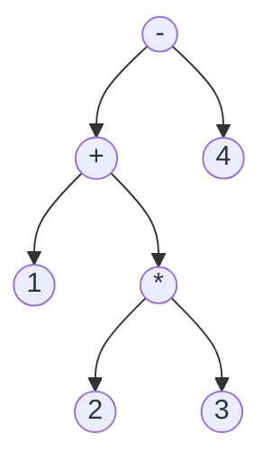

可以看到，运算符优先级越高，那么运算符节点的位置就越低。要想计算一个算术节点，我们就需要知道它的子树的数值，所以我们必须先计算子树的结果。这意味着要从叶节点一直计算到根节点—也就是 **后序** 遍历。计算过程如下：

1. 首先计算`2 * 3`这个子树，计算完以后，树形结构变成了：


2. 接下来计算`1 + 6`这个子树，计算完以后，树形结构变成了：

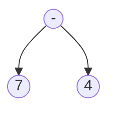

3. 接下来计算`7 - 4`这个子树，计算完以后，树形结构变成了，也就是最终的计算结果。


当我们看着抽象语法树计算表达式时，我们是自底向上计算的，因为越接近底部的运算符优先级就越高，所以是 **后序遍历** 。我们可以再看一些四则运算表达式的抽象语法树表示：

`1 + 2`

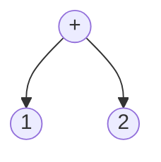

`1+2*3`

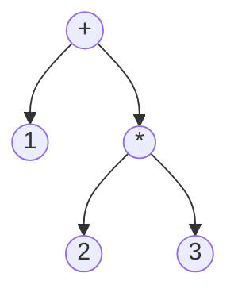

`(1+2)*3`

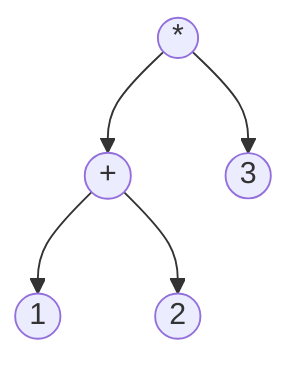

`1+2+3`

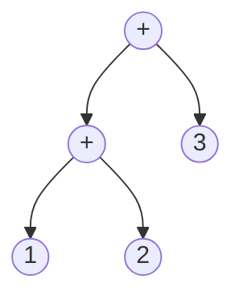

我们现在大致了解了抽象语法树的概念，那么我们应该怎么使用代码表示上面的抽象语法树，然后来进行计算呢？下面我们就使用$Java$代码来实现表达式的抽象语法树的求值，将人脑中的计算过程转化成代码：

> 创建新文件`Expr.java`

```java
package com.atguigu;

public abstract class Expr {
}
```

这是一个抽象类，用来表示表达式。而每种具体的表达式类型需要继承`Expr`类。下面我们再定义一个二元表达式的数据结构：

> 创建新文件`Binary.java`

```java
package com.atguigu;

public class Binary extends Expr {
    public final Expr left;      // 二元表达式左侧的表达式
    public final Token operator; // 运算符
    public final Expr right;     // 二元表达式右侧的表达式

    public Binary(Expr left, Token operator, Expr right) {
        this.left = left;
        this.operator = operator;
        this.right = right;
    }
}
```

这里要注意的一点是，二元运算符的左侧和右侧都是表达式，例如`(1 + 2) * 3`的`*`的左侧的表达式是`1 + 2`，右侧的表达式是`3`。

我们现在可以表示二元表达式，那么数值表达式，也就是`1`这样的表达式应该如何构建数据结构呢？

> 创建新文件`Literal.java`

```java
package com.atguigu;

public class Literal extends Expr {
    public final Object value;

    public Literal(Object value) {
        this.value = value;
    }
}
```

现在我们就可以使用以上定义的几个数据结构来表示四则运算的抽象语法树了。表示出抽象语法树，我们就可以对抽象语法树进行求值了。例如`(1+2)*3`的求值程序如下：

```java
package com.atguigu;

public class TestAstCalc {
    public static void main(String[] args) {
        // (1+2)*3
        Expr ast = new Binary(
                new Binary(
                        new Literal(1),
                        new Token(TokenType.PLUS, null, null, 0),
                        new Literal(2)
                ),
                new Token(TokenType.STAR, null, null, 0),
                new Literal(3)
        );

        System.out.println(evaluate(ast));
    }

    public static Integer evaluate(Expr node) {
        // 如果遍历到叶子节点，也就是数值，直接返回
        if (node instanceof Literal) {
            return (int) ((Literal) node).value;
        } else if (node instanceof Binary) {
            // 先遍历左子树
            Integer l = evaluate(((Binary) node).left);
            // 再遍历右子树
            Integer r = evaluate(((Binary) node).right);
            // 遍历根节点，判断根节点运算符的类型，并计算。
            if (((Binary) node).operator.type == TokenType.PLUS) {
                return l + r;
            } else if (((Binary) node).operator.type == TokenType.STAR) {
                return l * r;
            }
        }
        return null;
    }
}
```

注意，我们在代码中不能直接将`1+2`的左子树节点写成`1`,因为`1`也是树型结构中的节点，所以需要写成`new Literal(1)`。然后我们在求值时，对抽象语法树进行后序遍历，就可以求值出结果为`9`。

好，现在的问题来了。我们如何将已经生成的标记（$token$）序列，转换成抽象语法树呢？也就是如何将`(1+2)*3`的标记序列：

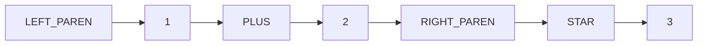

转换成如下树形结构呢？


所以我们要开始介绍上下文无关文法了。

## $3.2$ 上下文无关文法

> 上下无关文法：$Context \; Free \; Grammar$，$CFG$

在上一章中，我们用来定义词法语法（字符如何被分组为词法标记的规则）的形式体系，被称为 **正则语言** 。这对于我们的词法分析器来说没什么问题，因为它输出的是一个扁平的词法标记序列。但正则语言还不够强大，无法处理可以任意深度嵌套的表达式。

> 例如，使用正则表达式无法检测括号匹配问题。

### $3.2.1$ 文法规则

我们还需要一个更强大的工具，就是 **上下文无关文法** 。不要被这个名词吓到，其实它并不难理解，就是定义了语言的语法规则而已。例如，我们可以举一个简单的例子，就是数字的加法的文法表示：

```js
expression = number "+" number ;
number     = "0" ... "9" ;
```

那么上面的文法就是规定了`1 + 2`，`5 + 8`这样的表达式的文法。

| `expression` | `number` | `+`  | `number` |
| ------------ | -------- | ---- | -------- |
| `1 + 2`      | `1`      | `+`  | `1`      |

那么多个数的加法的文法如何表示呢？例如：`1 + 2 + 3 + 4`。可以如下表示:

```js
expression = number ( "+" number )* ;
number     = "0"..."9" ;
```

文法中的`*`号是匹配`0`次或者`1`次或者多次的意思，也就是正则表达式的语法。

`1`这个数值表达式就是匹配$0$次的情况。`1+2`这个表达式就是匹配$1$次的情况。`1+2+3`这个表达式就是匹配$2$次的情况。

在学术上，`expression`叫做 **非终结符** 。因为`expression`右边的`number`还可以继续展开。而`number`就是 **终结符** 了，因为`number`的右边已经没有需要继续展开的符号了。

而以上描述语言的文法的方式叫做$EBNF$（扩展的巴克斯范式）。

我们现在来看一下如何使用$EBNF$来分析一个表达式`1+2+3`，由于`1+2+3`这个字符串显然无法匹配`number`规则，所以需要匹配`expression`非终结符。

```
   1 + 2 + 3
-> expression
-> "1" ( "+" number )*
-> "1" "+" "2" ( "+" number)*
-> "1" "+" "2" "+" "3"
```

这样展开，就匹配成功了，说明`1+2+3`表达式符合我们所定义的语法。而`1+2-3`就不符合我们的语法了。我们可以将展开的过程表达为一颗树：

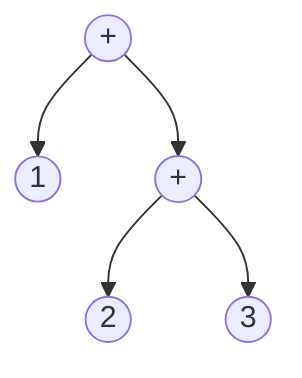

在这个过程中，我们可以看到，每碰到一个数值，就作为叶子节点，每碰到一个运算符，就作为内部节点。

### $3.2.2$ $EBNF$中的正则符号

我们引入了几个正则表达式中的符号，来方便编写语言的语法。

- `|`符号表示或者。下面的语法表示`digit`是`0`、`1`、`2`这三个字符中的一个。

  ```js
  digit = "0" | "1" | "2" ;
  ```

- 此外，我们允许用括号进行分组，然后在分组中可以用`|`表示从一系列生成式中选择一个。

  ```js
  number = ( "-" | "+" ) "1" ;
  ```

- 使用递归来支持符号的重复序列有一定的吸引力，但每次我们要循环的时候，都要创建一个单独的命名子规则，有点繁琐。所以，我们也使用后缀`*`来允许前一个符号或组重复零次或多次。以下是一般编程语言中标识符（变量名，函数名之类的）的语法规则，可以匹配`"a"`，`"a_1"`这样的标识符。

  ```js
  identifier = alpha ( alpha | number )* ;
  alpha      = "a" ... "z" | "A" ... "Z" | "_" ;
  number     = "0" ... "9" ;
  ```

- 后缀`+`与此类似，但要求前面的生成式至少出现一次。

  ```js
  crispiness → "really"+ ;
  ```

- 后缀`?`表示可选生成式，它之前的生成式可以出现零次或一次，但不能出现多次。以下的语法可以表示`1`、`-1`和`+1`这三个字符串。

  ```js
  number = ( "-" | "+" )? "1" ;
  ```

我们现在可以来举一个复杂一点的文法，来研究一下。这个文法定义了包含乘法和加法的表达式语法。

```js
expression = term ( "+" term)* ;
term       = NUMBER ( "*" NUMBER)* ;
NUMBER     = DIGIT+ ( "." DIGIT+ )? ;
DIGIT      = "0" ... "9" ;
```

想出这个文法并不容易，因为我们要在文法中体现乘法的优先级比加法要高。所以多看编程语言的文法会有助于我们设计自己的各种类型的语言。我们在文法中，先将`expression`展开成加法操作，然后再将`term`展开成乘法的操作，先加法后乘法，这样优先级就可以得到保证了。

我们来举个例子，`1 + 2 * 3`表达式，看看这个表达式是否符合我们定义的文法。第一个`term`是`1`，第二个`term`是`2 * 3`，那么通过推导，我们可以形成一棵树：


如果我们使用后序遍历的方式，可以正确的进行求值。而如果将文法定义成以下错误的文法：

```js
expression = term ( "*" term)* ;
term       = NUMBER ( "+" NUMBER)* ;
NUMBER     = DIGIT+ ( "." DIGIT+ )? ;
DIGIT      = "0" ... "9" ;
```

那么形成的树形结构是：


这样优先级就不对了，计算出来的结果当然也是不对的。

接下来，我们将使用这种表示法来精确地描述Lox语言的语法。当我们在使用编程语言时，会发现上下文无关的文法（例如$EBNF$）可以帮助我们将非正式的语法设计思想具体化。

### $3.2.3$ Lox表达式语法

我们将在接下来的几章中摸索Lox语言的一个子集，也就是从一个语言的子集开始设计，然后慢慢扩充语言的功能。一旦我们可以对这个小型语言进行表示、语法分析和解释执行，那么在之后的章节中将逐步为它添加新的特性，包括新的语法。现在，我们只关心几个表达式：

- **字面量**。数字、字符串、布尔值以及`nil`。

- **一元表达式**。前缀`!`执行逻辑非运算，`-`对数字求反。

- **二元表达式**。我们已经知道的中缀算术符（`+`，`-`，`*`，`/`）和逻辑运算符（`==`，`!=`，`<`，`<=`，`>`，`>=`）。

- **括号**。表达式前后的一对`(`和`)`。

这已经为表达式提供了足够的语法，例如：

```
1 - (2 * 3) < 4 == false
```

使用我们的新符号，下面是语法的表示：

```js
expression     = literal
               | unary
               | binary
               | grouping ;

literal        = NUMBER | STRING | "true" | "false" | "nil" ;
grouping       = "(" expression ")" ;
unary          = ( "-" | "!" ) expression ;
binary         = expression operator expression ;
operator       = "==" | "!=" | "<" | "<=" | ">" | ">="
               | "+"  | "-"  | "*" | "/" ;
```

`NUMBER`是任何数字字面量，`STRING`是任何字符串字面量。稍后，我们将对`IDENTIFIER`进行同样的处理。

这个定义的文法其实是有歧义的，我们在解析的时候就明白了。

## $3.3$ 实现语法树

最后，我们要写一些代码。这个小小的表达式语法就是我们的骨架。由于语法是递归的—请注意`grouping`，`unary`，和`binary`都是指回`expression`的—我们的数据结构将形成一棵树。因为这个结构代表了我们语言的语法，所以叫做**抽象语法树**。我们之前已经定义过几种抽象语法树的节点类型了。

`Expr`是所有表达式类继承的基类。例如`Binary`类和`Literal`类都继承了`Expr`基类。

接下来我们定义其它节点类型，我们先来定义一元运算符所对应的`Unary`类。

> 创建新文件`Unary.java`

```java
package com.atguigu;

public class Unary extends Expr {
    public final Token operator;
    public final Expr right;

    public Unary(Token operator, Expr right) {
        this.operator = operator;
        this.right = right;
    }
}
```

一元运算符只有一个`right`表达式，表示一元运算符右边的表达式。

我们再来定义用括号扩起来的表达式的类`Grouping`，来表示这样的表达式：`(1 + 2)`，可以看到括号里面有一个表达式。

> 创建新文件`Grouping.java`

```java
package com.atguigu;

public class Grouping extends Expr {
    public final Expr expression;

    public Grouping(Expr expression) {
        this.expression = expression;
    }
}
```

这个类只有一个字段，就是括号中间的那个表达式。

## $3.3$ 处理抽象语法树结构

我们上面已经写过一个小程序来展示如何对抽象语法树进行求值，而这其实就是解释器处理抽象语法树的方式。Lox中的每种表达式在运行时的行为都不一样。这意味着解释器需要选择不同的代码块来处理每种表达式类型。

我们可以编写一长串类型测试来完成对抽象语法树的处理。

```java
if (expr instanceof Binary) {
  // ...
} else if (expr instanceof Grouping) {
  // ...
} else // ...
```

## $3.4$ 打印抽象语法树

当我们调试语法分析器和解释器时，查看语法分析后的抽象语法树并确保其与期望的结构一致通常是很有用的。我们可以在调试器中进行检查，但那可能有点难。

相反，我们需要一些代码，在给定抽象语法树的情况下，生成一个明确的字符串表示。

我们希望字符串非常明确地显示树的嵌套结构。如果我们要调试的是操作符的优先级是否处理正确，那么返回`1 + 2 * 3`的打印器并没有什么用，我们想知道`+`或`*`是否在语法树的顶部。

因此，我们生成的字符串表示形式不是Lox语言的语法。因为我们会把每个表达式都用括号扩起来，并且它的所有子表达式和词法标记都包含在其中。

给定一个语法树，如：

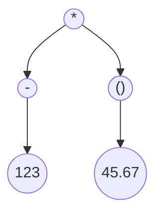


输出结果为：

```js
(* (- 123) (group 45.67))
```

打印结果明确地展示了嵌套和分组。对优先级展示的也很好。运算符越靠前，优先级越低。为了实现这一点，我们定义了一个新类。

> 创建新文件`AstPrinter.java`

```java
package com.atguigu;

// 注意在这个程序中，printExpr和parenthesize是互相递归调用的。
public class AstPrinter {
    public String printExpr(Expr expr) {
        if (expr instanceof Binary) {
            // 二元表达式的字符串输出格式
            // 用括号括起来
            // 先打印运算符，再打印运算符左边和右边的表达式
            // 1 + 2 --> (+ 1 2)
            // 1 + 2 * 3 --> (+ 1 (* 2 3))
            return parenthesize(
                    ((Binary) expr).operator.lexeme,
                    ((Binary) expr).left,
                    ((Binary) expr).right
            );
        } else if (expr instanceof Grouping) {
            return parenthesize(
                    "group",
                    ((Grouping) expr).expression
            );
        } else if (expr instanceof Unary) {
            return parenthesize(
                    ((Unary) expr).operator.lexeme,
                    ((Unary) expr).right
            );
        } else if (expr instanceof Literal) {
            if (((Literal) expr).value == null) return "nil";
            return ((Literal) expr).value.toString();
        }
        return null;
    }

    // 将表达式用括号括起来打印
    private String parenthesize(String name, Expr... exprs) {
        StringBuilder builder = new StringBuilder();

        builder.append("(").append(name);
        for (Expr expr : exprs) {
            builder.append(" ");
            // 注意！这里有递归调用，因为我们要括起来的是
            // 表达式的字符串
            builder.append(printExpr(expr));
        }
        builder.append(")");

        return builder.toString();
    }

    public static void main(String[] args) {
        Expr expression = new Binary(
                new Unary(
                        new Token(TokenType.MINUS, "-", null, 1),
                        new Literal(123)),
                new Token(TokenType.STAR, "*", null, 1),
                new Grouping(
                        new Literal(45.67)));

        System.out.println(new AstPrinter().printExpr(expression));
    }
}
```

我们还没有语法分析器，所以很难看到它的实际应用。现在，我们先使用一个`main()`方法来手动实例化一个树并打印它。这个表达式是：`-123 * (45.67)`。

> 在`AstPrinter.java`文件中，在`parenthesize()`方法后添加

```java
  public static void main(String[] args) {
    Expr expression = new Binary(
        new Unary(
            new Token(TokenType.MINUS, "-", null, 1),
            new Literal(123)),
        new Token(TokenType.STAR, "*", null, 1),
        new Grouping(
            new Literal(45.67)));

    System.out.println(new AstPrinter().print(expression));
  }
```

如果我们都做对了，它就会打印：

```js
(* (- 123) (group 45.67))
```

# $4$ 对表达式进行语法分析

由于我们已经定义好了表达式的抽象语法树节点，也熟悉了上下无关文法，所以本章的目标就是将标记序列转换成一颗抽象语法树。

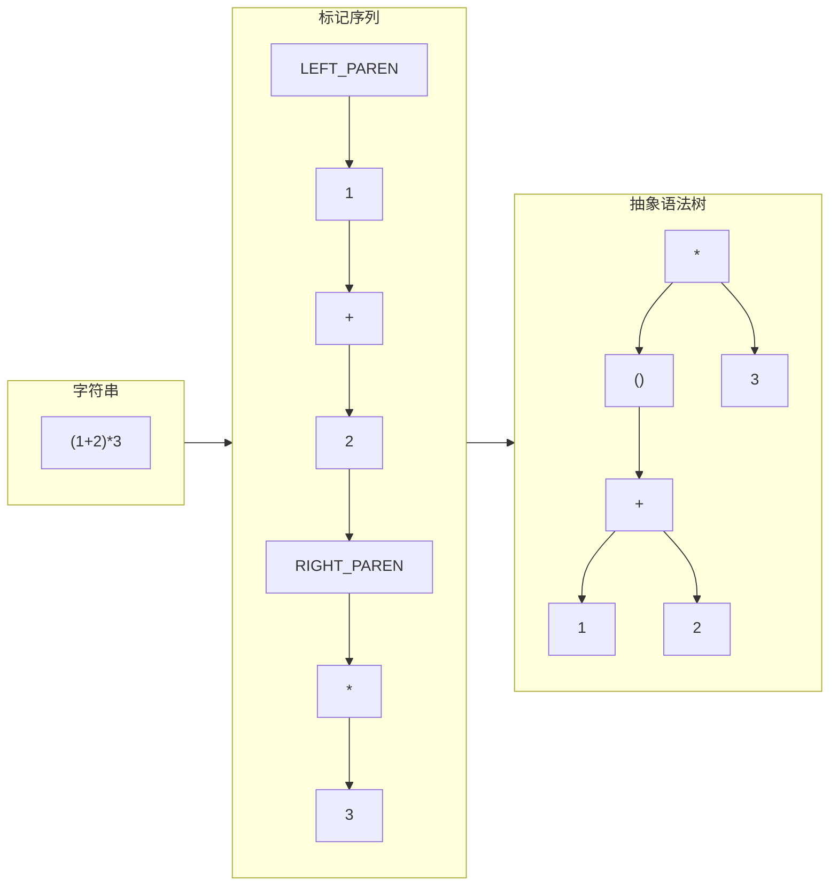

## $4.1$ 文法的歧义

我们完全有可能创建一个 **模棱两可** 的语法。

在语法分析时，歧义意味着语法分析器可能会误解用户的代码。当我们进行语法分析时，我们不仅要确定字符串是不是有效的Lox代码，还要记录哪些规则与代码的哪些部分相匹配，以便我们知道每个标记属于语言的哪一部分。下面是我们在上一章整理的Lox表达式语法：

```js
expression     = literal
               | unary
               | binary
               | grouping ;

literal        = NUMBER | STRING | "true" | "false" | "nil" ;
grouping       = "(" expression ")" ;
unary          = ( "-" | "!" ) expression ;
binary         = expression operator expression ;
operator       = "==" | "!=" | "<" | "<=" | ">" | ">="
               | "+"  | "-"  | "*" | "/" ;
```

下面是一个满足语法的有效字符串`6/3-1`：

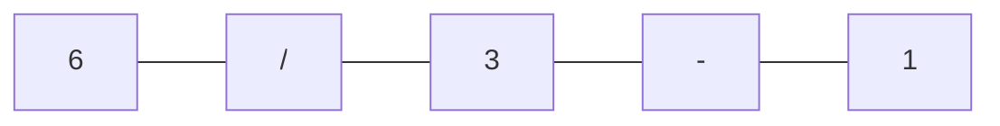

但是，有两种方式可以生成该字符串。其一是：

1. 从`expression`开始，选择`binary`。
2. 对于左边的`expression`，选择`NUMBER`，并且使用`6`。
3. 对于运算符，选择`/`。
4. 对于右边的`expression`，再次选择`binary`。
5. 在内层的`binary` 表达式中，选择`3-1`。

其二是：

1. 从`expression`开始，选择`binary`。
2. 对于左边的`expression`，再次选择`binary`。
3. 在内层的`binary` 表达式中，选择`6/3`。
4. 返回外层的`binary` ，对于运算符，选择`-`。
5. 对于右边的`expression`，选择`NUMBER`，并且使用`1`。

它们产生相同的字符串，但对应的是不同的 **抽象语法树** ：

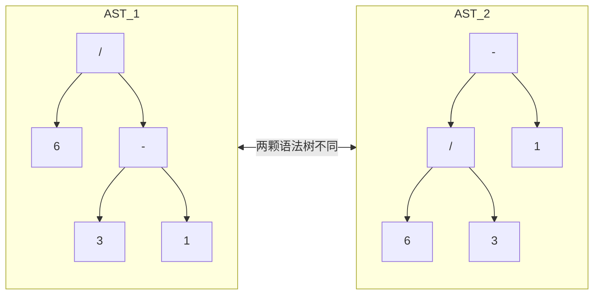

显然，两颗语法树的计算结果是不一样的。

换句话说，这个语法可以将该表达式看作是 `(6 / 3) - 1`或`6 / (3 - 1)`。`binary` 规则运行操作数以任意方式嵌套，这反过来又会影响解析数的计算结果。自从黑板被发明以来，数学家们解决这种模糊性的方法就是定义优先级和结合性规则。

- **优先级**决定了在一个包含不同运算符的混合表达式中，哪个运算符先被执行。优先级规则告诉我们，在上面的例子中，我们在`-`之前先计算`/`。优先级较高的运算符在优先级较低的运算符之前计算。同样，优先级较高的运算符被称为 **更严格的绑定** 。

- **结合性**决定在一系列相同运算符中先计算哪个运算符。如果一个操作符是**左结合**的（可以认为是“从左到右”）时，左边的操作符在右边的操作符之前计算。因为`-`是左结合的，下面的表达式：

  ```java
  5 - 3 - 1
  ```

  等价于：

  ```java
  (5 - 3) - 1
  ```

  另一方面，赋值是**右结合**的。如：

  ```java
  a = b = c
  ```

  等价于：

  ```java
  a = (b = c)
  ```

如果没有明确定义的优先级和结合性，使用多个运算符的表达式可能就会变得有歧义—它可以被解析为不同的抽象语法树，而这些抽象语法树又可能会计算出不同的结果。我们在Lox中会解决这个问题，使用与JS语言相同的优先级规则，从低到高分别是：

| 运算符名称   | 运算符            | 结合性 |
| ------------ | ----------------- | ------ |
| 判断是否相等 | `==` `!=`         | 左结合 |
| 比较运算符   | `>` `>=` `<` `<=` | 左结合 |
| 加减运算符   | `-` `+`           | 左结合 |
| 乘除运算符   | `/` `*`           | 左结合 |
| 一元运算符   | `!` `-`           | 右结合 |

现在，该语法将所有表达式类型都添加到一个 `expression`规则中。这条规则同样作用于操作数中的非终结符，这使得语法中可以接受任何类型的表达式作为子表达式，而不管优先级规则是否允许。

我们通过对语法进行分层来解决这个问题。我们为每个优先级定义一个单独的规则。

```js
expression     = ...
equality       = ...
comparison     = ...
term           = ...
factor         = ...
unary          = ...
primary        = ...
```

此处的每个规则仅匹配其当前优先级或更高优先级的表达式。 例如，`unary` 匹配一元表达式（如 `!negated`）或`primary`表达式（如`1234`）。`term`可以匹配`1 + 2`，但也可以匹配`3 * 4 /5`。最后的`primary` 规则涵盖优先级最高的形式—字面量和括号表达式。

我们只需要填写每条规则的生成式。我们先从简单的开始。顶级的`expression` 规则可以匹配任何优先级的表达式。由于`equality`的优先级最低，只要我们匹配了它，就涵盖了一切。

```
expression     = equality
```

在优先级表的另一端，`primary`表达式包括所有的字面量和分组表达式。

```js
primary        = NUMBER | STRING | "true" | "false" | "nil"
               | "(" expression ")" ;
```

一元表达式以一元运算符开头，后跟操作数。因为一元运算符可以嵌套—`!!true`虽奇怪也是可用的表达式—这个操作数本身可以是一个一元表达式。递归规则可以很好地解决这个问题。

```js
unary          = ( "!" | "-" ) unary ;
```

但是这条规则有一个问题，它永远不会终止。

请记住，每个规则都需要匹配该优先级或更高优先级的表达式，因此我们还需要使其与`primary`表达式匹配。

```js
unary          = ( "!" | "-" ) unary
               | primary ;
```

这样就可以了。

剩下的规则就是二元运算符。我们先从乘法和除法的规则开始。下面是第一次尝试：

```js
factor         = factor ( "/" | "*" ) unary
               | unary ;
```

该规则递归匹配左操作数，这样一来，就可以匹配一系列乘法和除法表达式，例如 `1 * 2 / 3`。将递归生成式放在左侧并将`unary` 放在右侧，可以使该规则具有左结合性和明确性。

所有这些都是正确的，但规则主体中的第一个符号与规则头部相同意味着这个生成式是**左递归**的。一些语法分析技术，包括我们将要使用的语法分析技术，在处理左递归时会遇到问题。（其他地方的递归，比如在`unary`中，以及在`primary`分组中的间接递归都不是问题。）

我们可以定义很多符合同一种语言的语法。如何对某一特定语言进行建模，一部分是品味问题，一部分是实用主义问题。这个规则是正确的，但对于我们后续的语法分析来说它并不是最优的。我们将使用不同的规则来代替左递归规则。

```js
factor         = unary ( ( "/" | "*" ) unary )* ;
```

我们将`factor`表达式定义为乘法和除法的扁平 **序列** 。这与前面的规则语法相同，但更好地反映了我们将编写的解析Lox语言的代码。我们对其它二元运算符的优先级使用相同的结构，从而得到下面这个完整的表达式语法：

```js
expression     = equality ;
equality       = comparison ( ( "!=" | "==" ) comparison )* ;
comparison     = term ( ( ">" | ">=" | "<" | "<=" ) term )* ;
term           = factor ( ( "-" | "+" ) factor )* ;
factor         = unary ( ( "/" | "*" ) unary )* ;
unary          = ( "!" | "-" ) unary
               | primary ;
primary        = NUMBER | STRING | "true" | "false" | "nil"
               | "(" expression ")" ;
```

这个语法比我们以前的那个更复杂，但反过来我们也消除了前一个语法定义中的歧义。这正是我们制作语法分析器时所需要的。

## $4.2$ 递归下降算法

递归下降被认为是一种**自顶向下解析器**，因为它从最顶部或最外层的语法规则(这里是`expression`)开始，一直向下进入嵌套子表达式，最后到达语法树的叶子。

递归下降解析器是一种将语法规则直接翻译成命令式代码的文本翻译器。每个规则都会变成一个函数，规则主体翻译成代码大致是这样的：

| Grammar notation | Code representation    |
| ---------------- | ---------------------- |
| 终结符           | 匹配并消费一个词法标记 |
| 非终结符         | 调用规则对应的函数     |
| `|`              | `if`或`switch`语句     |
| `*` 或者 `+`     | `while`或`for`循环     |
| `?`              | `if`语句               |

下降被“递归”修饰是因为，如果一个规则引用自身（直接或间接）就会变为递归的函数调用。

### $4.2.1$ $Parser$类

每个语法规则都成为新类中的一个方法:

> 创建新文件`Parser.java`

```java
package com.atguigu;

import java.util.List;

import static com.atguigu.TokenType.*;

public class Parser {
  private final List<Token> tokens;
  private int current = 0;

  public Parser(List<Token> tokens) {
    this.tokens = tokens;
  }
}
```

与词法分析器一样，语法分析器也是消费一个扁平的输入序列，只是这次我们要读取的是词法标记而不是字符。我们会保存标记列表并使用`current`指向待解析的下一个标记。

我们现在要直接执行表达式语法，并将每一条规则翻译为$Java$代码。第一条规则`expression`，简单地展开为`equality`规则，所以很直接：

> 在`Parser.java`文件中，在`Parser()`方法后添加

```java
  private Expr expression() {
    return equality();
  }
```

每个解析语法规则的方法都会生成该规则对应的语法树，并将其返回给调用者。当规则主体中包含一个非终结符—对另一条规则的引用时，我们就会调用另一条规则对应的方法。

等式规则有一点复杂：

```js
equality       = comparison ( ( "!=" | "==" ) comparison )* ;
```

在$Java$中，这会变成：

> 在`Parser.java`文件中，在`expression()`后面添加

```java
  private Expr equality() {
    Expr expr = comparison();

    while (match(BANG_EQUAL, EQUAL_EQUAL)) {
      Token operator = previous();
      Expr right = comparison();
      expr = new Binary(expr, operator, right);
    }

    return expr;
  }
```

让我们一步步来。规则体中的第一个`comparison`非终结符变成了方法中对 `comparison()`的第一次调用。我们获取结果并将其保存在一个局部变量中。

然后，规则中的`( ... )*`循环映射为一个`while`循环。我们需要知道何时退出这个循环。可以看到，在规则体中，我们必须先找到一个` !=` 或` == `标记。因此，如果我们 **没有** 看到其中任一标记，我们必须结束相等（不相等）运算符的序列。我们使用一个方便的`match()`方法来执行这个检查。

> 在`Parser.java`文件中，在`equality()`方法后添加

```java
  private boolean match(TokenType... types) {
    for (TokenType type : types) {
      if (check(type)) {
        advance();
        return true;
      }
    }

    return false;
  }
```

这个检查会判断当前的标记是否属于给定的类型之一。如果是，则消费该标记并返回`true`；否则，就返回`false`并保留当前标记。`match()`方法是由两个更基本的操作来定义的。

如果当前标记属于给定类型，则`check()`方法返回`true`。与`match()`不同的是，它从不消费标记，只是读取。

> 在`Parser.java`文件中，在`match()`方法后添加

```java
  private boolean check(TokenType type) {
    if (isAtEnd()) return false;
    return peek().type == type;
  }
```

`advance()`方法会消费当前的标记并返回它，类似于词法分析器中对应方法处理字符的方式。

> 在`Parser.java`文件中，在`check()`方法后添加

```java
  private Token advance() {
    if (!isAtEnd()) current++;
    return previous();
  }
```

这些方法最后都归结于几个基本操作。

> 在`Parser.java`文件中，在`advance()`后添加

```java
  private boolean isAtEnd() {
    return peek().type == EOF;
  }

  private Token peek() {
    return tokens.get(current);
  }

  private Token previous() {
    return tokens.get(current - 1);
  }
```

`isAtEnd()`检查我们是否处理完了待解析的标记。`peek()`方法返回我们还未消费的当前标记，而`previous()`会返回最近消费的标记。后者让我们更容易使用`match()`，然后访问刚刚匹配的标记。

这就是我们需要的大部分解析基本工具。我们说到哪里了？对，如果我们在`equality()`的`while`循环中，也就能知道我们已经找到了一个`!=`或`==`操作符，并且一定是在解析一个等式表达式。

我们获取到匹配的操作符标记，这样就可以知道我们要处理哪一类等式表达式。之后，我们再次调用`comparison()`解析右边的操作数。我们将操作符和它的两个操作数组合成一个新的`Binary`语法树节点，然后开始循环。对于每一次迭代，我们都将结果表达式存储在同一个`expr`局部变量中。在对等式表达式序列进行压缩时，会创建一个由二元操作符节点组成的左结合嵌套树。

一旦解析器遇到一个不是等式操作符的标记，就会退出循环。最后，它会返回对应的表达式。请注意，如果解析器从未遇到过等式操作符，它就永远不会进入循环。在这种情况下，`equality()`方法有效地调用并返回`comparison()`。这样一来，这个方法就会匹配一个等式运算符或 **任何更高优先级的表达式** 。

继续看下一个规则。

```js
comparison     = term ( ( ">" | ">=" | "<" | "<=" ) term )* ;
```

翻译成$Java$：

> 在`Parser.java`文件中，在`equality()`方法后添加

```java
  private Expr comparison() {
    Expr expr = term();

    while (match(GREATER, GREATER_EQUAL, LESS, LESS_EQUAL)) {
      Token operator = previous();
      Expr right = term();
      expr = new Binary(expr, operator, right);
    }

    return expr;
  }
```

语法规则与`equality`几乎完全相同，相应的代码也是如此。唯一的区别是匹配的操作符的标记类型，而且现在获取操作数时调用的方法是`term()`而不是`comparison()`。其余两个二元运算符规则遵循相同的模式。

按照优先级顺序，先做加减法：

> 在`Parser.java`文件中，在`comparison()`方法后添加

```java
  private Expr term() {
    Expr expr = factor();

    while (match(MINUS, PLUS)) {
      Token operator = previous();
      Expr right = factor();
      expr = new Binary(expr, operator, right);
    }

    return expr;
  }
```

最后，是乘除法：

> 在`Parser.java`文件中，在`term()`方法后面添加

```java
  private Expr factor() {
    Expr expr = unary();

    while (match(SLASH, STAR)) {
      Token operator = previous();
      Expr right = unary();
      expr = new Binary(expr, operator, right);
    }

    return expr;
  }
```

这就是所有的二元运算符，已经按照正确的优先级和结合性进行了语法分析。接下来，按照优先级层级，我们要处理一元运算符了。

```js
unary          = ( "!" | "-" ) unary
               | primary ;
```

该规则对应的代码有些不同。

> 在`Parser.java`文件中，在`factor()`方法后添加

```java
  private Expr unary() {
    if (match(BANG, MINUS)) {
      Token operator = previous();
      Expr right = unary();
      return new Unary(operator, right);
    }

    return primary();
  }
```

同样的，我们先检查当前的标记以确认要如何进行语法分析。如果是`!`或`-`，我们一定有一个一元表达式。在这种情况下，我们获取标记，然后递归调用`unary()`来解析操作数。将所有这些都包装到一元表达式语法树中，我们就完成了。

否则，我们就达到了最高级别的优先级，即基本表达式。

```js
primary        = NUMBER | STRING | "true" | "false" | "nil"
               | "(" expression ")" ;
```

该规则中大部分都是终结符，可以直接进行解析。

> 在`Parser.java`文件中，在`unary()`方法后添加

```java
  private Expr primary() {
    if (match(FALSE)) return new Literal(false);
    if (match(TRUE)) return new Literal(true);
    if (match(NIL)) return new Literal(null);

    if (match(NUMBER, STRING)) {
      return new Literal(previous().literal);
    }

    if (match(LEFT_PAREN)) {
      Expr expr = expression();
      consume(RIGHT_PAREN, "表达式后面必须有右括号')'存在。");
      return new Grouping(expr);
    }
  }
```

当我们匹配了一个开头`(`并解析了里面的表达式后，我们必须找到一个`)`标记。如果没有找到，那就是一个错误。

## $4.3$ 语法分析器的错误处理

语法分析器实际上有两项工作：

1. 给定一个 **有效** 的标记序列，生成相应的语法树。

2. 给定一个 **无效** 的标记序列，检测错误并告知用户。

当解析器遇到语法错误时，有几个硬性要求。解析器必须能够：

- **检测并报告错误。**如果它没有检测到错误，并将由此产生的畸形语法树传递给解释器，就会出现各种可怕的情况。

- **避免崩溃或挂起。**语法错误是生活中不可避免的事实，面对语法错误，语言工具必须非常健壮。段错误或陷入无限循环是不允许的。虽然源代码可能不是有效的*代码*，但它仍然是*解析器的有效输入*，因为用户使用解析器来了解什么是允许的语法。

在我们讨论错误恢复之前，我们正在编写解析括号表达式的代码。在解析表达式之后，会调用`consume()`方法查找收尾的`)`。这里，终于可以实现那个方法了：

> 在`Parser.java`文件中，在`match()`方法后添加

```java
  private Token consume(TokenType type, String message) {
    if (check(type)) return advance();

    throw error(peek(), message);
  }
```

它和 `match() `方法类似，检查下一个标记是否是预期的类型。如果是，它就会消费该标记，一切都很顺利。如果是其它的标记，那么我们就遇到了错误。我们通过调用下面的方法来报告错误：

> 在`Parser.java`文件中，在`previous()`方法后添加

```java
  private ParseError error(Token token, String message) {
    Atguigu.error(token, message);
    return new ParseError();
  }
```

首先，通过调用下面的方法向用户展示错误信息：

> 在`Atguigu.java`文件中，在`report()`方法后添加

```java
  public static void error(Token token, String message) {
    if (token.type == TokenType.EOF) {
      report(token.line, "结尾", message);
    } else {
      report(token.line, " 位于 '" + token.lexeme + "'", message);
    }
  }
```

该方法会报告给定标记处的错误。它显示了标记的位置和标记本身。这在以后会派上用场，因为我们在整个解释器中使用标记来跟踪代码中的位置。

在我们报告错误后，用户知道了他们的错误，但接下来解析器要做什么呢？回到`error()`方法中，我们创建并返回了一个`ParseError`，是下面这个新类的实例：

> 在`Parser.java`文件中，在`Parser`中嵌入内部类

```java
public class Parser {  
    // 新增部分开始
    private static class ParseError extends RuntimeException {}
    // 新增部分结束
    private final List<Token> tokens;
```

这是一个简单的哨兵类，我们用它来帮助解析器摆脱错误。

## $4.4$ 调整语法分析器

我们现在基本上已经完成了对表达式的解析。我们还需要在另一个地方添加一些错误处理。当解析器在每个语法规则的解析方法中下降时，它最终会进入`primary()`。如果该方法中的$case$都不匹配，就意味着我们正面对一个不是表达式开头的标记。我们也需要处理这个错误。

> 在`Parser.java`文件中，在`primary()`方法中添加

```java
    if (match(LEFT_PAREN)) {
      Expr expr = expression();
      consume(RIGHT_PAREN, "表达式后面必须有右括号')'存在。");
      return new Grouping(expr);
    }
    // 新增部分开头
    throw error(peek(), "这里应该是一个表达式。");
    // 新增部分结束
  }
```

这样，解析器中剩下的工作就是定义一个初始方法来启动它。这个方法自然应该叫做`parse()`。

> 在`Parser.java`文件中，在`Parser()`方法后添加

```java
  public Expr parse() {
    try {
      return expression();
    } catch (ParseError error) {
      return null;
    }
  }
```

稍后在向语言中添加语句时，我们将重新审视这个方法。目前，它只解析一个表达式并返回它。我们还有一些临时代码用于退出恐慌模式。语法错误恢复是解析器的工作，所以我们不希望ParseError异常逃逸到解释器的其它部分。

当确实出现语法错误时，该方法会返回`null`。这没关系。解析器承诺不会因为无效语法而崩溃或挂起，但它不承诺在发现错误时返回一个*可用的语法树*。一旦解析器报告错误，就会对`hadError`赋值，然后跳过后续阶段。

最后，我们可以将全新的解析器挂到`Atguigu.java`主类并进行试验。我们仍然还没有解释器，所以现在，我们将表达式解析为一个语法树，然后使用上一章中的`AstPrinter`类来显示它。

删除打印已扫描标记的旧代码，将其替换为：

> 在`Atguigu.java`文件中，在`run()`方法中，替换其中$5$行

```java
    List<Token> tokens = scanner.scanTokens();
    // 替换部分开始
    Parser parser = new Parser(tokens);
    Expr expression = parser.parse();

    // 如果停止，说明发生了语法错误。
    if (hadError) return;

    System.out.println(new AstPrinter().printExpr(expression));
    // 替换部分结束
  }
```

祝贺你，你已经跨过了门槛！这就是手写语法分析器的全部内容。我们将在后面的章节中扩展赋值、语句和其它特性对应的语法，但这些都不会比我们本章处理的二元操作符更复杂。

启动解释器并输入一些表达式。查看它是如何正确处理优先级和结合性的？这对于不到$200$行代码来说已经很不错了。

# $5$ 表达式求值

对于语言实现来说，有各种方式可以使计算机执行用户的源代码命令。它们可以将其编译为机器代码，将其翻译为另一种高级语言，或者将其还原为某种字节码格式，以便在虚拟机中执行。不过对于我们的第一个解释器，我们要选择最简单、最短的一条路，也就是执行语法树本身。

现在，我们的解释器只支持表达式。因此，为了“执行”代码，我们要计算一个表达式时并生成一个值。对于我们可以解析的每一种表达式语法—字面量，运算符等—我们都需要一个相应的代码块，该代码块知道如何计算该语法树并产生结果。这也就引出了两个问题：

1. 我们要生成什么类型的值？

2. 我们如何组织这些代码块？

## $5.1$ 值描述

在Lox中，值由字面量创建，由表达式计算，并存储在变量中。用户将其视作Lox对象，但它们是用编写解释器的底层语言实现的。这意味着要在Lox的动态类型和$Java$的静态类型之间架起桥梁。Lox中的变量可以存储任何（Lox）类型的值，甚至可以在不同时间存储不同类型的值。我们可以用什么$Java$类型来表示？

给定一个具有该静态类型的$Java$变量，我们还必须能够在运行时确定它持有哪种类型的值。当解释器执行 `+`运算符时，它需要知道它是在将两个数字相加还是在拼接两个字符串。有没有一种$Java$类型可以容纳数字、字符串、布尔值等等？有没有一种类型可以告诉我们它的运行时类型是什么？有的！就是老牌的`java.lang.Object`。

在解释器中需要存储Lox值的地方，我们可以使用`Object`作为类型。$Java$已经将其基本类型的所有子类对象装箱了，因此我们可以将它们用作Lox的内置类型：

| Lox中的类型   | $Java$表示 |
| ------------------- | ---------- |
| 任意Lox中的值 | `Object`   |
| `nil`               | `null`     |
| 布尔类型            | `Boolean`  |
| 数值类型            | `Double`   |
| 字符串类型          | `String`   |

给定一个静态类型为`Object`的值，我们可以使用$Java$内置的`instanceof`操作符来确定运行时的值是数字、字符串或其它什么。换句话说，$JVM$自己的对象表示方便地为我们提供了实现Lox内置类型所需的一切。当稍后添加Lox的函数、类和实例等概念时，我们还必须做更多的工作，但`Object`和基本类型的包装类足以满足我们现在的需要。

## $5.2$ 表达式求值

我们先创建一个新类。

> 创建新文件`Interpreter.java`

```java
package com.atguigu;

public class Interpreter {
}
```

### $5.2.1$ 字面量求值

一个表达式树的叶子节点（构成其它表达式的语法原子单位）是字面量。字面符号几乎已经是值了，但两者的区别很重要。字面量是产生一个值的语法单元。字面量总是出现在用户的源代码中的某个地方。而很多值是通过计算产生的，并不存在于代码中的任何地方，这些都不是字面量。字面量来自于解析器领域，而值是一个解释器的概念，是运行时世界的一部分。

因此，就像我们在解析器中将字面量*标记*转换为字面量*语法树节点*一样，现在我们将字面量树节点转换为运行时值。这其实很简单。

> 在`Interpreter.java`文件中，在`Interpreter`类中添加

```java
  public Object evaluateLiteralExpr(Literal expr) {
    return expr.value;
  }
```

我们早在扫描过程中就即时生成了运行时的值，并把它放进了语法标记中。解析器获取该值并将其插入字面量语法树节点中，所以要对字面量求值，我们只需把它存的值取出来。

### $5.2.2$ 括号求值

下一个要求值的节点是分组—在表达式中显式使用括号时产生的语法树节点。

> 在`Interpreter.java`文件中，在`Interpreter`类中添加

```java
  public Object evaluateGroupingExpr(Grouping expr) {
    return evaluate(expr.expression);
  }
```

一个分组节点中包含一个引用指向对应于括号内的表达式的内部节点。要想计算括号表达式，我们只需要递归地对子表达式求值并返回结果即可。

> 在`Interpreter.java`文件中，在`Interpreter`类中添加

```java
    private Object evaluate(Expr expr) {
        if (expr instanceof Literal) {
            return evaluateLiteralExpr((Literal) expr);
        } else if (expr instanceof Grouping) {
            return evaluateGroupingExpr((Grouping) expr);
        } else if (expr instanceof Unary) {
            return evaluateUnaryExpr((Unary) expr);
        } else if (expr instanceof Binary) {
            return evaluateBinaryExpr((Binary) expr);
        }

        return null;
    }
```

### $5.2.3$ 一元表达式求值

像分组表达式一样，一元表达式也有一个必须先求值的子表达式。不同的是，一元表达式自身在完成求值之后还会做一些工作。

> 在`Interpreter.java`文件中，在`evaluateLiteralExpr()`方法后添加

```java
  public Object evaluateUnaryExpr(Unary expr) {
    Object right = evaluate(expr.right);

    switch (expr.operator.type) {
      case MINUS:
        return -(double)right;
    }

    // Unreachable.
    return null;
  }
```

首先，我们计算操作数表达式，然后我们将一元操作符作用于子表达式的结果。我们有两种不同的一元表达式，由操作符标记的类型来区分。

这里展示的是`-`，它会对子表达式的结构取负。子表达式结果必须是数字。因为我们在$Java$中无法 **静态地** 知道这一点，所以我们在执行操作之前先对其进行强制转换。这个类型转换是在运行时对`-`求值时发生的。这就是将语言动态类型化的核心所在。

我们可以看到求值过程是如何递归遍历语法树的。在对一元运算符本身进行计算之前，我们必须先对其操作数子表达式求值。这表明，解释器正在进行**后序遍历**—每个节点在自己求值之前必须先对子节点求值。

另一个一元操作符是逻辑非。

> 在`Interpreter.java`文件中，在`evaluateUnaryExpr()`方法中添加

```java
		switch (expr.operator.type) { 
      // 新增部分开始  
			case BANG:
        return !isTruthy(right);
      // 新增部分结束
      case MINUS:
```

### $5.2.4$ 布尔类型

Lox语言遵循简单的规则：`false`和`nil`是 **假** ，其他都是 **真** 。我们是这样实现的：

> 在`Interpreter.java`文件中，在`evaluateUnaryExpr()`方法后添加

```java
  private boolean isTruthy(Object object) {
    if (object == null) return false;
    if (object instanceof Boolean) return (boolean)object;
    return true;
  }
```

### $5.2.5$ 二元运算符求值

来到最后的表达式树类—二元操作符，其中包含很多运算符，我们先从数学运算开始。

> 在`Interpreter.java`文件中，在`evaluate()`方法后添加

```java
  public Object evaluateBinaryExpr(Binary expr) {
    Object left = evaluate(expr.left);
    Object right = evaluate(expr.right); 

    switch (expr.operator.type) {
      case MINUS:
        return (double)left - (double)right;
      case SLASH:
        return (double)left / (double)right;
      case STAR:
        return (double)left * (double)right;
    }

    // Unreachable.
    return null;
  }
```

我想你能理解这里的实现。与一元取负运算符的主要区别是，我们有两个操作数要计算。

我漏掉了一个算术运算符，因为它有点特殊。

> 在`Interpreter.java`文件中，在`evaluateBinaryExpr()`方法中添加

```java
    switch (expr.operator.type) {
      case MINUS:
        return (double)left - (double)right;
      // 新增部分开始
      case PLUS:
        if (left instanceof Double && right instanceof Double) {
          return (double)left + (double)right;
        } 

        if (left instanceof String && right instanceof String) {
          return (String)left + (String)right;
        }

        break;
      // 新增部分结束
      case SLASH:
```

`+`操作符也可以用来拼接两个字符串。为此，我们不能只是假设操作数是某种类型并将其强制转换，而是要动态地检查操作数类型并选择适当的操作。这就是为什么我们需要对象表示能支持`instanceof`。

接下来是比较操作符。

> 在`Interpreter.java`文件中，在`evaluateBinaryExpr()`方法中添加

```java
    switch (expr.operator.type) {
      // 新增部分开始
      case GREATER:
        return (double)left > (double)right;
      case GREATER_EQUAL:
        return (double)left >= (double)right;
      case LESS:
        return (double)left < (double)right;
      case LESS_EQUAL:
        return (double)left <= (double)right;
      // 新增部分结束
      case MINUS:
```

它们基本上与算术运算符相同。唯一的区别是，算术运算符产生的值的类型与操作数（数字或字符串）相同，而比较运算符总是产生一个布尔值。

最后一对是等式运算符。

> 在`Interpreter.java`文件中，在`evaluateBinaryExpr()`方法中添加

```java
      case BANG_EQUAL: return !isEqual(left, right);
      case EQUAL_EQUAL: return isEqual(left, right);
```

与需要数字的比较运算符不同，等式运算符支持任何类型的操作数，甚至是混合类型。

与真假判断一样，相等判断也被提取到了单独的方法中。

> 在`Interpreter.java`文件中，在`isTruthy()`方法后添加

```java
  private boolean isEqual(Object a, Object b) {
    if (a == null && b == null) return true;
    if (a == null) return false;

    return a.equals(b);
  }
```

## $5.3$ 运行时错误

每当子表达式产生一个对象，而运算符要求它是一个数字或字符串时，我都会轻率地插入强制类型转换。这些类型转换可能会失败。如果我们想做出一个可用的语言，即使用户的代码是错误的，我们也有责任优雅地处理这个错误。

现在是时候讨论**运行时错误**了。在前面的章节中，我花了很多笔墨讨论错误处理，但这些都是语法或静态错误。这些都是在代码执行之前进行检测和报告的。运行时错误是语言语义要求我们在程序运行时检测和报告的故障（因此得名）。

现在，如果操作数对于正在执行的操作来说是错误的类型，那么$Java$强制类型转换将失败，$JVM$将抛出一个`ClassCastException`。这将跳脱出整个调用堆栈并退出应用程序，然后向用户抛出$Java$堆栈跟踪信息。这可能不是我们想要的。Lox是用$Java$实现的这一事实应该是一个对用户隐藏的细节。相反，我们希望他们理解此时发生的是Lox运行时错误，并给他们一个与我们的语言和他们的程序相关的错误信息。

不过，$Java$的行为确实有一个优点。当错误发生时，它会正确地停止执行代码。比方说，用户输入了一些表达式，比如：

```java
2 * (3 / -"atguigu")
```

我们无法对`"atguigu"`字符串取负，所以我们需要在内部的`-`表达式中报告一个运行时错误。这又意味着我们无法计算`/`表达式，因为它的右操作数无意义，对于`*`表达式也是如此。因此，当某个表达式深处出现运行时错误时，我们需要一直跳出到最外层。

我们可以打印一个运行时错误，然后中止进程并完全退出应用程序。

尽管这种处理方式很诱人，我们或许应该做一些不那么灾难性的事情。虽然运行时错误需要停止对表达式的计算，但它不应该杀死解释器。如果用户正在运行$REPL$，并且在一行代码中出现了错误，他们应该仍然能够保持会话，并在之后继续输入更多的代码。

### $5.3.1$ 检测运行时错误

我们的树遍历型解释器通过递归方法调用计算嵌套的表达式，而且我们需要能够跳脱出所有的调用层。在$Java$中抛出异常是实现这一点的好方法。但是，我们不使用$Java$自己的强制类型转换失败错误，而是定义一个Lox编程语言专用的错误，这样我们就可以按照我们想要的方式处理它。

在进行强制类型转换之前，我们先自己检查对象的类型。因此，对于一元操作符`-`，我们需要添加代码：

> 在`Interpreter.java`文件中，在`evaluateUnaryExpr()`方法中添加

```java
      case MINUS:
        // 新增部分开始
       	checkNumberOperand(expr.operator, right);
       	// 新增部分结束
        return -(double)right;
```

检查操作数的代码如下：

> 在`Interpreter.java`文件中，在`evaluateUnaryExpr()`方法后添加

```java
  private void checkNumberOperand(Token operator, Object operand) {
    if (operand instanceof Double) return;
    throw new RuntimeError(operator, "操作数必须是一个数值类型。");
  }
```

当检查失败时，代码会抛出一个以下的错误：

> 创建新文件`RuntimeError.java`

```java
package com.atguigu;

public class RuntimeError extends RuntimeException {
  public final Token token;

  public RuntimeError(Token token, String message) {
    super(message);
    this.token = token;
  }
}
```

与$Java$强制类型转换异常不同，我们的类会跟踪语法标记，可以指明用户代码中抛出运行时错误的位置。与静态错误一样，这有助于用户知道去哪里修复代码。

我们需要对二元运算符进行类似的检查。既然我答应了要展示实现解释器所需的每一行代码，那么我就把它们逐一介绍一遍。

大于：

> 在`Interpreter.java`文件中，在`evaluateBinaryExpr()`方法中添加

```java
      case GREATER:  
        // 新增部分开始
        checkNumberOperands(expr.operator, left, right);
        // 新增部分结束
        return (double)left > (double)right;
```

大于等于：

> 在`Interpreter.java`文件中，在`evaluateBinaryExpr()`方法中添加

```java
      case GREATER_EQUAL:  
        // 新增部分开始
        checkNumberOperands(expr.operator, left, right);
        // 新增部分结束
        return (double)left >= (double)right;
```

小于：

> 在`Interpreter.java`文件中，在`evaluateBinaryExpr()`方法中添加

```java
      case LESS:  
        // 新增部分开始
        checkNumberOperands(expr.operator, left, right);
        // 新增部分结束
        return (double)left < (double)right;
```

小于等于：

> 在`Interpreter.java`文件中，在`evaluateBinaryExpr()`方法中添加

```java
      case LESS_EQUAL:  
        // 新增部分开始
        checkNumberOperands(expr.operator, left, right);
        // 新增部分结束
        return (double)left <= (double)right;
```

减法：

> 在`Interpreter.java`文件中，在`evaluateBinaryExpr()`方法中添加

```java
      case MINUS:  
        // 新增部分开始
        checkNumberOperands(expr.operator, left, right);
        // 新增部分结束
        return (double)left - (double)right;
```

除法：

> 在`Interpreter.java`文件中，在`evaluateBinaryExpr()`方法中添加

```java
      case SLASH:  
        // 新增部分开始
        checkNumberOperands(expr.operator, left, right);
        // 新增部分结束
        return (double)left / (double)right;
```

乘法：

> 在`Interpreter.java`文件中，在`evaluateBinaryExpr()`方法中添加

```java
      case STAR:  
        // 新增部分开始
        checkNumberOperands(expr.operator, left, right);
        // 新增部分结束
        return (double)left * (double)right;
```

所有这些都依赖于下面这个验证器，它实际上与一元验证器相同：

> 在`Interpreter.java`文件中，在`checkNumberOperand()`方法后添加

```java
  private void checkNumberOperands(Token operator, Object left, Object right) {
    if (left instanceof Double && right instanceof Double) return;
    
    throw new RuntimeError(operator, "操作数必须是数值类型。");
  }
```

剩下的最后一个运算符，也是最奇怪的一个，就是加法。由于`+`已经对数字和字符串进行重载，其中已经有检查类型的代码。我们需要做的就是在这两种情况都不匹配时失败。 

> 在`Interpreter.java`文件中，在`evaluateBinaryExpr()`方法中替换$1$行

```java
          return (String)left + (String)right;
        }
        // 替换部分开始
        throw new RuntimeError(expr.operator,
            "操作数必须是两个数值类型或者两个字符串类型。");
        // 替换部分结束
      case SLASH:
```

这样我们就可以在计算器的内部检测运行时错误。错误已经被抛出了。下一步就是编写能捕获这些错误的代码。为此，我们需要将`Interpreter`类连接到驱动它的`Atguigu`主类中。

## $5.4$ 组装解释器

> 在`Interpreter.java`文件中，在`Interpreter`类中添加

```java
  public void interpret(Expr expression) { 
    try {
      Object value = evaluate(expression);
      System.out.println(stringify(value));
    } catch (RuntimeError error) {
      Atguigu.runtimeError(error);
    }
  }
```

该方法会接收一个表达式对应的语法树，并对其进行计算。如果成功了，`evaluate()`方法会返回一个对象作为结果值。`interpret()`方法将结果转为字符串并展示给用户。要将Lox中的值转为字符串，我们要依赖下面的方法：

> 在`Interpreter.java`文件中，在`isEqual()`方法后添加

```java
  private String stringify(Object object) {
    if (object == null) return "nil";

    if (object instanceof Double) {
      String text = object.toString();
      if (text.endsWith(".0")) {
        text = text.substring(0, text.length() - 2);
      }
      return text;
    }

    return object.toString();
  }
```

Lox编程语言即使对整数值也使用双精度数字。在这种情况下，打印时应该不带小数点。$Java$同时具有浮点型和整型，因为它希望我们知道正在使用的是哪一种类型。它通过在整数值的双数上添加一个明确的`.0`来告知用户。我们不关心这个，所以我们把它去掉。

### $5.4.1$ 报告运行时错误

如果在计算表达式时出现了运行时错误，`interpret()`方法会将其捕获。这样我们可以向用户报告这个错误，然后优雅地继续执行。我们现有的所有错误报告代码都在`Atguigu`类中，所以我们也把这个方法放在其中：

> 在`Atguigu.java`文件中，在`error()`方法后添加

```java
  public static void runtimeError(RuntimeError error) {
    System.err.println(error.getMessage() +
        "\n[行号 " + error.token.line + "]");
    hadRuntimeError = true;
  }
```

我们使用与`RuntimeError`关联的标记来告诉用户错误发生时正在执行哪一行代码。更好的做法是给用户一个完整的调用堆栈，来显示他们是如何执行该代码的。但我们目前还没有函数调用，所以我想我们不必担心这个问题。

展示错误之后，`runtimeError()`会设置以下字段：

> 在`Atguigu.java`文件中，在`Atguigu`类中添加

```java
  public static boolean hadError = false;
  // 新增部分开始
  public static boolean hadRuntimeError = false;
  // 新增部分结束
  public static void main(String[] args) throws IOException {
```

这个字段担任着很小但很重要的角色。

> 在`Atguigu.java`文件中，在`runFile()`方法中添加

```java
    run(new String(bytes, Charset.defaultCharset()));

    // Indicate an error in the exit code.
    if (hadError) System.exit(65);
    // 新增部分开始
    if (hadRuntimeError) System.exit(70);
    // 新增部分结束
  }
```

如果用户从文件中运行Lox脚本，并且发生了运行时错误，我们在进程退出时设置一个退出码，以便让调用进程知道。不是每个人都在乎$shell$的规矩，但我们在乎。

### $5.4.2$ 运行解释器

现在我们有了解释器，`Atguigu`类可以开始使用它了。

> 在`Atguigu.java`文件中，在`Atguigu`类中添加

```java
public class Atguigu {
  // 新增部分开始
  private static final Interpreter interpreter = new Interpreter();
  // 新增部分结束
  public static boolean hadError = false;
```

我们把这个字段设置为静态的，这样在一个$REPL$会话中连续调用`run()`时就会重复使用同一个解释器。目前这一点没有什么区别，但以后当解释器需要存储全局变量时就会有区别。这些全局变量应该在整个$REPL$会话中持续存在。

最后，我们删除上一章中用于打印语法树的那行临时代码，并将其替换为：

> 在`Atguigu.java`文件中，在`run()`方法中替换一行

```java
    // Stop if there was a syntax error.
    if (hadError) return;
    // 替换部分开始
    interpreter.interpret(expression);
    // 替换部分结束
  }
```

我们现在有一个完整的语言流水线：词法分析、语法分析和解释执行。

# $6$ 语句和状态

到目前为止，我们提供解释器的感觉不太像是在使用一种真正的语言进行编程，更像是在计算器上按按钮。对我来说，"编程 "意味着用较小的部分构建出一个系统。我们目前还不支持这样做，因为我们还无法将一个名称绑定到某个数据或函数。我们不能在无法引用小片段的情况下编写软件。

为了支持绑定，我们的解释器需要保存内部状态。如果你在程序开始处定义了一个变量，并在结束处使用它，那么解释器必须在这期间保持该变量的值。所以在这一章中，我们会给解释器一个大脑，它不仅可以运算，而且可以**记忆**。

状态和语句是相辅相成的。因为根据定义，语句不会计算出一个具体值，而是需要做一些事情来发挥作用。这些事情被称为**副作用**（$side \; effect$）。它可能意味着产生用户可见的输出，或者修改解释器中的一些状态，而这些状态后续可以被检测到。第二个特性使得语句非常适合于定义变量或其他命名实体。

在这一章中，我们会实现所有这些。我们会定义可以产生输出和创建状态的语句，然后会添加表达式来访问和赋值给这些变量，最后，我们会引入代码块和局部作用域。

## $6.1$ 语句

我们首先扩展Lox的语法以支持语句。语句与表达式并没有很大的不同，我们从两种最简单的类型开始：

1. **表达式语句**可以让我们将表达式放在需要语句的位置。它们的存在是为了计算有副作用的表达式。如果我们看到一个函数或方法调用后面跟着一个`;`，那么我们看到的其实就是一个表达式语句。

2. **`print`语句**会计算一个表达式，并将结果展示给用户。我承认把`print`直接放进语言中，而不是把它变成一个库函数，这很奇怪。这样做是基于本书的编排策略的让步，即我们会以章节为单位逐步构建这个解释器，并希望能够在完成解释器的所有功能之前能够使用它。如果让`print`成为一个标准库函数，我们必须等到拥有了定义和调用函数的所有机制之后，才能看到它发挥作用。

新的词法意味着新的语法规则。在本章中，我们终于获得了解析整个Lox脚本的能力。由于Lox是一种命令式的、动态类型的语言，所以脚本的“顶层”也只是一组语句。新的规则如下：

```javascript
program        = statement* EOF ;

statement      = exprStmt
               | printStmt ;

exprStmt       = expression ";" ;
printStmt      = "print" "(" expression ")" ";" ;
```

现在第一条规则是`program`，这也是语法的起点，代表一个完整的Lox脚本或$REPL$输入项。程序是一个语句列表，后面跟着特殊的“文件结束”（$EOF$）标记。强制性的结束标记可以确保解析器能够消费所有输入内容，而不会默默地忽略脚本结尾处错误的、未消耗的标记。

目前，`statement`只有两种情况，分别对应于我们描述的两类语句。我们将在本章后面和接下来的章节中补充更多内容。接下来就是将这个语法转化为我们可以存储在内存中的东西—抽象语法树。。

### $6.1.1$ 语句的抽象语法树

语法中没有地方既允许使用表达式，也允许使用语句。运算符（如`+`）的操作数总是表达式，而不是语句。`while`循环的主体总是一个语句。

因为这两种语法是不相干的，所以我们不需要提供一个它们都继承的基类。将表达式和语句拆分为单独的类结构，可使$Java$编译器帮助我们发现一些愚蠢的错误，例如将语句传递给需要表达式的$Java$方法。

这意味着要为语句创建一个新的基类。正如我们的前辈那样，我们将使用$Stmt$这个隐秘的名字。

> 创建新文件`Stmt.java`

```java
package com.atguigu;

public abstract class Stmt {
}
```

然后我们为表达式语句来创建抽象语法树的节点类型。

> 创建新文件`Expression.java`

```java
package com.atguigu;

public class Expression extends Stmt {
    public final Expr expression;

    public Expression(Expr expression) {
        this.expression = expression;
    }
}
```

然后我们为`print`语句创建抽象语法树的节点类型。

> 创建新文件`Print.java`

```java
package com.atguigu;

public class Print extends Stmt {
    public final Expr expression;

    public Print(Expr expression) {
        this.expression = expression;
    }
}
```

### $6.1.2$ 解析语句

解析器的`parse()`方法会解析并返回一个表达式，这是一个临时方案，是为了让上一章的代码能启动并运行起来。现在，我们的语法已经有了正确的起始规则，即`program`，我们可以正式编写`parse()`方法了。

> 在`Parser.java`文件中，在`parse()`方法里替换$7$行

```java
  public List<Stmt> parse() {
    List<Stmt> statements = new ArrayList<>();
    while (!isAtEnd()) {
      statements.add(statement());
    }

    return statements;
  }
```

该方法会尽可能多地解析一系列语句，直到命中输入内容的结尾为止。这是一种非常直接的将`program`规则转换为递归下降风格的方式。

> 在`Parser.java`文件中，新增代码

```java
package com.atguigu;
// 新增部分开始
import java.util.ArrayList;
// 新增部分结束
import java.util.List;
```

一个程序就是一系列的语句，而我们可以通过下面的方法解析每一条语句：

> 在`Parser.java`文件中，在`expression()`方法后添加

```java
  private Stmt statement() {
    if (match(PRINT)) return printStatement();

    return expressionStatement();
  }
```

这是一个简单的框架，但是稍后我们将会填充更多的语句类型。我们通过查看当前标记来确定匹配哪条语句规则。`print`标记意味着它显然是一个`print`语句。

如果下一个标记看起来不像任何已知类型的语句，我们就认为它一定是一个表达式语句。这是解析语句时典型的最终失败分支，因为我们很难通过第一个标记主动识别出一个表达式。

每种语句类型都有自己的方法。首先是`print`：

> 在`Parser.java`文件中，在`statement()`方法后添加

```java
  private Stmt printStatement() {
      consume(LEFT_PAREN, "print语句必须有左括号。");
      Expr value = expression();
      consume(RIGHT_PAREN, "print语句必须有右括号。");
      consume(SEMICOLON, "print语句结尾必须有分号。");
      return new Print(value);
  }
```

因为我们已经匹配并消费了`print`标记本身，所以这里不需要重复消费。我们先解析随后的表达式，消费表示语句终止的分号，并生成语法树。

如果我们没有匹配到`print`语句，那一定是一条下面的语句：

> 在`Parser.java`文件中，在`printStatement()`方法后添加

```java
  private Stmt expressionStatement() {
    Expr expr = expression();
    consume(SEMICOLON, "表达式后面必须是一个分号';'");
    return new Expression(expr);
  }
```

与前面的方法类似，我们解析一个后面带分号的表达式。我们将`Expr`封装在一个正确类型的`Stmt`中，并返回它。

### $6.1.3$ 执行语句

> 在`Interpreter.java`文件中，在`evaluate()`方法后添加

```java
  public Void executeExpressionStmt(Expression stmt) {
      evaluate(stmt.expression);
      return null;
  }
```

我们使用现有的`evaluate()`方法计算内部表达式，并丢弃其结果值。然后我们返回`null`，因为$Java$要求为特殊的大写`Void`返回类型返回该值。

`print`语句的执行方法没有太大的不同。

> 在`Interpreter.java`文件中，在`executeExpressionStmt()`方法后添加

```java
  public Void executePrintStmt(Print stmt) {
      Object value = evaluate(stmt.expression);
      System.out.println(stringify(value));
      return null;
  }
```

在丢弃表达式的值之前，我们使用上一章引入的`stringify()`方法将其转换为字符串，然后将其输出到标准输出。

我们的解释器现在可以处理语句了，但是我们还需要做一些工作将语句输入到解释器中。首先，修改`Interpreter`类中原有的`interpret()` 方法，让其能够接受一组语句—即一段程序。

> 在`Interpreter.java`文件中，修改`interpret()`方法，替换$8$行

```java
  public void interpret(List<Stmt> statements) {
    try {
      for (Stmt statement : statements) {
        execute(statement);
      }
    } catch (RuntimeError error) {
      Atguigu.runtimeError(error);
    }
  }
```

这段代码替换了原先处理单个表达式的旧代码。新代码依赖于下面的小辅助方法。

> 在`Interpreter.java`文件中，在`evaluate()`方法后添加

```java
    private void execute(Stmt stmt) {
        if (stmt instanceof Expression) {
            executeExpressionStmt((Expression) stmt);
        } else if (stmt instanceof Print) {
            executePrintStmt((Print) stmt);
        }
    }
```

这类似于处理表达式的`evaluate()`方法，这是这里处理语句。因为我们要使用列表，所以我们需要在$Java$中引入一下。

> 在`Interpreter.java`文件中

```java
package com.atguigu;
// 新增部分开始
import java.util.List;
// 新增部分结束
public class Interpreter {
```

`Atguigu`主类中仍然是只解析单个表达式并将其传给解释器。我们将其修正如下：

> 在`Atguigu.java`文件中，在`run()`方法中替换$1$行

```java
    Parser parser = new Parser(tokens);
    // 替换部分开始
    List<Stmt> statements = parser.parse();
    // 替换部分结束
    // Stop if there was a syntax error.
```

然后将对解释器的调用替换如下：

> 在`Atguigu.java`文件中，在`run()`方法中替换$1$行

```java
    if (hadError) return;
    // 替换部分开始
    interpreter.interpret(statements);
    // 替换部分结束
  }
```

基本就是对新语法进行遍历。启动解释器并测试一下。现在有必要在文本文件中草拟一个小的Lox程序来作为脚本运行。就像是：

```java
print("one");
print(true);
print(2 + 1);
```

请注意，$REPL$现在也要求我们输入完整的语句，而不是简单的表达式。所以不要忘记后面的分号。

## $6.2$ 全局变量

现在我们已经有了语句，可以开始处理状态了。在深入探讨语法作用域的复杂性之前，我们先从最简单的变量（全局变量）开始。我们需要两个新的结构。

1. **变量声明**语句用于创建一个新变量。
   
   ```javascript
   var name = "atguigu";
   ```
   
   该语句将创建一个新的绑定，将一个名称（这里是 `name`）和一个值（这里是字符串 `"atguigu"`）关联起来。
   
2. 一旦声明完成，**变量表达式**就可以访问该绑定。当标识符`name`被用作一个表达式时，程序会查找与该名称绑定的值并返回。
   
   ```javascript
   print(name); // "atguigu".
   ```

稍后，我们会添加赋值和块作用域，但是这些已经足够继续后面的学习了。

### $6.2.1$ 变量语法

与前面一样，我们将从语法开始，从前到后依次完成实现。变量声明是一种语句，但它们不同于其他语句，我们把语句的语法一分为二来处理该情况。这是因为语法要限制某个位置上哪些类型的语句是被允许的。

控制流语句中的子句—比如，`if`或`while`语句体中的`then`和`else`分支—都是一个语句。但是这个语句不应该是一个声明名称的语句。下面的代码是$OK$的：

```java
if (monday) print("准备好上班了吗？");
```

但是下面的代码不行：

```java
if (monday) var name = "atguigu";
```

我们也 **可以** 允许后者，但是会令人困惑。 `name`变量的作用域是什么？`if`语句结束之后它是否还继续存在？如果存在的话，在其它条件下它的值是什么？这个变量是否在其它情形下也一直存在？

这样的代码有点奇怪，所以$C$、$Java$及类似语言中都不允许这种写法。语句就好像有两个“优先级”。有些允许语句的地方—比如在代码块内或程序顶层—可以允许任何类型的语句，包括变量声明。而其他地方只允许那些不声明名称的、优先级更高的语句。

为了适应这种区别，我们为声明名称的语句类型添加了另一条规则：

```javascript
program        = declaration* EOF ;

declaration    = varDecl
               | statement ;

statement      = exprStmt
               | printStmt ;
```

声明语句属于新的 `declaration`规则。目前，这里只有变量，但是后面还会包含函数和类。任何允许声明的地方都允许一个非声明式的语句，所以 `declaration` 规则会下降到`statement`。显然，你可以在脚本的顶层声明一些内容，所以`program`规则需要路由到新规则。

声明一个变量的规则如下：

```javascript
varDecl        = "var" IDENTIFIER ( "=" expression )? ";" ;
```

像大多数语句一样，它以一个前置关键字开头，这里是`var`。然后是一个标识符标记，作为声明变量的名称，后面是一个可选的初始化式表达式。最后，以一个分号作为结尾。

为了访问变量，我们还需要定义一个新类型的基本表达式：

```javascript
primary        = "true" | "false" | "nil"
               | NUMBER | STRING
               | "(" expression ")"
               | IDENTIFIER ;
```

 `IDENTIFIER` 子语句会匹配单个标识符标记，该标记会被理解为正在访问的变量的名称。

这些新的语法规则需要其相应的语法树。

> 创建新文件`Var.java`

```java
package com.atguigu;

public class Var extends Stmt {
    public final Token name;
    public final Expr initializer;
    
    public Var(Token name, Expr initializer) {
        this.name = name;
        this.initializer = initializer;
    }
}
```

这里存储了名称标记，以便我们知道该语句声明了什么，此外还有初始化表达式（如果没有，字段就是`null`）。

然后我们添加一个表达式节点用于访问变量。

> 创建新文件`Variable.java`

```java
package com.atguigu;

public class Variable extends Expr {
    public final Token name;
    public Variable(Token name) {
        this.name = name;
    }
}
```

### $6.2.2$ 解析变量

在解析变量语句之前，我们需要修改一些代码，为语法中的新规则`declaration`腾出一些空间。现在，程序的最顶层是声明语句的列表，所以解析器方法的入口需要更改：

> 在`Parser.java`文件中，在`parse()`方法中替换$1$行：

```java
    List<Stmt> parse() {
    List<Stmt> statements = new ArrayList<>();
    while (!isAtEnd()) {  
      // 替换部分开始
      statements.add(declaration());
      // 替换部分结束
    }

    return statements; 
  }
```

这里会调用下面的新方法：

> 在`Parser.java`文件中，在`expression()`方法后添加

```java
  private Stmt declaration() {
    try {
      if (match(VAR)) return varDeclaration();

      return statement();
    } catch (ParseError error) {
      synchronize();
      return null;
    }
  }
```

我们这里的解析器需要做一个同步`synchronize`操作。代码如下：

```java
private void synchronize() {
  advance();

  while (!isAtEnd()) {
    if (previous().type == SEMICOLON) return;

    switch (peek().type) {
      case FUNCTION:
      case VAR:
      case FOR:
      case IF:
      case WHILE:
      case PRINT:
      case RETURN:
        return;
    }

    advance();
  }
}
```

这个同步操作会将标记同步到行首。

你还记得前面的章节中，我们建立了一个进行错误恢复的框架吗？现在我们终于可以用起来了。

当我们解析块或脚本中的 一系列语句时， `declaration()` 方法会被重复调用。因此当解析器进入恐慌模式时，它就是进行同步的正确位置。该方法的整个主体都封装在一个try块中，以捕获解析器开始错误恢复时抛出的异常。这样可以让解析器跳转到解析下一个语句或声明的开头。

真正的解析工作发生在try块中。首先，它通过查找前面的`var`关键字判断是否是变量声明语句。如果不是的话，就会进入已有的`statement()`方法中，解析`print`和语句表达式。

还记得 `statement()` 会在没有其它语句匹配时会尝试解析一个表达式语句吗？而`expression()`如果无法在当前语法标记处解析表达式，则会抛出一个语法错误？这一系列调用链可以保证在解析无效的声明或语句时会报告错误。

当解析器匹配到一个`var`标记时，它会跳转到：

> 在`Parser.java`文件中，在`printStatement()`方法后添加

```java
  private Stmt varDeclaration() {
    Token name = consume(IDENTIFIER, "这里应该是一个变量名。");

    Expr initializer = null;
    if (match(EQUAL)) {
      initializer = expression();
    }

    consume(SEMICOLON, "变量声明语句最后必须是分号。");
    return new Var(name, initializer);
  }
```

与之前一样，递归下降代码会遵循语法规则。解析器已经匹配了`var`标记，所以接下来要消费一个标识符标记作为变量的名称。

然后，如果找到`=`标记，解析器就知道后面有一个初始化表达式，并对其进行解析。否则，它会将初始器保持为`null`。最后，会消费语句末尾所需的分号。然后将所有这些都封装到一个Stmt.Var语法树节点中。

解析变量表达式甚至更简单。在`primary()`中，我们需要查找一个标识符标记。

> 在`Parser.java`文件中，在`primary()`方法中添加

```java
      return new Literal(previous().literal);
    }
    // 新增部分开始
    if (match(IDENTIFIER)) {
      return new Variable(previous());
    }
    // 新增部分开始
    if (match(LEFT_PAREN)) {
```

这为我们提供了声明和使用变量的可用前端，剩下的就是将其接入解释器中。在此之前，我们需要讨论变量在内存中的位置。

## $6.3$ 环境

变量与值之间的绑定关系需要保存在某个地方。这种数据结构被称为**环境**。也叫 **符号表** 。

例如：

```js
var a = 1;
var b = 2;
```

的环境是：

| 变量 |               | 值   |
| ---- | ------------- | ---- |
| `a`  | $\rightarrow$ | `1`  |
| `b`  | $\rightarrow$ | `2`  |

我们可以把它想象成一个映射，其中键是变量名称，值就是变量的值。实际上，这也就是我们在$Java$中采用的实现方式。我们可以直接在解释器中加入该映射及其管理代码，但是因为它形成了一个很好的概念，我们可以将其提取到单独的类中。

> 创建新文件`Environment.java`

```java
package com.atguigu;

import java.util.HashMap;
import java.util.Map;

public class Environment {
  private final Map<String, Object> values = new HashMap<>();
}
```

其中使用一个$Java$的`Map`来保存绑定关系。这里使用原生字符串作为键，而不是使用标记。一个标记表示源文本中特定位置的一个代码单元，但是在查找变量时，具有相同名称的标识符标记都应该指向相同的变量（暂时忽略作用域）。使用原生字符串可以保证所有这些标记都会指向相同的映射键。

我们需要支持两个操作。首先，是变量定义操作，可以将一个新的名称与一个值进行绑定。

> 在`Environment.java`文件中，在`Environment`类中添加

```java
  public void define(String name, Object value) {
    values.put(name, value);
  }
```

不算困难，但是我们这里也做出了一个有趣的语义抉择。当我们向映射中添加键时，没有检查该键是否已存在。这意味着下面的代码是有效的：

```javascript
var a = "before";
print(a); // "before".
var a = "after";
print(a); // "after".
```

变量语句不仅可以定义一个新变量，也可以用于重新定义一个已有的变量。我们可以选择将其作为一个错误来处理。用户可能不打算重新定义已有的变量（如果他们想这样做，可能会使用赋值，而不是`var`），将重定义作为错误可以帮助用户发现这个问题。

然而，这样做与$REPL$的交互很差。在与$REPL$的交互中，最好是让用户不必在脑子记录已经定义了哪些变量。我们可以在$REPL$中允许重定义，在脚本中不允许。但是这样一来，用户就不得不学习两套规则，而且一种形式的代码复制粘贴到另一种形式后可能无法运行。

所以，为了保证两种模式的统一，我们选择允许重定义—至少对于全局变量如此。一旦一个变量存在，我们就需要可以查找该变量的方法。

> 在`Environment.java`文件中，在`Environment`类中添加

```java
public class Environment {
  private final Map<String, Object> values = new HashMap<>();
  // 新增部分开始
  public Object get(Token name) {
    if (values.containsKey(name.lexeme)) {
      return values.get(name.lexeme);
    }

    throw new RuntimeError(name,
        "未定义变量 '" + name.lexeme + "'。");
  }
  // 新增部分结束
  public void define(String name, Object value) {
```

这在语义上更有趣一些。如果找到了这个变量，只需要返回与之绑定的值。但如果没有找到呢？我们又需要做一个选择：

- 抛出语法错误

- 抛出运行时错误
  
- 允许该操作并返回默认值（如`nil`）

我们把最后一个选项作为语法错误（一个编译时的错误）。使用未定义的变量确实是一个错误，用户越早发现这个错误就越好。

问题在于，**使用** 一个变量并不等同于 **引用** 它。如果代码块封装在函数中，则可以在代码块中引用变量，而不必立即对其求值。如果我们把引用未声明的变量当作一个静态错误，那么定义递归函数就变得更加困难了。

通过在检查函数体之前先声明函数名称，我们可以支持单一递归—调用自身的函数。但是，这无法处理互相调用的递归程序。考虑以下代码：

```js
function isOdd(n) {
  if (n == 0) return false;
  return isEven(n - 1);
}

function isEven(n) {
  if (n == 0) return true;
  return isOdd(n - 1);
}
```

当我们查看`isOdd()`方法时， `isEven()` 方法被调用的时候还没有被声明。如果我们交换这两个函数的顺序，那么在查看`isEven()`方法体时会发现`isOdd()`方法未被定义。

因为将其当作 **静态** 错误会使递归声明过于困难，因此我们把这个错误推迟到运行时。在一个变量被定义之前引用它是可以的，只要你不对引用进行 **求值** 。这样可以让前面的奇偶数代码正常工作。但是执行以下代码时，你会得到一个运行时错误：

```javascript
print(a);
var a = "too late!";
```

与表达式计算代码中的类型错误一样，我们通过抛出一个异常来报告运行时错误。异常中包含变量的标记，以便我们告诉用户代码的什么位置出现了错误。

### $6.3.1$ 解释全局变量

`Interpreter`类会获取`Environment`类的一个实例。

> 在`Interpreter.java`文件中，在`Interpreter`类中添加

```java
public class Interpreter {  
  // 添加部分开始                           
  private Environment environment = new Environment();
  // 添加部分结束                             
  public void interpret(List<Stmt> statements) {
```

我们直接将它作为一个字段存储在解释器中，这样，只要解释器仍在运行，变量就会留在内存中。

我们有两个新的语法树，所以这就是两个新的访问方法。第一个是关于声明语句的。

> 在`Interpreter.java`文件中，在`executePrintStmt()`方法后添加

```java
  public Void executeVarStmt(Var stmt) {
    Object value = null;
    if (stmt.initializer != null) {
      value = evaluate(stmt.initializer);
    }

    environment.define(stmt.name.lexeme, value);
    return null;
  }
```

然后在`execute`方法中添加执行的代码

> 在`Interpreter.java`文件中，在`execute(Stmt stmt)`方法中添加：

```java
        } else if (stmt instanceof Print) {
            executePrintStmt((Print) stmt);
        // 添加部分开始
        } else if (stmt instanceof Var) {
            executeVarStmt((Var) stmt);
        }
        // 添加部分结束
```

如果该变量有初始化式，我们就对其求值。如果变量没有被显式初始化，Lox会将变量设置为`nil`。

```javascript
var a;
print(a); // "nil".
```

因此，如果没有初始化式，我们将值设为`null`，这也是Lox语言中的`nil`值的$Java$表示形式。然后，我们告诉环境上下文将变量与该值进行绑定。

接下来，我们要对变量表达式求值。

> 在`Interpreter.java`文件中，在`evaluateUnaryExpr()`方法后添加

```java
  public Object evaluateVariableExpr(Variable expr) {
      return environment.get(expr.name);
  }
```

> 在`Interpreter.java`文件中，在`evaluate`方法中添加

```java
        } else if (expr instanceof Binary) {
            return evaluateBinaryExpr((Binary) expr);
        // 添加部分开始
        } else if (expr instanceof Variable) {
            return evaluateVariableExpr((Variable) expr);
        }
        // 添加部分结束
```

这里只是简单地将操作转发到环境上下文中，环境做了一些繁重的工作保证变量已被定义。这样，我们就可以支持基本的变量操作了。尝试以下代码：

```javascript
var a = 1;
var b = 2;
print(a + b);
```

我们还不能复用代码，但是我们可以构建能够复用数据的程序。

## $6.4$ 赋值

### $6.4.1$ 赋值语法

这个小小的`=`语法比看起来要更复杂。像JS一样，赋值是一个表达式，而不是一个语句。和JS语言中一样，它是优先级最低的表达式形式。这意味着该规则在语法中处于 `expression` 和`equality`（下一个优先级的表达式）之间。

```javascript
expression     = assignment ;
assignment     = IDENTIFIER "=" assignment
               | equality ;
```

这就是说，一个`assignment`（赋值式）要么是一个标识符，后跟一个`=`和一个对应值的表达式；要么是一个等式（也就是任何其它）表达式。

让我们为赋值表达式创建抽象语法树的节点类型：

> 创建新文件`Assign.java`

```java
package com.atguigu;

public class Assign extends Expr {
    public final Token name;
    public final Expr value;
    
    public Assign(Token name, Expr value) {
        this.name = name;
        this.value = value;
    }
}
```

我们必须对`expression`方法使用新的规则，如下：

> 在`Parser.java`文件中，在`expression()`方法中替换$1$行

```java
  private Expr expression() {
    // 替换部分开始
    return assignment();
    // 替换部分结束
  }
```

单个标记前瞻递归下降解析器直到解析完左侧标记并且遇到`=`标记*之后*，才能判断出来正在解析的是赋值语句。你可能会想，为什么需要这样做？毕竟，我们也是完成左操作数的解析之后才知道正在解析的是`+`表达式。

区别在于，赋值表达式的左侧不是可以求值的表达式，而是一种伪表达式，计算出的是一个你可以赋值的“东西”。考虑以下代码：

```javascript
var a = "before";
a = "value";
```

在第二行中，我们不会对`a`进行求值（如果求值会返回`"before"`）。我们要弄清楚`a`指向的是什么变量，这样我们就知道该在哪里保存右侧表达式的值。这两个概念的经典术语是**左值**和**右值**。到目前为止，我们看到的所有产生值的表达式都是右值。左值计算会得到一个存储位置，我们可以向它赋值。

我们希望语法树能够反映出左值不会像常规表达式那样计算。这也是为什么`Assign`节点的左侧是一个`Token`，而不是`Expr`。问题在于，解析器直到遇到`=`才知道正在解析一个左值。

我们只会前瞻一个标记，那我们该怎么办呢？我们使用一个小技巧，看起来像下面这样：

> 在`Parser.java`文件中，在`expressionStatement()`方法后添加

```java
  private Expr assignment() {
    Expr expr = equality();

    if (match(EQUAL)) {
      Token equals = previous();
      Expr value = assignment();

      if (expr instanceof Variable) {
        Token name = ((Variable)expr).name;
        return new Assign(name, value);
      }

      error(equals, "无效的赋值目标。"); 
    }

    return expr;
  }
```

解析赋值表达式的大部分代码看起来与解析其它二元运算符（如`+`）的代码类似。我们解析左边的内容，它可以是任何优先级更高的表达式。如果我们发现一个`=`，就解析右侧内容，并把它们封装到一个复杂表达式树节点中。

与二元运算符的一个细微差别在于，我们不会循环构建相同操作符的序列。因为赋值操作是右结合的，所以我们递归调用 `assignment()`来解析右侧的值。

诀窍在于，在创建赋值表达式节点之前，我们先查看左边的表达式，弄清楚它是什么类型的赋值目标。然后我们将右值表达式节点转换为左值的表示形式。

这种转换是有效的，因为事实证明，每个有效的赋值目标正好也是符合普通表达式的有效语法。

这意味着，我们可以像解析表达式一样解析左侧内容，然后生成一个语法树，将其转换为赋值目标。如果左边的表达式不是一个有效的赋值目标，就会出现一个语法错误。这样可以确保在遇到类似下面的代码时会报告错误：

```java
a + b = c;
```

现在，唯一有效的赋值目标就是一个简单的变量表达式。这个技巧的最终结果是一个赋值表达式树节点，该节点知道要向什么赋值，并且有一个表达式子树用于计算要使用的值。所有这些都只用了一个前瞻标记，并且没有回溯。

### $6.4.2$ 赋值的语义

我们有了一个新的语法树节点，所以我们的解释器也需要一个新的访问方法。

> 在`Interpreter.java`文件中，在`executeVarStmt()`方法后添加

```java
  public Object evaluateAssignExpr(Assign expr) {
    Object value = evaluate(expr.value);
    environment.assign(expr.name, value);
    return value;
  }
```

> 在`Interpreter.java`文件中，在`evaluate`方法中

```java
        } else if (expr instanceof Variable) {
            return evaluateVariableExpr((Variable) expr);
        // 添加部分开始
        } else if (expr instanceof Assign) {
            return evaluateAssignExpr((Assign) expr);
        }
        // 添加部分结束
```

很明显，这与变量声明很类似。首先，对右侧表达式运算以获取值，然后将其保存到命名变量中。这里不使用`Environment`中的 `define()`，而是调用下面的新方法：

> 在`Environment.java`文件中，在`get()`方法后添加

```java
  public void assign(Token name, Object value) {
    if (values.containsKey(name.lexeme)) {
      values.put(name.lexeme, value);
      return;
    }

    throw new RuntimeError(name,
        "未定义变量 '" + name.lexeme + "'。");
  }
```

赋值与定义的主要区别在于，赋值操作不允许创建新变量。就我们的实现而言，这意味着如果环境的变量映射中不存在变量的键，那就是一个运行时错误。

上面的方法做的最后一件事就是返回要赋给变量的值。这是因为赋值是一个表达式，可以嵌套在其他表达式里面，就像这样：

```javascript
var a = 1;
print(a = 2); // "2".
```

我们的解释器现在可以创建、读取和修改变量。全局变量很简单，但是在编写一个大型程序时，任何两块代码都可能不小心修改对方的状态，这就不好玩了。我们需要 **局部** 变量，这意味着是时候讨论 **作用域** 了。

## $6.5$ 作用域

**作用域**定义了名称映射到特定实体的一个区域。多个作用域允许同一个名称在不同的上下文中指向不同的内容。

**词法作用域**（或者叫**静态作用域**）是一种特殊的作用域定义方式，程序本身的文本显示了作用域的开始和结束位置。Lox编程语言，和大多数现代语言一样，变量在词法作用域内有效。当我们看到使用了某些变量的表达式时，可以通过静态地阅读代码就可以确定其指向的变量声明。

举例来说：

```javascript
{
  var a = "first";
  print(a); // "first".
}

{
  var a = "second";
  print(a); // "second".
}
```

这里，我们在两个块中都定义了一个变量`a`。我们可以从代码中看出，在第一个`print`语句中使用的`a`指的是第一个`a`，第二个语句指向的是第二个变量`a`。

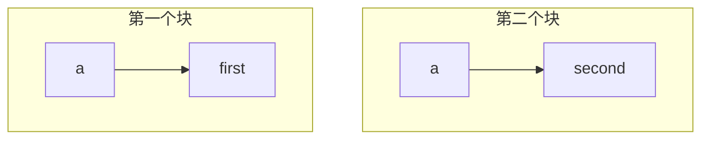


这与**动态作用域**形成了对比，在动态作用域中，直到执行代码时才知道名称指向的是什么。

作用域和环境是近亲，前者是理论概念，而后者是实现它的机制。当我们的解释器处理代码时，影响作用域的语法树节点会改变环境上下文。在像Lox这样的类JS语言语法中，作用域是由花括号的块控制的。（这就是为什么我们称它为**块范围**）。

```java
{
  var a = "in block";
}
print(a); // 错误！访问不到a变量。
```

块的开始引入了一个新的局部作用域，当执行通过结束的`}`时，这个作用域就结束了。块内声明的任何变量都会消失。

### $6.5.1$ 嵌套和遮蔽

实现块作用域的第一步可能是这样的：

1. 当访问块内的每个语句时，跟踪所有声明的变量。

2. 执行完最后一条语句后，告诉环境将这些变量全部删除。

这对前面的例子是可行的。但是请记住，局部作用域的一个目的是封装—程序中一个块内的代码，不应该干扰其他代码块。看看下面的例子：

```java
// How loud?
var volume = 11;

// Silence.
volume = 0;

// Calculate size of 3x4x5 cuboid.
{
  var volume = 3 * 4 * 5;
  print(volume);
}
```

请看这个代码块，在这里我们声明了一个局部变量`volume`来计算长方体的体积。该代码块退出后，解释器将删除 **全局** `volume`变量。这是不对的。当我们退出代码块时，我们应该删除在块内声明的所有变量，但是如果在代码块外声明了相同名称的变量，那就是一个不同的变量。它不应该被删除。

当局部变量与外围作用域中的变量具有相同的名称时，内部变量会遮蔽外部变量。代码块内部不能再看到外部变量—它被遮蔽在内部变量的阴影中—但它仍然是存在的。

当进入一个新的块作用域时，我们需要保留在外部作用域中定义的变量，这样当我们退出内部代码块时这些外部变量仍然存在。为此，我们为每个代码块定义一个新的环境，该环境只包含该作用域中定义的变量。当我们退出代码块时，我们将丢弃其环境并恢复前一个环境。

我们还需要处理没有被遮蔽的外围变量。

```javascript
var global = "outside";
{
  var local = "inside";
  print(global + local);
}
```

这段代码中，`global`在外部全局环境中，`local`则在块环境中定义。在执行`print`语句时，这两个变量都在作用域内。为了找到它们，解释器不仅要搜索当前最内层的环境，还必须搜索所有外层的环境。

我们通过将环境链接在一起来实现这一点。每个环境都有一个对直接外围作用域的环境的引用。当我们查找一个变量时，我们从最内层开始遍历环境链直到找到该变量。从内部作用域开始，就是我们使局部变量遮蔽外部变量的方式。

```mermaid
flowchart TB
    subgraph B["块作用域"]
		E["local"] --> F["inside"]
	end
	subgraph A["外层作用域"]
		C["global"] --> D["outside"]
	end
	B --> |"parent"| A
```


在我们添加块语法之前，我们要强化`Environment`类对这种嵌套的支持。首先，我们在每个环境中添加一个对其外围环境的引用。

> 在`Environment.java`文件中，在`Environment`类中添加

```java
public class Environment {
  // 新增部分开始
  public final Environment enclosing;
  // 新增部分结束
  private final Map<String, Object> values = new HashMap<>();
```

这个字段需要初始化，所以我们添加两个构造函数。

> 在`Environment.java`文件中，在`Environment`类中添加

```java
  public Environment() {
      enclosing = null;
  }

  public Environment(Environment enclosing) {
      this.enclosing = enclosing;
  }
```

无参构造函数用于全局作用域环境，它是环境链的结束点。另一个构造函数用来创建一个嵌套在给定外部作用域内的新的局部作用域。

我们不必修改`define()`方法——因为新变量总是在当前最内层的作用域中声明。但是变量的查找和赋值是结合已有的变量一起处理的，需要遍历环境链以找到它们。首先是查找操作：

> 在`Environment.java`文件中，在`get()`方法中添加

```java
      return values.get(name.lexeme);
    }
    // 新增部分开始
    if (enclosing != null) return enclosing.get(name);
    // 新增部分结束
    throw new RuntimeError(name,
        "未定义变量 '" + name.lexeme + "'。");
```

如果当前环境中没有找到变量，就在外围环境中尝试。然后递归地重复该操作，最终会遍历完整个链路。如果我们到达了一个没有外围环境的环境，并且仍然没有找到这个变量，那我们就放弃，并且像之前一样报告一个错误。

赋值也是如此。

> 在`Environment.java`文件中，在`assign()`方法中添加

```java
      values.put(name.lexeme, value);
      return;
    }
    // 新增部分开始
    if (enclosing != null) {
      enclosing.assign(name, value);
      return;
    }
    // 新增部分结束
    throw new RuntimeError(name,
```

同样，如果变量不在此环境中，它会递归地检查外围环境。

### $6.5.2$ 块语法和语义

现在环境已经嵌套了，我们就准备向语言中添加块了。请看以下语法：

```javascript
statement      = exprStmt
               | printStmt
               | block ;

block          = "{" declaration* "}" ;
```

块是由花括号包围的一系列语句或声明（可能是空的）。块本身就是一条语句，可以出现在任何允许语句的地方。语法树节点如下所示。

> 创建新文件`Block.java`

```java
package com.atguigu;

import java.util.List;

public class Block extends Stmt {
    public final List<Stmt> statements;
    
    public Block(List<Stmt> statements) {
        this.statements = statements;
    }
}
```

它包含块中语句的列表。解析很简单。与其他语句一样，我们通过块的前缀标记（在本例中是`{`）来检测块的开始。在`statement()`方法中，我们添加代码：

> 在`Parser.java`文件中，在`statement()`方法中添加

```java
    if (match(PRINT)) return printStatement();
    // 新增部分开始
    if (match(LEFT_BRACE)) return new Block(block());
    // 新增部分结束
    return expressionStatement();
```

真正的工作都在这里进行：

> 在`Parser.java`文件中，在`expressionStatement()`方法后添加

```java
  private List<Stmt> block() {
    List<Stmt> statements = new ArrayList<>();

    while (!check(RIGHT_BRACE) && !isAtEnd()) {
      statements.add(declaration());
    }

    consume(RIGHT_BRACE, "块必须以右花括号结尾。");
    return statements;
  }
```

我们先创建一个空列表，然后解析语句并将其放入列表中，直至遇到块的结尾（由`}`符号标识）。注意，该循环还有一个明确的`isAtEnd()`检查。我们必须小心避免无限循环，即使在解析无效代码时也是如此。如果用户忘记了结尾的`}`，解析器需要保证不能被阻塞。

语法到此为止。对于语义，我们要在`Interpreter`中添加另一个访问方法。

> 在`Interpreter.java`文件中，在`execute()`方法后添加

```java
  public Void executeBlockStmt(Block stmt) {
    executeBlock(stmt.statements, new Environment(environment));
    return null;
  }
```

要执行一个块，我们先为该块作用域创建一个新的环境，然后将其传入下面这个方法：

> 在`Interpreter.java`文件中，在`execute()`方法后添加

```java
  public void executeBlock(List<Stmt> statements,
                    Environment environment) {
    Environment previous = this.environment;
    try {
      this.environment = environment;

      for (Stmt statement : statements) {
        execute(statement);
      }
    } finally {
      this.environment = previous;
    }
  }
```

这个新方法会在给定的环境上下文中执行一系列语句。在此之前，解释器中的 `environment` 字段总是指向相同的环境—全局环境。现在，这个字段会指向 **当前** 环境，也就是与要执行的代码的最内层作用域相对应的环境。

为了在给定作用域内执行代码，该方法会先更新解释器的 `environment` 字段，执行所有的语句，然后恢复之前的环境。基于$Java$中一贯的优良传统，它使用`finally`子句来恢复先前的环境。这样一来，即使抛出了异常，环境也会被恢复。

> 在`Interpreter.java`文件中，在`execute`方法中添加

```java
        } else if (stmt instanceof Var) {
            executeVarStmt((Var) stmt);
        // 新增部分开始
        } else if (stmt instanceof Block) {
            executeBlockStmt((Block) stmt);
        }
        // 新增部分结束
```

出乎意料的是，这就是我们为了完全支持局部变量、嵌套和遮蔽所需要做的全部事情。试运行下面的代码：

```javascript
var a = "global a";
var b = "global b";
var c = "global c";
{
  var a = "outer a";
  var b = "outer b";
  {
    var a = "inner a";
    print(a);
    print(b);
    print(c);
  }
  print(a);
  print(b);
  print(c);
}
print(a);
print(b);
print(c);
```

我们的小解释器现在可以记住东西了，我们距离全功能编程语言又近了一步。

# $7$ 控制流

现在，我们的解释器只不过是一个计算器而已。一个Lox程序在结束之前只能做固定的工作量。要想让它的运行时间延长一倍，你就必须让源代码的长度增加一倍。我们即将解决这个问题。

## $7.1$ 条件执行

说完了历史，现在让我们把语言优化一下。我们大致可以把控制流分为两类：

- **条件**或**分支控制流**是用来不执行某些代码的。意思是，我们可以把它看作是跳过了代码的一个区域。

- **循环控制流**是用于多次执行一块代码的。它会 **向回** 跳转，从而能再次执行某些代码。用户通常不需要无限循环，所以一般也会有一些条件逻辑用于判断何时停止循环。

让我们开始实现`if`语句。我们的语句语法需要一个新的生成式。

```javascript
statement      = exprStmt
               | ifStmt
               | printStmt
               | block ;

ifStmt         = "if" "(" expression ")" statement
               ( "else" statement )? ;
```

`if`语句有一个表达式作为条件，然后是一个在条件为真时要执行的语句。另外，它还可以有一个`else`关键字和条件为假时要执行的语句。语法树节点中对语法的这三部分都有对应的字段。

> 创建新文件`If.java`

```java
package com.atguigu;

public class If extends Stmt {
    public final Expr condition;
    public final Stmt thenBranch;
    public final Stmt elseBranch;
    
    public If(Expr condition, Stmt thenBranch, Stmt elseBranch) {
        this.condition = condition;
        this.thenBranch = thenBranch;
        this.elseBranch = elseBranch;
    }
}
```

与其它语句类似，解析器通过开头的`if`关键字来识别`if`语句。

> 在`Parser.java`文件中，在`statement()`方法中添加

```java
  private Stmt statement() {
    // 新增部分开始
    if (match(IF)) return ifStatement();
    // 新增部分结束
    if (match(PRINT)) return printStatement();
```

如果发现了`if`关键字，就调用下面的新方法解析其余部分：

> 在`Parser.java`文件中，在`statement()`方法后添加

```java
  private Stmt ifStatement() {
    consume(LEFT_PAREN, "if后面需要有左括号。");
    Expr condition = expression();
    consume(RIGHT_PAREN, "条件表达式后面需要有右括号。"); 

    Stmt thenBranch = statement();
    Stmt elseBranch = null;
    if (match(ELSE)) {
      elseBranch = statement();
    }

    return new If(condition, thenBranch, elseBranch);
  }
```

跟之前一样，解析代码严格遵循语法。它通过查找前面的`else`关键字来检测`else`子句。如果没有，语法树中的`elseBranch`字段为`null`。

实际上，这个看似无伤大雅的可选项在我们的语法中造成了歧义。考虑以下代码：

```java
if (first) if (second) whenTrue(); else whenFalse();
```

谜题是这样的:这里的`else`子句属于哪个`if`语句?这不仅仅是一个关于如何标注语法的理论问题。它实际上会影响代码的执行方式：

- 如果我们将`else`语句关联到第一个`if`语句，那么当`first`为假时，无论`second`的值是多少，都将调用`whenFalse()`。

- 如果我们将`else`语句关联到第二个`if`语句，那么只有当`first`为假并且`second`也为假时，才会调用`whenFalse()`。

由于`else`子句是可选的，而且没有明确的分隔符来标记`if`语句的结尾，所以当你以这种方式嵌套`if`时，语法是不明确的。这种典型的语法陷阱被称为悬空的`else`问题。

```
if (first)
|	if (second)
|		whenTrue();
else
	whenFalse();
```

还有一种匹配方式：

```
if (first)
	if (second)
	|	whenTrue();
	else
		whenFalse();
```

大多数语言和解析器都以一种特殊的方式避免了这个问题。不管他们用什么方法来解决这个问题，他们总是选择同样的解释—`else`与前面最近的`if`绑定在一起。

我们的解析器已经很方便地做到了这一点。因为 `ifStatement()`在返回之前会继续寻找一个`else`子句，连续嵌套的最内层调用在返回外部的`if`语句之前，会先为自己声明`else`语句。

语法就绪了，我们可以开始解释了。

> 在`Interpreter.java`文件中，在`executeExpressionStmt()`后添加

```java
  public Void executeIfStmt(If stmt) {
    if (isTruthy(evaluate(stmt.condition))) {
      execute(stmt.thenBranch);
    } else if (stmt.elseBranch != null) {
      execute(stmt.elseBranch);
    }
    return null;
  }
```

解释器实现就是对相同的$Java$代码的简单包装。它首先对条件表达式进行求值。如果为真，则执行`then`分支。否则，如果有存在`else`分支，就执行该分支。

> 在`Interpreter.java`文件中，在`execute`方法中添加

```java
        } else if (stmt instanceof Block) {
            executeBlockStmt((Block) stmt);
        // 新增部分开始
        } else if (stmt instanceof If) {
            executeIfStmt((If) stmt);
        }
        // 新增部分结束
```

如果我们把这段代码与解释器中我们已实现的处理其它语法的代码进行比较，会发现控制流中特殊的地方就在于$Java$的`if`语句。其它大多数语法树总是会对子树求值，但是这里，我们可能会不执行`then`语句或`else`语句。如果其中任何一个语句有副作用，那么选择不执行某条语句就是用户可见的。

## $7.2$ 逻辑运算符

你可能认为我们已经完成分支开发了，但其实还没有。因为还有两个其它运算符在技术上是控制流结构—逻辑运算符`and`和`or`。

它们与其它二元运算符不同，是因为它们会短路求值。如果在计算左操作数之后，我们已经确切知道逻辑表达式的结果，那么就不再计算右操作数。例如：

```java
false and sideEffect();
```

对于一个`and`表达式来说，两个操作数都必须是真，才能得到结果为真。我们只要看到左侧的`false`操作数，就知道结果不会是真，也就不需要对`sideEffect()`求值，会直接跳过它。

这就是为什么我们没有在实现其它二元运算符的时候一起实现逻辑运算符。现在我们已经准备好了。这两个新的运算符在优先级表中的位置很低，类似于JS语言中的`||`和`&&`，它们都有各自的优先级，`or`低于`and`。我们把这两个运算符插入`assignment` 和 `equality`之间。

```javascript
expression     = assignment ;
assignment     = IDENTIFIER "=" assignment
               | logic_or ;
logic_or       = logic_and ( "or" logic_and )* ;
logic_and      = equality ( "and" equality )* ;
```

`assignment` 现在不是落到 `equality`，而是继续进入`logic_or`。两个新规则，`logic_or` 和 `logic_and`，与其它二元运算符类似。然后`logic_and`会调用`equality`计算其操作数，然后我们就链入了表达式规则的其它部分。

对于这两个新表达式，我们可以重用`Binary`类，因为他们具有相同的字段。但是这样的话，`evaluateBinaryExpr()` 方法中必须检查运算符是否是逻辑运算符，并且要使用不同的代码处理短路逻辑。我认为更整洁的方法是为这些运算符定义一个新类，这样它们就有了自己的求值方法。

> 创建新文件`Logical.java`

```java
package com.atguigu;

public class Logical extends Expr {
    public final Expr left;
    public final Token operator;
    public final Expr right;
    
    public Logical(Expr left, Token operator, Expr right) {
        this.left = left;
        this.operator = operator;
        this.right = right;
    }
}
```

为了将新的表达式加入到解析器中，我们首先将赋值操作的解析代码改为调用`or()`方法。

> 在`Parser.java`文件中，在`assignment()`方法中替换$1$行

```java
  private Expr assignment() {
    // 新增部分开始
    Expr expr = or();
    // 新增部分结束
    if (match(EQUAL)) {
```

解析一系列`or`语句的代码与其它二元运算符相似。

> 在`Parser.java`文件中，在`assignment()`方法后添加

```java
  private Expr or() {
    Expr expr = and();

    while (match(OR)) {
      Token operator = previous();
      Expr right = and();
      expr = new Logical(expr, operator, right);
    }

    return expr;
  }
```

它的操作数是位于下一优先级的新的`and`表达式。

> 在`Parser.java`文件中，在`or()`方法后添加

```java
  private Expr and() {
    Expr expr = equality();

    while (match(AND)) {
      Token operator = previous();
      Expr right = equality();
      expr = new Logical(expr, operator, right);
    }

    return expr;
  }
```

这里会调用 `equality()` 计算操作数，这样一来，表达式解析器又重新绑定到了一起。我们已经准备好进行解释了。

> 在`Interpreter.java`文件中，在`evaluateLiteralExpr()`方法后添加

```java
  public Object evaluateLogicalExpr(Logical expr) {
    Object left = evaluate(expr.left);

    if (expr.operator.type == TokenType.OR) {
      if (isTruthy(left)) return left;
    } else {
      if (!isTruthy(left)) return left;
    }

    return evaluate(expr.right);
  }
```

如果我们把这个方法与前面章节的`evaluateBinaryExpr()`方法相比较，就可以看出其中的区别。这里，我们先计算左操作数。然后我们查看结果值，判断是否可以短路。当且仅当不能短路时，我们才计算右侧的操作数。

> 在`Interpreter.java`文件中，在`evaluate`方法中

```java
        } else if (expr instanceof Assign) {
            return evaluateAssignExpr((Assign) expr);
        // 新增部分开始
        } else if (expr instanceof Logical) {
            return evaluateLogicalExpr((Logical) expr);
        }
        // 新增部分结束
```

另一个有趣的部分是决定返回什么实际值。由于Lox语言是动态类型的，我们允许任何类型的操作数，并使用真实性来确定每个操作数代表什么。我们对结果采用类似的推理。逻辑运算符并不承诺会真正返回`true`或`false`，而只是保证它将返回一个具有适当真实性的值。

幸运的是，我们手边就有具有适当真实性的值—即操作数本身的结果，所以我们可以直接使用它们。如：

```javascript
print("hi" or 2); // "hi".
print(nil or "yes"); // "yes".
```

在第一行，`"hi"`是真的，所以`or`短路并返回它。在第二行，`nil`是假的，因此它计算并返回第二个操作数`"yes"`。

这样就完成了Lox中的所有分支原语，我们准备实现循环吧。

## $7.3$ $while$循环

Lox有两种类型的循环控制流语句，分别是`while`和`for`。`while`循环更简单一点，我们先从它开始。

```javascript
statement      = exprStmt
               | ifStmt
               | printStmt
               | whileStmt
               | block ;

whileStmt      = "while" "(" expression ")" statement ;
```

我们在`statement`规则中添加一个子句，指向`while`对应的新规则`whileStmt`。该规则接收一个`while`关键字，后跟一个带括号的条件表达式，然后是循环体对应的语句。新语法规则需要定义新的语法树节点。

> 创建新文件`While.java`

```java
package com.atguigu;

public class While extends Stmt {
    public final Expr condition;
    public final Stmt body;
    
    public While(Expr condition, Stmt body) {
        this.condition = condition;
        this.body = body;
    }
}
```

该节点中保存了条件式和循环体。这里就可以看出来为什么表达式和语句最好要有单独的基类。字段声明清楚地表明了，条件是一个表达式，循环主体是一个语句。

在解析器中，我们遵循与`if`语句相同的处理步骤。首先，在 `statement()` 添加一个case分支检查并匹配开头的关键字。

> 在`Parser.java`文件中，在`statement()`方法中添加

```java
    if (match(PRINT)) return printStatement();
    // 新增部分开始
    if (match(WHILE)) return whileStatement();
    // 新增部分结束
    if (match(LEFT_BRACE)) return new Block(block());
```

实际的工作委托给下面的方法：

> 在`Parser.java`文件中，在`varDeclaration()`方法后添加

```java
  private Stmt whileStatement() {
    consume(LEFT_PAREN, "Expect '(' after 'while'.");
    Expr condition = expression();
    consume(RIGHT_PAREN, "Expect ')' after condition.");
    Stmt body = statement();

    return new While(condition, body);
  }
```

语法非常简单，这里将其直接翻译为$Java$。下面是我们执行新语法的方式：

> 在`Interpreter.java`，在`executeVarStmt()`方法后添加

```java
  public Void executeWhileStmt(While stmt) {
    while (isTruthy(evaluate(stmt.condition))) {
      execute(stmt.body);
    }
    return null;
  }
```

和`if`的访问方法一样，这里的执行方法使用了相应的$Java$特性。

> 在`Interpreter.java`文件中，在`execute`方法中添加

```java
        } else if (stmt instanceof If) {
            executeIfStmt((If) stmt);
        // 新增部分开始
        } else if (stmt instanceof While) {
            executeWhileStmt((While) stmt);
        }
        // 新增部分结束
```

# $8$ 函数

这也是人类思维的运作方式—将旧的想法复合成为新结构，成为新的想法，而这些想法本身又可以被用于复合，循环往复，无休无止，越来越远离每一种语言赖以生存的基本的土壤。

这一章标志着很多艰苦工作的一个高潮。在前面的章节中，各自添加了一些有用的功能，但是每一章也都提供了一个拼图的碎片。我们整理这些碎片—表达式、语句、变量、控制流和词法作用域，再加上其它功能，并把他们组合起来，以支持真正的用户定义函数和函数调用。

## $8.1$ 函数调用

我们已经很熟悉JS语言风格的函数调用语法，但其语法可能比我们意识到的更微妙。调用通常是指向命名的函数，例如：

```js
average(1, 2);
```

但是被调用函数的名称实际上并不是调用语法的一部分。被调用者（$$callee$$）可以是计算结果为一个函数的任何表达式。（好吧，它必须是一个非常高优先级的表达式，但是圆括号可以解决这个问题。）例如：

```java
getCallback()();
```

这里有两个函数调用。第一对括号将`getCallback`作为其被调用者。但是第二对括号将整个`getCallback()` 表达式作为其被调用者。表达式后面的小括号表示函数调用，我们可以把调用看作是一种以`(`开头的后缀运算符。

这个“运算符”比其它运算符（包括一元运算符）有更高的优先级。所以我们通过让`unary`规则跳转到新的`call`规则，将其添加到语法中。

```javascript
unary          = ( "!" | "-" ) unary | call ;
call           = primary ( "(" arguments? ")" )* ;
```

该规则匹配一个基本表达式，后面跟着$0$个或多个函数调用。如果没有括号，则解析一个简单的基本表达式。否则，每一对圆括号都表示一个函数调用，圆括号内有一个可选的参数列表。参数列表语法是：

```javascript
arguments      = expression ( "," expression )* ;
```

这个规则要求至少有一个参数表达式，后面可以跟$0$个或多个其它表达式，每两个表达式之间用`,`分隔。为了处理无参调用，`call`规则本身认为整个`arguments`生成式是可选的。

我承认，对于极其常见的 "零或多个逗号分隔的事物 "模式来说，这在语法上似乎比想象的更难处理。有一些复杂的元语法可以更好地处理这个问题，但在我们的$EBNF$和我见过的许多语言规范中，它就是如此的麻烦。

我们为函数调用表达式创建新的抽象语法树节点类型。

> 创建新文件`Call.java`

```java
package com.atguigu;

import java.util.List;

public class Call extends Expr {
    public final Expr callee;
    public final Token paren;
    public final List<Expr> arguments;
    
    public Call(Expr callee, Token paren, List<Expr> arguments) {
        this.callee = callee;
        this.paren = paren;
        this.arguments = arguments;
    }
}
```

它存储了被调用者表达式和参数表达式列表，同时也保存了右括号标记。当我们报告由函数调用引起的运行时错误时，会使用该标记的位置。

打开解析器，原来`unary()`直接跳转到`primary()`方法，将其修改为调用`call()`。

> 在`Parser.java`文件中，在`unary()`方法中替换一行

```java
      return new Unary(operator, right);
    }
    // 替换部分开始
    return call();
    // 替换部分结束
  }
```

该方法定义为：

> 在`Parser.java`文件中，在`unary()`方法后添加

```java
  private Expr call() {
    Expr expr = primary();

    while (true) { 
      if (match(LEFT_PAREN)) {
        expr = finishCall(expr);
      } else {
        break;
      }
    }

    return expr;
  }
```

这里的代码与语法规则并非完全一致。为了保持代码简洁，我调整了一些东西—这是我们手写解析器的优点之一。但它与我们解析中缀运算符的方式类似。首先，我们解析一个基本表达式，即调用的左操作数。然后，每次看到`(`，我们就调用`finishCall()`解析调用表达式，并使用之前解析出的表达式作为被调用者。返回的表达式成为新的`expr`，我们循环检查其结果是否被调用。

解析参数列表的代码在下面的工具方法中：

> 在`Parser.java`文件中，在`unary()`方法后添加

```java
  private Expr finishCall(Expr callee) {
    List<Expr> arguments = new ArrayList<>();
    if (!check(RIGHT_PAREN)) {
      do {
        arguments.add(expression());
      } while (match(COMMA));
    }

    Token paren = consume(RIGHT_PAREN,
                          "参数列表应该以右括号结尾。");

    return new Call(callee, paren, arguments);
  }
```

这或多或少是`arguments` 语法规则翻译成代码的结果，除了我们这里还处理了无参情况。我们首先判断下一个标记是否`)`来检查这种情况。如果是，我们就不会尝试解析任何参数。

如果不是，我们就解析一个表达式，然后寻找逗号（表明后面还有一个参数）。只要我们在表达式后面发现逗号，就会继续解析表达式。当我们找不到逗号时，说明参数列表已经结束，我们继续消费预期的右括号。最终，我们将被调用者和这些参数封装成一个函数调用的$AST$节点。

### $8.1.1$ 解释执行函数调用

我们还没有任何可以调用的函数，所以先实现函数调用似乎有点奇怪，但是这个问题我们后面再考虑。首先，我们的解释器需要引入一个新依赖。

> 在`Interpreter.java`文件中

```java
import java.util.ArrayList;
import java.util.List;
```

跟之前一样，解释工作从新的调用表达式节点对应的新的求值方法开始。

> 在`Interpreter.java`文件中，在`evaluateBinaryExpr()`方法后添加

```java
  public Object evaluateCallExpr(Call expr) {
    Object callee = evaluate(expr.callee);

    List<Object> arguments = new ArrayList<>();
    for (Expr argument : expr.arguments) { 
      arguments.add(evaluate(argument));
    }

    AtguiguCallable function = (AtguiguCallable) callee;
    return function.call(this, arguments);
  }
```

首先，对被调用者的表达式求值。通常情况下，这个表达式只是一个标识符，可以通过它的名字来查找函数。但它可以是任何东西。然后，我们依次对每个参数表达式求值，并将结果值存储在一个列表中。

一旦我们准备好被调用者和参数，剩下的就是执行函数调用。我们将被调用者转换为`AtguiguCallable`，然后对其调用`call()`方法来实现。任何可以像函数一样被调用的Lox对象的$Java$表示都要实现这个接口。这包括用户定义的函数。

这个新接口中没有太多内容。

> 创建新文件`AtguiguCallable.java`

```java
package com.atguigu;

import java.util.List;

public interface AtguiguCallable {
    Object call(Interpreter interpreter, List<Object> arguments);
}
```

我们会传入解释器，以防实现`call()`方法的类会需要它。我们也会提供已求值的参数值列表。接口实现者的任务就是返回调用表达式产生的值。

### $8.1.3$ 调用类型错误

在我们实现`AtguiguCallable`之前，我们需要使得求值方法更加健壮一些。例如，如果碰到下面的语句，应该发生什么？因为字符串不能当作函数被调用。

```
"totally not a function"();
```

所以我们需要检查类型，看看是否是可以调用的函数。

> 在`Interpreter.java`文件中，在`evaluateCallExpr()`方法中

```java
    }
    // 新增代码开始
    if (!(callee instanceof AtguiguCallable)) {
      throw new RuntimeError(expr.paren,
          "只能调用函数。");
    }
    // 新增代码结束
    AtguiguCallable function = (AtguiguCallable) callee;
```

### $8.1.4$ 检查元数

另一个问题与函数的**元数**有关。元数是一个花哨的术语，指一个函数或操作所期望的参数数量。一元运算符的元数是1，二元运算符是2，等等。对于函数来说，元数由函数声明的参数数量决定。

```js
function add(a, b, c) {
  print a + b + c;
}
```

这个函数定义了三个形参，`a` 、`b` 和`c`，所以它的元数是$3$，而且它期望有$3$个参数。那么如果用下面的方式调用该函数会怎样：

```java
add(1, 2, 3, 4); // 参数太多
add(1, 2);       // 参数不够
```

所以，在执行可调用方法之前，我们检查参数列表的长度是否与可调用方法的元数相符。

> 在`Interpreter.java`文件中，在`evaluateCallExpr()`方法中添加代码

```java
    AtguiguCallable function = (AtguiguCallable)callee;
    // 新增部分开始
    if (arguments.size() != function.arity()) {
      throw new RuntimeError(expr.paren, "应该有 " +
          function.arity() + " 个参数，实际上提供了 " +
          arguments.size() + " 个参数。");
    }
    // 新增部分结束
    return function.call(this, arguments);
```

这就需要在`AtguiguCallable`接口中增加一个新方法来查询函数的元数。

> 在`AtguiguCallable.java`文件中，在`AtguiguCallable`接口中新增

```java
public interface AtguiguCallable {
  // 新增部分开始
  int arity();
  // 新增部分结束
  Object call(Interpreter interpreter, List<Object> arguments);
```

我们可以在`call()`方法的具体实现中做元数检查。但是，由于我们会有多个实现`AtguiguCallable`的类，这将导致冗余的验证分散在多个类中。把它提升到访问方法中，这样我们可以在一个地方完成该功能。

## $8.2$ 函数声明

我们终于可以在添加变量时就引入的`declaration`规则中添加产生式了。就像变量一样，函数声明也会绑定一个新的名称。这意味中它们只能出现在允许声明的地方。

```js
declaration    = funDecl
               | varDecl
               | statement ;
```

更新后的`declaration`引用了下面的新规则：

```js
funDecl        = "function" function ;
function       = IDENTIFIER "(" parameters? ")" block ;
```

主要的`funDecl`规则使用了一个单独的辅助规则`function`。函数 **声明语句** 是`function`关键字后跟实际的函数体内容。等到我们实现类的时候，将会复用`function`规则来声明方法。这些方法与函数声明类似，但是前面没有`function`关键字。

函数本身是一个名称，后跟带括号的参数列表和函数体。函数体是一个带花括号的块，可以使用与块语句相同的语法。参数列表则使用以下规则：

```js
parameters     = IDENTIFIER ( "," IDENTIFIER )* ;
```

这就类似于前面的`arguments` 规则，区别在于参数是一个标识符，而不是一个表达式。

> 创建新文件`Function.java`

```java
package com.atguigu;

import java.util.List;

public class Function extends Stmt {
    public final Token name;
    public final List<Token> params;
    public final List<Stmt> body;
    
    public Function(Token name, List<Token> params, List<Stmt> body) {
        this.name = name;
        this.params = params;
        this.body = body;
    }
}
```

函数节点有一个名称、一个参数列表(参数的名称)，然后是函数主体。我们将函数主体存储为包含在花括号中的语句列表。

在解析器中，我们把新的声明添加进去。

> 在`Parser.java`文件中，在`declaration()`方法中添加

```java
    try {
      // 新增部分开始
      if (match(FUNCTION)) return function("function");
      // 新增部分结束
      if (match(VAR)) return varDeclaration();
```

像其它语句一样，函数是通过前面的关键字来识别的。当我们遇到`function`关键字时，我们就调用`function`规则。这步操作对应于`function`语法规则，因为我们已经匹配并消费了`function`关键字。我们会一步步构建这个方法，首先从下面的代码开始：

> 在`Parser.java`文件中，在`expressionStatement()`方法后添加

```java
  private Function function(String kind) {
      Token name = consume(IDENTIFIER, "类型应该是 " + kind + " 。");
  }
```

现在，它只是消费了标识符标记作为函数名称。你可能会对这里的`kind`参数感到疑惑。就像我们复用语法规则一样，稍后我们也会复用`function()`方法来解析类中的方法。到时候，我们会在`kind`参数中传入 "method"，这样错误信息就会针对被解析的声明类型来展示。

接下来，我们要解析参数列表和包裹着它们的一对小括号。

> 在`Parser.java`文件中，在`function()`方法中添加

```java
    Token name = consume(IDENTIFIER, "类型应该是 " + kind + " 。");
    // 新增部分开始
    consume(LEFT_PAREN, "左括号后面应该是 " + kind + " 。");
    List<Token> parameters = new ArrayList<>();
    if (!check(RIGHT_PAREN)) {
      do {
        parameters.add(
            consume(IDENTIFIER, "这里应该是参数名。"));
      } while (match(COMMA));
    }
    consume(RIGHT_PAREN, "参数列表应该以右括号结尾。");
    // 新增部分结束
  }
```

这就像在函数调用中处理参数的代码一样，只是没有拆分到一个辅助方法中。外部的`if`语句用于处理零参数的情况，内部的`while`会循环解析参数，只要能找到分隔参数的逗号。其结果是包含每个参数名称的标记列表。

最后，我们解析函数主体，并将其封装为一个函数节点。

> 在`Parser.java`文件中，在`function()`方法中添加

```java
    consume(RIGHT_PAREN, "参数列表应该以右括号结尾。");
    // 新增部分开始
    consume(LEFT_BRACE, kind + " 体应该以左花括号开始。");
    List<Stmt> body = block();
    return new Function(name, parameters, body);
    // 新增部分结束
  }
```

请注意，在调用`block()`方法之前，我们已经消费了函数体开头的`{`。这是因为`block()`方法假定大括号标记已经匹配了。在这里消费该标记可以让我们在找不到`{`的情况下报告一个更精确的错误信息，因为我们知道当前是在一个函数声明的上下文中。

## $8.3$ 函数对象

> 在`Interpreter.java`文件中，替换$1$行

```java
    public final Environment globals = new Environment();
    private Environment environment = globals;
```

创建一个全局环境，用来保存我们定义的函数。

我们已经解析了一些语法，通常我们要开始准备解释了，但是我们首先需要思考一下，在$Java$中如何表示一个Lox函数。我们需要跟踪形参，以便在函数被调用时可以将形参与实参值进行绑定。当然，我们也要保留函数体的代码，以便我们可以执行它。

这基本上就是`Function`的内容。我们可以用这个吗？差不多，但还不够。我们还需要一个实现`AtguiguCallable`的类，以便我们可以调用它。我们不希望解释器的运行时阶段渗入到前端语法类中，所以我们不希望使用`Function`本身来实现它。相反，我们将它包装在一个新类中。

> 创建新文件`AtguiguFunction.java`

```java
package com.atguigu;

import java.util.List;

public class AtguiguFunction implements AtguiguCallable {
  private final Function declaration;
  public AtguiguFunction(Function declaration) {
    this.declaration = declaration;
  }
}
```

使用如下方式实现`AtguiguCallable`的`call()`方法：

> 在`Function.java`文件中，在`AtguiguFunction()`方法后添加

```java
  @Override
  public Object call(Interpreter interpreter,
                     List<Object> arguments) {
    Environment environment = new Environment(interpreter.globals);
    for (int i = 0; i < declaration.params.size(); i++) {
      environment.define(declaration.params.get(i).lexeme,
          arguments.get(i));
    }

    interpreter.executeBlock(declaration.body, environment);
    return null;
  }
```

这几行代码是我们的解释器中最基本、最强大的部分之一。正如我们在上一章中所看到的，管理名称环境是语言实现中的核心部分。函数与此紧密相关。

参数是函数的核心，尤其是考虑到函数 **封装** 了其参数—函数之外的代码看不到这些参数。这意味着每个函数都会维护自己的环境，其中存储着那些变量。

此外，这个环境必须是动态创建的。每次函数 **调用** 都会获得自己的环境，否则，递归就会中断。如果在同一时刻对相同的函数有多次调用，那么每个调用都需要自身的环境，即便它们都是对相同函数的调用。

举例来说，下面是一个计数到$3$的复杂方法：

```js
function count(n) {
  if (n > 1) count(n - 1);
  print(n);
}

count(3);
```

假设一下，如果我们在最内层的嵌套调用中即将打印$1$的时候暂停了解释器。打印$2$和$3$的外部调用还没有打印出它们的值，所以在内存的某个地方一定有环境仍然存储着这样的数据：$n$在一个上下文中被绑定到$3$，在另一个上下文中被绑定到$2$，而在最内层调用中绑定为$1$，比如：

```mermaid
flowchart TB
	subgraph AA["count(3)"]
		A["n"] --> B["3"]
	end
	subgraph BB["count(2)"]
		C["n"] --> D["2"]
	end
	subgraph CC["count(1)"]
		E["n"] --> F["1"]
	end
```

这就是为什么我们在每次 **调用** 时创建一个新的环境，而不是在函数声明时创建。我们前面看到的`call()`方法就是这样做的。在调用开始的时候，它创建了一个新环境。然后它以同步的方式遍历形参和实参列表。对于每一对参数，它用形参的名字创建一个新的变量，并将其与实参的值绑定。

所以，对于类似下面这样的代码：

```js
function add(a, b, c) {
  print(a + b + c);
}

add(1, 2, 3);
```

在调用`add()`时，解释器会创建类似下面这样的内容：

```
function add(a, b, c) {...}
             |  |  |
             |  |  |
             v  v  v
         add(1, 2, 3)
```

而环境中的内容如下：

| 形式参数 |               | 实际参数 |
| -------- | ------------- | -------- |
| `a`      | $\rightarrow$ | `1`      |
| `b`      | $\rightarrow$ | `2`      |
| `c`      | $\rightarrow$ | `3`      |

然后`call()`会告诉解释器在这个新的函数局部环境中执行函数体。在此之前，当前环境是函数被调用的位置所处的环境。现在，我们转入了为函数创建的新的参数空间中。

这就是将数据传入函数所需的全部内容。通过在执行函数主体时使用不同的环境，用同样的代码调用相同的函数可以产生不同的结果。

一旦函数的主体执行完毕，`executeBlock()`就会丢弃该函数的本地环境，并恢复调用该函数前的活跃环境。最后，`call()`方法会返回`null`，它向调用者返回`nil`。（我们会在稍后添加返回值）

从机制上讲，这段代码是非常简单的。遍历几个列表，绑定一些新变量，调用一个方法。但这就是将代码块变成有生命力的调用执行的地方。

完成了吗？好的。注意当我们绑定参数时，我们假设参数和参数列表具有相同的长度。这是安全的，因为`evaluateCallExpr()`在调用`call()`之前会检查元数。它依靠报告其元数的函数来做到这一点。

> 在`AtguiguFunction.java`文件中，在`AtguiguFunction()`方法后添加

```java
  @Override
  public int arity() {
    return declaration.params.size();
  }
```

这基本就是我们的函数对象表示了。既然已经到了这一步，我们也可以实现`toString()`。

> 在`AtguiguFunction.java`文件中，在`AtguiguFunction()`方法后添加

```java
  @Override
  public String toString() {
    return "<函数 " + declaration.name.lexeme + ">";
  }
```

如果用户要打印函数的值，该方法能提供一个更漂亮的输出值。

```javascript
fun add(a, b) {
  print(a + b);
}

print add; // "<函数 add>".
```

### $8.3.1$ 解释函数声明

我们很快就会回头来完善`AtguiguFunction`，但是现在已足够开始进行解释了。现在，我们可以访问函数声明节点了。

> 在`Interpreter.java`文件中，在`executeExpressionStmt()`方法后添加

```java
  public Void executeFunctionStmt(Function stmt) {
    AtguiguFunction function = new AtguiguFunction(stmt);
    environment.define(stmt.name.lexeme, function);
    return null;
  }
```

这类似于我们介绍其它文本表达式的方式。我们会接收一个函数 **语法** 节点—函数的编译时表示形式—然后将其转换为运行时表示形式。在这里就是一个封装了语法节点的`AtguiguFunction`实例。

函数声明与其它文本节点的不同之处在于，声明还会将结果对象绑定到一个新的变量。因此，在创建`AtguiguFunction`之后，我们在当前环境中创建一个新的绑定，并在其中保存对该函数的引用。

这样，我们就可以在Lox中定义和调用我们自己的函数。试一下：

```javascript
function sayHi(first, last) {
  print("Hi, " + first + " " + last + "!");
}

sayHi("Dear", "Atguigu");
```

> 在`Interpreter.java`文件中，在`execute`方法里添加

```java
        } else if (stmt instanceof While) {
            executeWhileStmt((While) stmt);
        // 新增部分开始
        } else if (stmt instanceof Function) {
            executeFunctionStmt((Function) stmt);
        }
        // 新增部分结束
```

> 在`Interpreter.java`文件中，在`evaluate`方法里添加

```java
        } else if (expr instanceof Logical) {
            return evaluateLogicalExpr((Logical) expr);
        // 新增部分开始
        } else if (expr instanceof Call) {
            return evaluateCallExpr((Call) expr);
        }
        // 新增部分结束
```

## $8.4$ $return$语句

我们可以通过传递参数将数据输入函数中，但是我们没有办法将结果 **传出来** 。所以我们需要`return`语句。

```
statement      = exprStmt
               | ifStmt
               | printStmt
               | returnStmt
               | whileStmt
               | block ;

returnStmt     = "return" expression? ";" ;
```

我们又得到一个`statement`规则下的新产生式（实际上也是最后一个）。一个`return`语句就是一个`return`关键字，后跟一个可选的表达式，并以一个分号结尾。

返回值是可选的，用以支持从一个不返回有效值的函数中提前退出。在静态类型语言中，`void`函数不返回值，而非`void`函数返回值。由于Lox是动态类型的，所以没有真正的`void`函数。在调用一个不包含`return`语句的函数时，编译器没有办法阻止我们获取其结果值。

```javascript
function procedure() {
  print("don't return anything");
}

var result = procedure();
print(result); // ?
```

这意味着每个Lox函数都要返回一些内容，即使其中根本不包含`return`语句。我们使用`nil`，这就是为什么`AtguiguFunction`的`call()`实现在最后返回`null`。同样，如果省略了`return `语句中的值，我们将其视为等价于：

```java
return nil;
```

> 创建新文件`Return.java`

```java
package com.atguigu;

public class Return extends Stmt {
    public final Token keyword;
    public final Expr value;
    
    public Return(Token keyword, Expr value) {
        this.keyword = keyword;
        this.value = value;
    }
}
```

其中保留了`return`关键字标记（这样我们可以使用该标记的位置来报告错误），以及返回的值（如果有的话）。我们像解析其它语句一样来解析它，首先识别起始的关键字。

> 在`Parser.java`文件中，在`statement()`方法中添加

```java
    if (match(PRINT)) return printStatement();
    // 新增部分开始
    if (match(RETURN)) return returnStatement();
    // 新增部分结束
    if (match(WHILE)) return whileStatement();
```

分支会跳转到：

> 在`Parser.java`文件中，在`printStatement()`方法后添加

```java
  private Stmt returnStatement() {
    Token keyword = previous();
    Expr value = null;
    if (!check(SEMICOLON)) {
      value = expression();
    }

    consume(SEMICOLON, "return语句必须以分号结尾。");
    return new Return(keyword, value);
  }
```

在捕获先前消耗的`return`关键字之后，我们会寻找一个值表达式。因为很多不同的标记都可以引出一个表达式，所以很难判断是否存在返回值。相反，我们检查它是否不存在。因为分号不能作为表达式的开始，如果下一个标记是分号，我们就知道一定没有返回值。

### $8.4.1$ 从函数调用中返回

解释`return`语句是很棘手的。我们可以从函数体中的任何位置返回，甚至是深深嵌套在其它语句中的位置。当返回语句被执行时，解释器需要完全跳出当前所在的上下文，完成函数调用，就像某种顶层的控制流结构。

举例来说，假设我们正在运行下面的代码，并且我们即将执行`return`语句：

```java
function count(n) {
  while (n < 100) {
    if (n == 3) return n; // <--
    print(n);
    n = n + 1;
  }
}

count(1);
```

$Java$调用栈目前看起来大致如下所示：

```java
Interpreter.executeReturnStmt()
Interpreter.executeIfStmt()
Interpreter.executeBlock()
Interpreter.executeBlockStmt()
Interpreter.executeWhileStmt()
Interpreter.executeBlock()
AtguiguFunction.call()
Interpreter.evaluateCallExpr()
```

我们需要从栈顶一直回退到`call()`。我不知道你怎么想，但是对我来说，这听起来很像是异常。当我们执行`return`语句时，我们会使用一个异常来解开解释器，经过所有函数内含语句的执行方法，一直回退到开始执行函数体的代码。

新的$AST$节点的执行方法如下所示：

> 在`Interpreter.java`文件中，在`executePrintStmt()`方法后添加

```java
  public Void executeReturnStmt(Return stmt) {
    Object value = null;
    if (stmt.value != null) value = evaluate(stmt.value);

    throw new ReturnValue(value);
  }
```

如果我们有返回值，就对其求值，否则就使用`nil`。然后我们取这个值并将其封装在一个自定义的异常类中，并抛出该异常。

> 创建新文件`ReturnValue.java`

```java
package com.atguigu;

public class ReturnValue extends RuntimeException {
  public final Object value;

  public ReturnValue(Object value) {
    super(null, null, false, false);
    this.value = value;
  }
}
```

这个类使用$Java$运行时异常类来封装返回值。其中那个奇怪的带有`null`和`false`的父类构造器方法，禁用了一些我们不需要的$JVM$机制。因为我们只是使用该异常类来控制流，而不是真正的错误处理，所以我们不需要像堆栈跟踪这样的开销。

我们希望可以一直跳出到函数调用开始的地方，也就是`AtguiguFunction`中的`call()`方法。

> 在`AtguiguFunction.java`文件中，在`call()`方法中替换$1$行

```java
         arguments.get(i));
    }
    // 替换部分开始
    try {
      interpreter.executeBlock(declaration.body, environment);
    } catch (ReturnValue returnValue) {
      return returnValue.value;
    }
    // 替换部分结束
    return null;
```

我们将对`executeBlock()`的调用封装在一个`try-catch`块中。当捕获一个返回异常时，它会取出其中的值并将其作为`call()`方法的返回值。如果没有捕获任何异常，意味着函数到达了函数体的末尾，而且没有遇到`return`语句。在这种情况下，隐式地返回`nil`。

> 在`Interpreter.java`文件中，在`execute`方法中添加

```java
        } else if (stmt instanceof Function) {
            executeFunctionStmt((Function) stmt);
        // 新增部分开始
        } else if (stmt instanceof Return) {
            executeReturnStmt((Return) stmt);
        }
        // 新增部分结束
```

我们来试一下。我们终于有能力支持这个经典的例子—递归函数计算$Fibonacci$数：

```js
function fib(n) {
  if (n <= 1) return n;
  return fib(n - 2) + fib(n - 1);
}

for (var i = 0; i < 20; i = i + 1) {
  print(fib(i));
}
```

这个小程序练习了我们在过去几章中实现的几乎所有语言特性，包括表达式、算术运算、分支、循环、变量、函数、函数调用、参数绑定和返回。

## $8.5$ 内部函数和闭包

我们的函数功能已经相当全面了，但是还有一个漏洞需要修补。实际上，这是一个很大的问题，我们将会在下一章中花费大部分时间来修补它，但是我们可以从这里开始。

`AtguiguFunction`中的`call()`实现创建了一个新的环境，并在其中绑定了函数的参数。当我向你展示这段代码时，我忽略了一个重要的问题：这个环境的父类是什么？

目前，它始终是`globals`，即顶级的全局环境。这样，如果一个标识符不是在函数体内部定义的，解释器可以在函数外部的全局作用域中查找它。在$Fibonacci$的例子中，这就是解释器如何能够在函数体中实现对`fib`的递归调用—`fib`是一个全局变量。

但请记住，在Lox编程语言中，允许在可以绑定名字的 **任何地方** 进行函数声明。其中包括Lox脚本的顶层，但也包括块或其他函数的内部。Lox支持在另一个函数内定义或在一个块内嵌套的**内部函数**。

考虑下面这个经典的例子：

```js
function makeCounter() {
  var i = 0;
  function count() {
    i = i + 1;
    print(i);
  }

  return count;
}

var counter = makeCounter();
counter(); // "1".
counter(); // "2".
```

这个例子中，`count()`使用了`i`，它是在该函数外部的 `makeCounter()`声明的。`makeCounter()` 返回对`count()`函数的引用，然后它的函数体就执行完成了。

同时，顶层代码调用了返回的`count()`函数。这就执行了`count()`函数的主体，它会对`i`赋值并读取`i`，尽管定义`i`的函数已经退出。

如果你以前从未遇到过带有嵌套函数的语言，那么这可能看起来很疯狂，但用户确实希望它能工作。唉，如果你现在运行它，当`count()`的函数体试图查找`i`时，会在对`counter()`的调用中得到一个未定义的变量错误，这是因为当前的环境链看起来像是这样的：

```mermaid
flowchart BT
	subgraph AA["全局环境"]
		A["makeCount"] --> B["<函数 makeCount>"]
		C["counter"] --> D["<函数 count>"]
	end
	subgraph BB["count()函数体的环境"]
		E["空环境"]
	end
	BB --> |"parent"| AA
```

当我们调用`count()`时（通过`counter`中保存的引用），我们会为函数体创建一个新的空环境，它的父环境就是全局环境。我们丢失了`i`所在的`makeCounter()`环境。

我们把时间往回拨一点。我们在`makeCounter()`的函数体中声明`count()`时，环境链的样子是下面这样：

```mermaid
flowchart BT
	subgraph AA["全局环境"]
		A["makeCount"] --> B["<函数 makeCount>"]
		C["counter"] --> D["<函数 count>"]
	end
	subgraph BB["makeCounter()函数体的环境"]
		E["i"] --> F["0"]
	end
	BB --> |"parent"| AA
```

所以，在函数声明的地方，我们可以看到`i`。但是当我们从 `makeCounter()` 返回并退出其主体时，解释器会丢弃这个环境。因为解释器不会保留`count()` 外围的环境，所以要靠函数对象本身来保存它。

这种数据结构被称为**闭包**，因为它 "封闭 "并保留着函数声明的外围变量。在Lox中，我们将采用最简单的方式。在`AtguiguFunction`中，我们添加一个字段来存储环境。

> 在`AtguiguFunction.java`文件中，在`AtguiguFunction`类中添加

```java
  private final Function declaration;
  // 新增部分开始
  private final Environment closure;
  // 新增部分结束
  public AtguiguFunction(Function declaration) {
```

我们在构造函数中对其初始化。

> 在`AtguiguFunction.java`文件中，在`AtguiguFunction()`构造方法中替换$1$行

```java
  //替换部分开始
  public AtguiguFunction(Function declaration, Environment closure) {
    this.closure = closure;
    // 替换部分结束
    this.declaration = declaration;
```

当我们创建`AtguiguFunction`类时，我们会捕获当前环境。

> 在`Interpreter.java`文件中，在`executeFunctionStmt()`方法中替换$1$行

```java
    public Void executeFunctionStmt(Function stmt) {
      // 替换部分开始
      AtguiguFunction function = new AtguiguFunction(stmt, environment);
      // 替换部分结束
      environment.define(stmt.name.lexeme, function);
```

这是函数声明时生效的环境，而不是函数被调用时的环境，这正是我们想要的。它代表了函数声明时的词法作用域。最后，当我们调用函数时，我们使用该环境作为调用的父环境，而不是直接使用`globals`。

> 在`AtguiguFunction.java`文件中，在`call()`方法中替换$1$行

```java
                      List<Object> arguments) {
    // 替换部分开始                  
    Environment environment = new Environment(closure);
    // 替换部分结束
    for (int i = 0; i < declaration.params.size(); i++) {
```

这样就创建了一个环境链，从函数体开始，经过函数被声明的环境，然后到全局作用域。运行时环境链与源代码的文本嵌套相匹配，跟我们想要的一致。当我们调用该函数时，最终的结果是这样的：

```mermaid
flowchart BT
	subgraph AA["全局环境"]
		A["makeCount"] --> B["<函数 makeCount>"]
		C["counter"] --> D["<函数 count>"]
	end
	subgraph BB["makeCounter()函数体的环境"]
		E["i"] --> F["0"]
		G["count"] --> H["<函数 count>"]
	end
	subgraph CC["count()函数体的环境"]
		I["空环境"]
	end
	CC --> |parent| BB --> |parent| AA
```

如你所见，现在解释器可以在需要的时候找到`i`，因为它在环境链中。现在尝试运行`makeCounter()`的例子，起作用了！ 

函数让我们对代码进行抽象、重用和编排。Lox比之前的初级算术计算器要强大得多。唉，在我们匆匆忙忙支持闭包时，已经让一小部分动态作用域泄露到解释器中了。在下一章中，我们将深入探索词法作用域，堵住这个漏洞。

# $9$ 解析和绑定

## $9.1$ 静态作用域

快速复习一下：Lox和大多数现代语言一样，使用 **词法作用域** 。这意味着我们可以通过阅读代码文本找到变量名字指向的是哪个声明。例如：

```js
var a = "outer";
{
  var a = "inner";
  print(a);
}
```

这里，我们知道打印的`a`是上一行声明的变量，而不是全局变量。运行代码并不会（也不能）影响这一点。作用域规则是语言的静态语义的一部分，这也就是为什么它们被称为静态作用域。

我还没有详细说明这些作用域规则，但是现在是时候详细说明一下了：

**变量指向的是使用变量的表达式外围环境中，前面具有相同名称的最内层作用域中的变量声明。**

其中有很多东西需要解读：

- 我说的是“变量使用”而不是“变量表达式”，是为了涵盖变量表达式和赋值两种情况。类似于“使用变量的表达式”。

- “前面”意味着出现在 **程序文本** 之前。

  ```js
  var a = "outer";
  {
    print(a);
    var a = "inner";
  }
  ```

  这里，打印的`a`是外层的，因为它在使用该变量的`print`语句之前。在大多数情况下，在单行代码中，文本中靠前的变量声明在时间上也先于变量使用。但并不总是如此。正如我们将看到的，函数可以推迟代码块，以使其动态执行的时间不受静态文本顺序的约束。

- “最内层”是因为 **变量遮蔽** 。在外围作用域中可能存在多个具有给定名称的变量。如：
  
  ```js
  var a = "outer";
  {
    var a = "inner";
    print(a);
  }
  ```
  
  我们的规则规定最内层作用域优先级最高来消除这种歧义。

由于这条规则没有提及任何运行时行为，它意味着一个变量表达式在程序的整个执行过程中总是指向同一声明。到目前为止，我们的解释器基本正确实现了这一规则。但是当我们添加了闭包后，一个错误悄悄出现了。

```js
var a = "global";
{
  function showA() {
    print(a);
  }

  showA();
  var a = "block";
  showA();
}
```

在我们执行这段代码之前，先思考一下它 **应该** 输出什么。

如果我们熟悉其它语言中的闭包，可能期望会输出两次`"global"`。对 `showA() `的第一次调用肯定会打印 `"global"`，因为我们甚至还没有执行到内部变量 `a` 的声明。而根据我们的规则，一个变量表达式总是解析为同一个变量，这意味着对 `showA() `的第二次调用也应该打印出同样的内容。

可惜，它输出的是：

```
global
block
```

我要强调一下，这个代码中从未重新分配任何变量，并且只包含一个`print`语句。然而，不知何故，对于这个从未分配过的变量，`print`语句在不同的时间点上打印了两个不同的值。我们肯定在什么地方出了问题。

### $9.1.1$ 作用域和可变环境

在我们的解释器中，环境是静态作用域的动态表现。这两者大多情况下保持同步—当我们进入一个新的作用域时，我们会创建一个新的环境，当我们离开这个作用域时，我们会丢弃它。在环境中还有一个可执行的操作：在环境中绑定一个变量。这就是我们的问题所在。

让我们通过这个有问题的例子，看看每一步的环境是什么样的。首先，我们在全局作用域内声明`a`。

```mermaid
flowchart TB
	subgraph A["全局环境"]
		B["a"] --> C["#quot;global#quot;"]
	end
```

这为我们提供了一个环境，其中只有一个变量。然后我们进入代码块，并执行`showA()`的声明。

```mermaid
flowchart RL
	subgraph AA["全局环境"]
		B["a"] --> C["#quot;global#quot;"]
	end
	subgraph BB["块环境"]
		D["showA"]
	end
	subgraph CC["showA[AtguiguFunction]"]
		E["closure"]
	end
	BB --> AA
	BB --> CC
	CC --> BB
```

我们得到一个代码块的新环境。在这个环境中，我们声明了一个名称`showA`，它绑定到为表示函数而创建的`AtguiguFunction`对象。该对象中有一个`closure`字段，用于捕获函数声明时的环境，因此它有一个指向该代码块环境的引用。

现在我们调用`showA()`。

```mermaid
flowchart RL
	subgraph AA["全局环境"]
		B["a"] --> C["#quot;global#quot;"]
	end
	subgraph BB["块环境"]
		D["showA"] --> F["<函数 showA>"]
	end
	subgraph CC["showA()函数体的环境"]
		E["空环境"]
	end
	BB --> AA
	CC --> BB
	G["在全局环境中找到了a的定义"] --> AA
```

解释器为`showA()`的函数体动态地创建了一个新环境。它是空的，因为该函数没有声明任何变量。该环境的父环境是该函数的闭包—外部的代码块环境。

在`showA()`函数体中，输出`a`的值。解释器通过遍历环境链来查找这个值。它会一直到达全局环境，在其中找到变量`a`并打印`"global"`。

接下来，我们声明第二个`a`，这次是在代码块内。

```mermaid
flowchart RL
	subgraph AA["全局环境"]
		B["a"] --> C["#quot;global#quot;"]
	end
	subgraph BB["块环境"]
		D["showA"] --> F["<函数 showA>"]
		E["a"] --> G["#quot;block#quot;"]
	end
	BB --> AA
```

它和`showA()`在同一个代码块中—同一个作用域，所以它进入了同一个环境，也就是`showA()`的闭包所指向的环境。这就是有趣的地方了。我们再次调用`showA()`。

```mermaid
flowchart RL
	subgraph AA["全局环境"]
		B["a"] --> C["#quot;global#quot;"]
	end
	subgraph BB["块环境"]
		D["showA"] --> F["<函数 showA>"]
		E["a"] --> G["#quot;block#quot;"]
	end
	BB --> AA
	H["在块环境中找到了a的定义"] --> BB
	subgraph CC["showA()函数体的环境"]
		I["空环境"]
	end
	CC --> BB
```

我们再次为`showA()`的函数体创建了一个新的空环境，将其连接到该闭包，并运行函数体。当解释器遍历环境链去查找`a`时，它会发现代码块环境中新的变量`a`。

我选择了一种实现环境的方式，希望它能够与我们对作用域的直觉相一致。我们倾向于认为一个块中的所有代码在同一个作用域中，所以我们的解释器使用了一个环境来表示它。每个环境都是一个可变的哈希表。当一个新的局部变量被声明时，它会被加入该作用域的现有环境中。

就像生活中的很多直觉一样，这种直觉并不完全正确。一个代码块并不一定都是同一个作用域。考虑一下：

```javascript
{
  var a;
  // 1.
  var b;
  // 2.
}
```

在标记的第一行，作用域中只有`a`。在第二行时，`a`和`b`都在其中。如果将作用域定义为一组声明，那么它们显然不是相同的作用域—它们不包含相同的声明。这就好像是`var`语句将代码块分割成了两个独立的作用域，变量声明前的作用域和包含新变量的作用域。

但是在我们的实现中，环境确实表现得像整个代码块是一个作用域，只是这个作用域会随时间变化。而闭包不是这样的。当函数被声明时，它会捕获一个指向当前环境的引用。函数 **应该** 捕获一个冻结的环境快照，就像它存在于函数被声明的那一瞬间。但是事实上，在$Java$代码中，它引用的是一个实际可变的环境对象。当后续在该环境所对应的作用域内声明一个变量时，闭包会看到该变量，即使变量声明 **没有** 出现在函数之前。

## $9.2$ 语义分析

我们的解释器每次对变量表达式求值时，都会**解析**变量—追踪它所指向的声明。如果这个变量被包在一个运行$1000$次的循环中，那么该变量就会被重复解析$1000$次。

我们知道静态作用域意味着一个变量的使用总是解析到同一个声明，而且可以通过查看文本来确定。既然如此，我们为什么每次都要动态地解析呢？这样做不仅仅导致了这个恼人的$bug$，而且也造成了不必要的低效。

一个更好的解决方案是一次性解析每个变量的使用。编写一段代码，检查用户的程序，找到所提到的每个变量，并找出每个变量引用的是哪个声明。这个过程是**语义分析**的一个例子。解析器只告诉程序在语法上是否正确（语法分析），而语义分析则更进一步，开始弄清楚程序的各个部分的实际含义。在这种情况下，我们的分析将解决变量绑定的问题。我们不仅要知道一个表达式是一个变量，还要知道它是哪个变量。

有很多方法可以存储变量及其声明直接的绑定关系。

而我们将以最充分利用现有`Environment`类的方式来存储解析结果。回想一下，在有问题的例子中，`a`的访问是如何被解释的。

```mermaid
flowchart RL
	subgraph AA["全局环境"]
		B["a"] --> C["#quot;global#quot;"]
	end
	subgraph BB["块环境"]
		D["showA"] --> F["<函数 showA>"]
	end
	subgraph CC["showA()函数体的环境"]
		E["空环境"]
	end
	BB --> AA
	CC --> BB
	G["在全局环境中找到了a的定义"] --> AA
```

在第一次（正确的）求值中，我们会检查链中的环境，并找到`a`的全局声明。然后，当内部的`a`在块作用域中声明时，它会遮蔽全局的变量`a`。

```mermaid
flowchart RL
	subgraph AA["全局环境"]
		B["a"] --> C["#quot;global#quot;"]
	end
	subgraph BB["块环境"]
		D["showA"] --> F["<函数 showA>"]
		E["a"] --> G["#quot;block#quot;"]
	end
	BB --> AA
	H["在块环境中找到了a的定义"] --> BB
	subgraph CC["showA()函数体的环境"]
		I["空环境"]
	end
	CC --> BB
```

下一次查找会遍历环境链，在第二个环境中找到`a`并停止。每个环境都对应于一个声明变量的词法作用域。如果我们能够保证变量查找总是在环境链上遍历相同数量的链接，也就可以保证每次都可以在相同的作用域中找到相同的变量。

要“解析”一个变量使用，我们只需要计算声明的变量在环境链中有多少“跳”。有趣的问题是在什么时候进行这个计算—或者换句话说，在解释器的实现中，这段代码要添加到什么地方？

因为我们是根据源代码的结构来计算一个静态属性，所以答案显然是在解析器中。

### $9.2.1$ 变量解析过程

在解析器生成语法树之后，解释器执行语法树之前，我们会对语法树再进行一次遍历，以解析其中包含的变量。在解析和执行之间的额外遍历是很常见的。基本上，任何不依赖与运行时状态的工作都可以通过这种方式完成。

我们的变量解析工作就像一个小型的解释器。它会遍历整棵树，访问每个节点，但是静态分析与动态执行还是不同的：

- **没有副作用**。当静态分析处理一个`print`语句时，它并不会打印任何东西。对本地函数或其它与外部世界联系的操作也会被终止，并且没有任何影响。

- **没有控制流**。循环只会被处理一次，`if`语句中的两个分支都会处理，逻辑操作符也不会做短路处理。

## $9.3$ $Resolver$类

与$Java$中的所有内容一样，我们将变量解析处理也放在一个类中。

> 创建新文件`Resolver.java`

```java
package com.atguigu;

import java.util.HashMap;
import java.util.List;
import java.util.Map;
import java.util.Stack;

public class Resolver {
  private final Interpreter interpreter;

  public Resolver(Interpreter interpreter) {
    this.interpreter = interpreter;
  }
}
```

因为解析器需要处理语法树中的每个节点，所以它实现了我们已有的访问者抽象。在解析变量时，有几个节点是比较特殊的：

- 块语句为它所包含的语句引入了一个新的作用域。

- 函数声明为其函数体引入了一个新的作用域，并在该作用域中绑定了它的形参。

- 变量声明将一个新变量加入到当前作用域中。

- 变量定义和赋值表达式需要解析它们的变量值。

其余的节点不做任何特别的事情，但是我们仍然需要为它们实现解析方法，以遍历其子树。尽管`+`表达式本身没有任何变量需要解析，但是它的任一操作数都可能需要。

### $9.3.1$ 解析代码块

我们从块语法开始，因为它们创建了局部作用域—魔法出现的地方。

> 在`Resolver.java`文件中，在`Resolver()`方法后添加

```java
  public Void resolveBlockStmt(Block stmt) {
    beginScope();
    resolve(stmt.statements);
    endScope();
    return null;
  }
```

这里会开始一个新的作用域，遍历块中的语句，然后丢弃该作用域。有趣的部分都在这些辅助方法中。我们先看一个简单的。

> 在`Resolver.java`文件中，在`Resolver()`方法后添加

```java
  public void resolve(List<Stmt> statements) {
    for (Stmt statement : statements) {
      resolve(statement);
    }
  }
```

它会遍历语句列表，并解析其中每一条语句。它会进一步调用：

> 在`Resolver.java`文件中，在`resolveBlockStmt()`方法后添加

```java
  private void resolve(Stmt stmt) {
  }
```

在此过程中，让我们添加一个后续解析表达式时会用到的重载方法。

> 在`Resolver.java`文件中，在`resolve(Stmt stmt)`方法后添加

```java
  private void resolve(Expr expr) {
  }
```

这些方法与解释器中的 `evaluate()`和`execute()`方法类似—它们会对每个语法树节点进行解析。

真正有趣的部分是围绕作用域的。一个新的块作用域是这样创建的：

> 在`Resolver.java`文件中，在`resolve()`方法后添加

```java
  private void beginScope() {
    scopes.push(new HashMap<String, Boolean>());
  }
```

词法作用域在解释器和解析器中都有使用。它们的行为像一个栈。解释器是使用链表（`Environment`对象组成的链）来实现栈的，在解析器中，我们使用一个真正的$Java$的`Stack`类。

> 在`Resolver.java`文件中，在`Resolver`类中添加

```java
  private final Interpreter interpreter;
  // 新增部分开始
  private final Stack<Map<String, Boolean>> scopes = new Stack<>();
  // 新增部分结束
  public Resolver(Interpreter interpreter) {
```

这个字段会记录当前作用域内的栈。栈中的每个元素是代表一个块作用域的`Map`。与`Environment`中一样，键是变量名。值是布尔值，原因我很快会解释。

作用域栈只用于局部块作用域。解析器不会跟踪在全局作用域的顶层声明的变量，因为它们在Lox中是更动态的。当解析一个变量时，如果我们在本地作用域栈中找不到它，我们就认为它一定是全局的。

由于作用域被存储在一个显式的栈中，退出作用域很简单。

> 在`Resolver.java`文件中，在`beginScope()`方法后添加

```java
  private void endScope() {
      scopes.pop();
  }
```

现在我们可以在一个栈中压入和弹出一个空作用域，接下来我们往里面放些内容。

### $9.3.2$ 解析变量声明

解析一个变量声明，会在当前最内层的作用域`Map`中添加一个新的条目。这看起来很简单，但是我们需要做一些小动作。

> 在`Resolver.java`文件中，在`resolveBlockStmt()`方法后添加

```java
  public Void resolveVarStmt(Var stmt) {
    declare(stmt.name);
    if (stmt.initializer != null) {
      resolve(stmt.initializer);
    }
    define(stmt.name);
    return null;
  }
```

我们将绑定分为两个步骤，先声明，然后定义，以便处理类似下面这样的边界情况：

```javascript
var a = "outer";
{
  var a = a;
}
```

当局部变量的初始化式指向一个与当前声明变量名称相同的变量时，会发生什么？我们的选择是：**在初始化式中引用一个变量是错误的。**如果初始化式使用了要初始化的变量，则解释器在编译时或运行时都会失败。

此外，我们要将其作为一个编译错误而不是运行时错误。这样一来，在代码运行之前，用户就会收到该问题的警报。

要做到这一点，当我们访问表达式时，我们需要知道当前是否在某个变量的初始化式中。我们通过将绑定拆分为两步来实现。首先是**声明**。

> 在`Resolver.java`文件中，在`endScope()`方法后添加

```java
  private void declare(Token name) {
    if (scopes.isEmpty()) return;

    Map<String, Boolean> scope = scopes.peek();
    scope.put(name.lexeme, false);
  }
```

声明将变量添加到最内层的作用域，这样它就会遮蔽任何外层作用域，我们也就知道了这个变量的存在。我们通过在作用域`Map`中将其名称绑定到`false`来表明该变量“尚未就绪”。作用域`Map`中与$key$相关联的值代表的是我们是否已经结束了对变量初始化式的解析。

在声明完变量后，我们在变量当前存在但是不可用的作用域中解析变量的初始化表达式。一旦初始化表达式完成，变量也就绪了。我们通过`define`来实现。

> 在`Resolver.java`文件中，在`declare()`方法后添加

```java
  private void define(Token name) {
      if (scopes.isEmpty()) return;
      scopes.peek().put(name.lexeme, true);
  }
```

我们在作用域map中将变量的值置为`true`，以标记它已完全初始化并可使用。

### $9.3.3$ 解析变量表达式

变量声明—以及我们即将讨论的函数声明—会向作用域`Map`中写数据。在我们解析变量表达式时，需要读取这些`Map`。

> 在`Resolver.java`文件中，在`resolveVarStmt()`方法后添加

```java
  public Void resolveVariableExpr(Variable expr) {
    if (!scopes.isEmpty() &&
        scopes.peek().get(expr.name.lexeme) == Boolean.FALSE) {
      Atguigu.error(expr.name,
          "不能使用变量作为初始化的值。");
    }

    resolveLocal(expr, expr.name);
    return null;
  }
```

首先，我们要检查变量是否在其自身的初始化式中被访问。这也就是作用域`Map`中的值发挥作用的地方。如果当前作用域中存在该变量，但是它的值是`false`，意味着我们已经声明了它，但是还没有定义它。我们会报告一个错误出来。

在检查之后，我们实际上使用了这个辅助方法来解析变量：

> `Resolver.java`文件中，在`define()`方法后添加

```java
  private void resolveLocal(Expr expr, Token name) {
    for (int i = scopes.size() - 1; i >= 0; i--) {
      if (scopes.get(i).containsKey(name.lexeme)) {
        interpreter.resolve(expr, scopes.size() - 1 - i);
        return;
      }
    }
  }
```

这看起来很像是`Environment`中对变量求值的代码。我们从最内层的作用域开始，向外扩展，在每个`Map`中寻找一个可以匹配的名称。如果我们找到了这个变量，我们就对其解析，传入当前最内层作用域和变量所在作用域之间的作用域的数量。所以，如果变量在当前作用域中找到该变量，则传入`0`；如果在紧邻的外层作用域中找到，则传`1`。

如果我们遍历了所有的作用域也没有找到这个变量，我们就不解析它，并假定它是一个全局变量。稍后我们将讨论`resolve()`方法的实现。现在，让我们继续遍历其他语法树的节点。

### $9.3.4$ 解析赋值表达式

另一个引用变量的表达式就是赋值表达式。解析方法如下：

> 在`Resolver.java`文件中，在`resolveVarStmt()`方法后添加

```java
  public Void resolveAssignExpr(Assign expr) {
    resolve(expr.value);
    resolveLocal(expr, expr.name);
    return null;
  }
```

首先，我们解析右值的表达式，以防它还包含对其它变量的引用。然后使用现有的 `resolveLocal()` 方法解析待赋值的变量。

### $9.3.5$ 解析函数声明

最后是函数。函数既绑定名称又引入了作用域。函数本身的名称被绑定在函数声明时所在的作用域中。当我们进入函数体时，我们还需要将其参数绑定到函数内部作用域中。

> 在`Resolver.java`文件中，在`resolveBlockStmt()`方法后添加

```java
  public Void resolveFunctionStmt(Function stmt) {
    declare(stmt.name);
    define(stmt.name);

    resolveFunction(stmt);
    return null;
  }
```

与`resolveVariableStmt()`类似，我们在当前作用域中声明并定义函数的名称。与变量不同的是，我们在解析函数体之前，就急切地定义了这个名称。这样函数就可以在自己的函数体中递归地使用自身。

那么我们可以使用下面的方法来解析函数体：

> 在`Resolver.java`文件中，在`resolve()`方法后添加

```java
  private void resolveFunction(Function function) {
    beginScope();
    for (Token param : function.params) {
      declare(param);
      define(param);
    }
    resolve(function.body);
    endScope();
  }
```

这是一个单独的方法，因为我们以后添加类时，还需要使用它来解析Lox方法。它为函数体创建一个新的作用域，然后为函数的每个参数绑定变量。

一旦就绪，它就会在这个作用域中解析函数体。这与解释器处理函数声明的方式不同。在 **运行时** ，声明一个函数不会对函数体做任何处理。直到后续函数被调用时，才会触及主体。在 **静态** 分析中，我们会立即遍历函数体。

### $9.3.6$ 解析其它语法树节点

这涵盖了语法中很多有趣的部分。我们处理了声明、读取、写入遍历，创建、销毁作用域的部分。虽然其它部分不受遍历解析的影响，我们也需要为其它语法树节点提供解析方法，以便递归到它们的子树。我们采用“自上而下”的方式，从语句开始。

一个表达式语句中包含一个需要遍历的表达式。

> 在`Resolver.java`文件中，在`resolveBlockStmt()`方法后添加

```java
  public Void resolveExpressionStmt(Expression stmt) {
    resolve(stmt.expression);
    return null;
  }
```

`if`语句包含一个条件表达式，以及一个或两个分支语句。

> 在`Resolver.java`文件中，在`resolveFunctionStmt()`方法后添加

```java
  public Void resolveIfStmt(If stmt) {
    resolve(stmt.condition);
    resolve(stmt.thenBranch);
    if (stmt.elseBranch != null) resolve(stmt.elseBranch);
    return null;
  }
```

在这里，我们可以看到解析与解释是不同的。当我们解析`if`语句时，没有控制流。我们会解析条件表达式和两个分支表达式。动态执行则只会进入 **正在执行** 的分支，而静态分析是保守的—它会分析所有 **可能执行** 的分支。因为任何一个分支在运行时都可能被触及，所以我们要对两者都进行解析。

与表达式语句类似，`print`语句也包含一个子表达式。

> 在`Resolver.java`文件中，在`resolveIfStmt()`方法后添加

```java
  public Void resolvePrintStmt(Print stmt) {
    resolve(stmt.expression);
    return null;
  }
```

`return`语句也是相同的。

> 在`Resolver.java`文件中，在`resolvePrintStmt()`方法后添加

```java
  public Void resolveReturnStmt(Return stmt) {
    if (stmt.value != null) {
      resolve(stmt.value);
    }

    return null;
  }
```

与`if`语句一样，对于`while`语句，我们会解析其条件，并解析一次循环体。

> 在`Resolver.java`文件中，在`resolveVarStmt()`方法后添加

```java
  public Void resolveWhileStmt(While stmt) {
    resolve(stmt.condition);
    resolve(stmt.body);
    return null;
  }
```

这样就涵盖了所有的语句。接下来是表达式……

我们的老朋友二元表达式。我们要遍历并解析两个操作数。

> 在`Resolver.java`文件中，在`resolveAssignExpr()`方法后添加

```java
  public Void resolveBinaryExpr(Binary expr) {
    resolve(expr.left);
    resolve(expr.right);
    return null;
  }
```

调用也是类似的—我们遍历参数列表并解析它们。被调用的对象也是一个表达式（通常是一个变量表达式），所以它也会被解析。

> 在`Resolver.java`文件中，在`resolveBinaryExpr()`方法后添加

```java
  public Void resolveCallExpr(Call expr) {
    resolve(expr.callee);

    for (Expr argument : expr.arguments) {
      resolve(argument);
    }

    return null;
  }
```

括号表达式比较简单。

> 在`Resolver.java`文件中，在`resolveCallExpr()`方法后添加

```java
  public Void resolveGroupingExpr(Grouping expr) {
    resolve(expr.expression);
    return null;
  }
```

字面量表达式是最简单的。

> 在`Resolver.java`文件中，在`resolveGroupingExpr()`方法后添加

```java
  public Void resolveLiteralExpr(Literal expr) {
    return null;
  }
```

字面表达式中没有使用任何变量，也不包含任何子表达式，所以也不需要做任何事情。

因为静态分析没有控制流或短路处理，逻辑表达式与其它的二元运算符是一样的。

> 在`Resolver.java`文件中，在`resolveLiteralExpr()`方法后添加

```java
  public Void resolveLogicalExpr(Logical expr) {
    resolve(expr.left);
    resolve(expr.right);
    return null;
  }
```

接下来是最后一个节点，我们解析它的一个操作数。

> 在`Resolver.java`文件中，在`resolveLogicalExpr()`方法后添加

```java
  public Void resolveUnaryExpr(Unary expr) {
    resolve(expr.right);
    return null;
  }
```

## $9.4$ 解释已解析的变量

让我们看看解析器有什么用处。每次访问一个变量时，它都会告诉解释器，在当前作用域和变量定义的作用域之间隔着多少层作用域。在运行时，这正好对应于当前环境与解释器可以找到变量值的外围环境之间的 **环境** 数量。解析器通过调用下面的方法将这个数字传递给解释器：

> 在`Interpreter.java`文件中，在`execute()`方法后添加

```java
  public void resolve(Expr expr, int depth) {
    locals.put(expr, depth);
  }
```

我们要把解析信息存储在某个地方，这样在执行变量表达式和赋值表达式时就可以使用它，但是要存在哪里呢？一个明显的位置就是语法树节点本身。这是一个很好的方法，许多编译器都是在这里存储类似的分析结果的。

我们可以这样做，但是需要对我们的语法树生成器进行修改。相反，我们会采用另一种常见的方法，将其存储在一个`Map`中，将每个语法树节点与其解析的数据关联起来。

将这些数据存储在节点之外的好处之一就是，可以很容易地丢弃这部分数据—只需要清除`Map`即可。

> 在`Interpreter.java`文件中，在`Interpreter`类中添加

```java
  private Environment environment = globals;
  // 新增部分开始
  private final Map<Expr, Integer> locals = new HashMap<>();
  // 新增部分结束
  public Interpreter() {
```

你可能认为我们需要某种嵌套的树状结构，以避免在有多个表达式引用同一个变量时出现混乱，但是每个表达式节点都有其对应的$Java$对象，具有唯一性标识。一个简单的`Map`就足以将它们全部区分开来。

与之前一样，使用集合需要先引入一些包名称。

> 在`Interpreter.java`文件中添加

```java
import java.util.ArrayList;
// 新增部分开始
import java.util.HashMap;
// 新增部分结束
import java.util.List;
```

还有：

> 在`Interpreter.java`文件中添加

```java
import java.util.List;
// 新增部分开始
import java.util.Map;
// 新增部分结束
public class Interpreter {
```

### $9.4.1$ 访问已解析的变量

我们的解释器现在可以访问每个变量的解析位置。最后，我们可以利用这一点了，将变量表达式的visit方法替换如下：

> 在`Interpreter.java`文件中，在`evaluateVariableExpr()`方法中替换$1$行

```java
  public Object evaluateVariableExpr(Variable expr) {
    // 替换部分开始
    return lookUpVariable(expr.name, expr);
    // 替换部分结束
  }
```

这里引用了：

> 在`Interpreter.java`文件中，在`evaluateVariableExpr()`方法后添加

```java
  private Object lookUpVariable(Token name, Expr expr) {
    Integer distance = locals.get(expr);
    if (distance != null) {
      return environment.getAt(distance, name.lexeme);
    } else {
      return globals.get(name);
    }
  }
```

这里有几件事要做。首先，我们在`Map`中查找已解析的距离值。要记住，我们只解析了本地变量。全局变量被特殊处理了，不会出现了`Map`中（所以它的名字叫`locals`）。所以，如果我们没有在`Map`中找到变量对应的距离值，它一定是全局变量。在这种情况下，我们直接在全局环境中查找。如果变量没有被定义，就会产生一个运行时错误。

如果我们 **确实** 查到了一个距离值，那这就是个局部变量，我们可以利用静态分析的结果。我们不会调用`get()`方法，而是调用下面这个`Environment`中的新方法：

> 在`Environment.java`文件中，在`define()`方法后添加

```java
  public Object getAt(int distance, String name) {
    return ancestor(distance).values.get(name);
  }
```

原先的`get()`方法会动态遍历外围的环境链，搜索每一个环境，查看变量是否包含在其中。但是现在我们明确知道链路中的哪个环境中会包含该变量。我们使用下面的辅助方法直达这个环境：

> 在`Environment.java`文件中，在`define()`方法后添加

```java
  public Environment ancestor(int distance) {
    Environment environment = this;
    for (int i = 0; i < distance; i++) {
      environment = environment.enclosing; 
    }

    return environment;
  }
```

该方法在环境链中经过确定的跳数之后，返回对应的环境。一旦我们有了环境，`getAt()`方法就可以直接返回对应环境`Map`中的变量值。甚至不需要检查变量是否存在—我们知道它是存在的，因为解析器之前已经确认过了。

### $9.4.2$ 赋值已解析的变量

我们也可以通过赋值来使用一个变量。赋值表达式对应的解析方法的修改也是类似的。

> 在`Interpreter.java`文件中，在`evaluateAssignExpr()`方法中替换$1$行

```java
  public Object evaluateAssignExpr(Assign expr) {
    Object value = evaluate(expr.value);  
    // 替换部分开始
    Integer distance = locals.get(expr);
    if (distance != null) {
      environment.assignAt(distance, expr.name, value);
    } else {
      globals.assign(expr.name, value);
    }
    // 替换部分结束
    return value;
```

又一次，我们要查找变量的作用域距离。如果没有找到，我们就假定它是全局变量并采用跟之前一样的方式来处理；否则，我们使用下面的新方法：

> 在`Environment.java`文件中，在`getAt()`方法后添加

```java
  public void assignAt(int distance, Token name, Object value) {
    ancestor(distance).values.put(name.lexeme, value);
  }
```

正如`getAt()` 与`get()`的关系，`assignAt()` 对应于`assign()`。它会遍历固定数量的环境，然后在其map中塞入新的值。

解释器就只需要做这些调整。这也就是为什么我为解析数据选择了一种侵入性最小的表示方法。其余所有节点都跟之前一样，甚至连修改环境的代码也没有改动。

### $9.4.3$ 运行解析器

不过，我们确实需要 **运行** 解析器。我们在解析器完成工作之后插入一次解析器处理。

> 在`Atguigu.java`文件中，在`run()`方法中添加代码

```java
    // Stop if there was a syntax error.
    if (hadError) return;
    // 新增部分开始
    Resolver resolver = new Resolver(interpreter);
    resolver.resolve(statements);
    // 新增部分结束
    interpreter.interpret(statements);
```

如果前面的分析中存在任何错误，我们都不会运行解析器。如果代码有语法错误，它就不会运行，所以解析它的价值不大。如果语法是干净的，我们就告诉解析器做该做的事。解析器中有一个对解释器的引用，当它遍历变量时，会将解析数据直接放入解释器中。解释器后续运行时，它就具备了所需的一切数据。

退一步讲，如果解析器成功了，这么说就是对的。但是如果解析过程中出现错误会怎么办？

## $9.5$ 解析错误

由于我们正在进行语义分析，因此我们有机会使Lox的语义更加精确，以帮助用户在执行代码之前及早发现错误。看一下下面这个错误代码：

```javascript
function bad() {
  var a = "first";
  var a = "second";
}
```

我们确实允许在 **全局** 作用域内声明多个同名的变量，但在局部作用域内这样做可能是错误的。如果用户知道变量已经存在，就应该使用赋值操作而不是`var`。如果他们不知道变量的存在，他们可能并不想覆盖之前的变量。

我们可以在解析的时候静态地检测到这个错误。

> 在`Resolver.java`文件中，在`declare()`方法中添加

```java
    Map<String, Boolean> scope = scopes.peek();
    // 新增部分开始
    if (scope.containsKey(name.lexeme)) {
      Atguigu.error(name,
          "作用域中已经有相同名字的变量了。");
    }
    // 新增部分结束
    scope.put(name.lexeme, false);
```

当我们在局部作用域中声明一个变量时，我们已经知道了之前在同一作用域中声明的每个变量的名字。如果我们看到有冲突，我们就报告一个错误。

### $9.5.1$ 无效返回错误

这是另一个错误的脚本：

```java
return "at top level";
```

这里执行了一个`return`语句，但它甚至根本不在函数内部。这是一个顶层代码。我不知道用户认为会发生什么，但是我认为我们不希望Lox允许这种做法。

我们可以对解析器进行扩展来静态检测这种错误。就像我们遍历语法树时跟踪作用域一样，我们也可以跟踪当前访问的代码是否在一个函数声明内部。

> 在`Resolver.java`文件中，在`Resolver`类中添加代码

```java
  private final Stack<Map<String, Boolean>> scopes = new Stack<>();
  // 新增部分开始
  private FunctionType currentFunction = FunctionType.NONE;
  // 新增部分结束
  Resolver(Interpreter interpreter) {
```

我们不是使用一个简单的`Boolean`值，而是使用下面这个枚举：

> 在`Resolver.java`文件中，在`Resolver()`方法后添加

```
  private enum FunctionType {
    NONE,
    FUNCTION
  }
```

当我们解析函数声明时，将其作为参数传入。

> 在`Resolver.java`文件中，在`resolveFunctionStmt()`方法中，替换$1$行

```java
    define(stmt.name);
    // 替换部分开始
    resolveFunction(stmt, FunctionType.FUNCTION);
    // 替换部分结束
    return null;
```

在`resolveFunction()`中，我们接受该参数，并在解析函数体之前将其保存在字段中。

> 在`Resolver.java`，在`resolveFunction()`方法中替换$1$行

```java
    // 替换部分开始
	private void resolveFunction(
      Function function, FunctionType type) {
    FunctionType enclosingFunction = currentFunction;
    currentFunction = type;
    // 替换部分结束
    beginScope();
```

我们先把该字段的旧值存在一个局部变量中。记住，Lox中有局部函数，所以可以任意深度地嵌套函数声明。我们不仅需要跟踪是否在一个函数内部，还要记录我们在 **多少** 函数内部。

我们可以使用一个显式的`FunctionType`值堆栈来进行记录，但我们会借助$JVM$的力量。我们将前一个值保存在$Java$堆栈中的一个局部变量。当我们完成函数体的解析之后，我们将该字段恢复为之前的值。

> 在`Resolver.java`，在`resolveFunction()`方法中添加代码

```java
    endScope();
    // 新增部分开始
    currentFunction = enclosingFunction;
    // 新增部分结束
  }
```

既然我们能知道是否在一个函数声明中，那我们就可以在解析`return`语句时进行检查。

> 在`Resolver.java`文件中，在`resolveReturnStmt()`方法中添加代码

```java
  public Void resolveReturnStmt(Return stmt) {
    // 新增部分开始
    if (currentFunction == FunctionType.NONE) {
      Atguigu.error(stmt.keyword, "return语句必须在函数体内部使用。");
    }
    // 新增部分结束
    if (stmt.value != null) {
```

回到将所有部分整合到一起的主类`Atguigu`中，我们很小心，如果遇到任何解析错误就不会运行解释器。这个检查是在解析器 **之前** 运行的，这样我们就不需要再去尝试解析语法无效的代码。

好，现在我们把解析表达式和解析语句的代码填充一下。

```java
    private void resolve(Stmt stmt) {
        if (stmt instanceof Var) {
            resolveVarStmt((Var) stmt);
        } else if (stmt instanceof Function) {
            resolveFunctionStmt((Function) stmt);
        } else if (stmt instanceof Expression) {
            resolveExpressionStmt((Expression) stmt);
        } else if (stmt instanceof If) {
            resolveIfStmt((If) stmt);
        } else if (stmt instanceof Print) {
            resolvePrintStmt((Print) stmt);
        } else if (stmt instanceof Return) {
            resolveReturnStmt((Return) stmt);
        } else if (stmt instanceof While) {
            resolveWhileStmt((While) stmt);
        } else if (stmt instanceof Block) {
            resolveBlockStmt((Block) stmt);
        }
    }

    private void resolve(Expr expr) {
        if (expr instanceof Variable) {
            resolveVariableExpr((Variable) expr);
        } else if (expr instanceof Binary) {
            resolveBinaryExpr((Binary) expr);
        } else if (expr instanceof Unary) {
            resolveUnaryExpr((Unary) expr);
        } else if (expr instanceof Logical) {
            resolveLogicalExpr((Logical) expr);
        } else if (expr instanceof Literal) {
            resolveLiteralExpr((Literal) expr);
        } else if (expr instanceof Assign) {
            resolveAssignExpr((Assign) expr);
        } else if (expr instanceof Call) {
            resolveCallExpr((Call) expr);
        } else if (expr instanceof Grouping) {
            resolveGroupingExpr((Grouping) expr);
        }
    }
```

但是如果在解析变量时存在错误，也需要跳过解释器，所以我们添加 **另一个** 检查。

> 在`Atguigu.java`文件中，在`run()`方法中添加代码

```java
    resolver.resolve(statements);
    // 新增部分开始
    // Stop if there was a resolution error.
    if (hadError) return;
    // 新增部分结束
    interpreter.interpret(statements);
```

